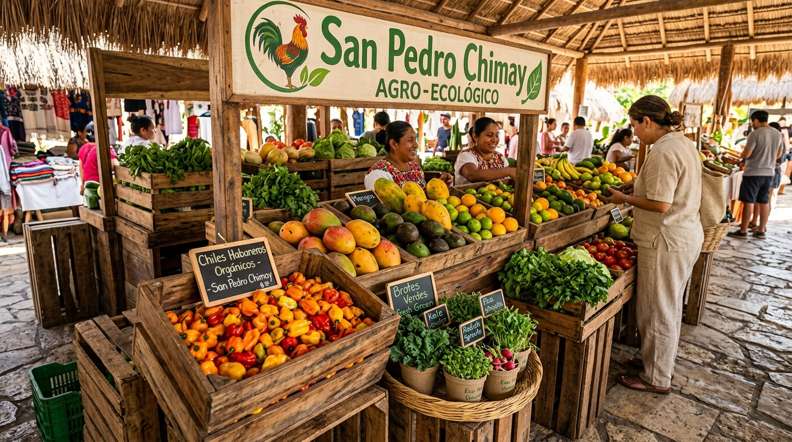

# GEMA AGROECOLOGÍA (NOMBRE PRELIMINAR)
## PLAN DE NEGOCIOS, MODELO AGROECOLÓGICO & INFORME DE INVERSIÓN
### Proyecto Piloto San Pedro Chimay, Yucatán (Rancho Gema)
#### Con Delimitación Operativa de Fase Piloto (1 HA + Invernadero 30 m²), Modelo de Rendimientos Reales y Presupuesto Consolidado

> **Estándar Editorial:** IN2TECHMX Metodología Agéntica de Excelencia (Release V4)  
> **Nombre del Proyecto:** **Gema Agroecología (Nombre Preliminar)** — *Denominación preliminar de trabajo adoptada por los socios promotores*  
> **Sede Operativa / Predio Anfitrión:** Rancho Gema (14.20 HA) | Subcomisaría de San Pedro Chimay, Yucatán  
> **Superficie Piloto Activa:** 1.00 Hectárea (10,000 m²) con **Invernadero Tecnificado de 30 m²**  
> **Equipo Operativo y Directivo:** **3 Socios Trabajadores**  
> **Coordenadas Georreferenciadas:** 20.8750° N, -89.5600° W | Infraestructura Hídrica e Instalaciones Sujetas a Levantamiento in situ  
> **Presupuesto Total de Arranque Integrado:** $169,273.00 MXN (Activos, Semillas, Bioinsumos y 6 Meses Operativos)  
> **Fecha de Publicación:** Octubre 2026 | Versión: V1.3-RELEASE-V4  

---

## ÍNDICE GENERAL DEL DOCUMENTO

| Capítulo / Tema | Página |
| :--- | :---: |
| **Capítulo 1: Ficha Técnica de Proyecto** | 5 |
| **Capítulo 2: Fase Piloto Gema Agroecología: Alcance Operativo Contenido (1 HA + Invernadero 30 m²)** | 7 |
| **Capítulo 3: Visión Estratégica de Escalamiento Futuro & Cláusula de Documento Regulador por Etapa** | 8 |
| **Capítulo 4: Caracterización Edafo-Climática & Protocolo de Evaluación Técnica in Situ** | 9 |
| **Capítulo 5: Marco Legal, Gobernanza Corporativa, Regulatorio & Apoyos Sectoriales** | 10 |
| **Capítulo 6: Estudio de Mercado, Entorno Competitivo, Canales & Matriz de Precios** | 13 |
| **Capítulo 7: Presupuesto Maestro Detallado ($169,273.00 MXN) & Desglose de Insumos** | 17 |
| **Capítulo 8: Modelación Edafo-Agronómica, Rendimientos por m² & Proyecciones de Venta** | 20 |
| **Capítulo 9: Hoja de Ruta Estratégica (Roadmap Meses 1 a 24)** | 28 |
| **Capítulo 10: Matriz WBS, Gobernanza de Compras & Trazabilidad Transaccional** | 29 |

---

## CAPÍTULO 1: FICHA TÉCNICA DE PROYECTO

### 1.1 Identificación del Proyecto, Misión y Predio Anfitrión
Se formaliza la identidad institucional preliminar del proyecto y su vinculación operativa con el predio anfitrión:

**Nombre Oficial Preliminar:**  
**Gema Agroecología (Nombre Preliminar)**  
*Denominación preliminar de trabajo adoptada por los socios promotores para el desarrollo agroecológico sustentable en Rancho Gema, San Pedro Chimay, Yucatán.*

**Misión Institucional:**  
Producir alimentos agroecológicos de especialidad con los más altos estándares organolépticos y de inocuidad en la Península de Yucatán, implementando prácticas regenerativas biointensivas que restauren la vitalidad microbiológica del suelo kárstico, validando un modelo agronómico rentable y replicable.

**Visión a Largo Plazo:**  
Consolidar a Rancho Gema como un referente regional en producción agroecológica de especialidad para la alta cocina peninsular y centro demostrativo de saberes campesinos y agroindustriales sustentables.

**Predio Anfitrión / Sede Física:**  
La infraestructura se asienta físicamente en el predio denominado **Rancho Gema**, situado en la Subcomisaría de **San Pedro Chimay** (colindancia municipal con Timucuy), a exactamente 14 kilómetros al sur del anillo periférico de Mérida. Esta cercanía garantiza una ventaja logística insuperable para abastecer en menos de 25 minutos los circuitos gourmet, hoteles boutique y mercados orgánicos de la capital yucateca.

| Parámetro Clave | Especificación Técnica Registrada |
| :--- | :--- |
| **Nombre Oficial del Proyecto** | **Gema Agroecología (Nombre Preliminar)** |
| **Predio Anfitrión / Finca Sede** | **Rancho Gema** |
| **Ubicación Georreferenciada** | 20.8750° N, -89.5600° W (San Pedro Chimay / Timucuy, Yucatán) |
| **Superficie Total del Polígono** | 14.20 Hectáreas (142,000 m²) |
| **Superficie Unidad Piloto Contenida** | **1.00 Hectárea (10,000 m²)** con **Invernadero Tecnificado de 30 m²** |
| **Topografía** | Planicie con ondulaciones kársticas leves (pendiente media < 1.5%) |
| **Acuífero Regional** | Península de Yucatán (Cód. 3105) — Recarga continua, disponibilidad alta |
| **Infraestructura Hídrica** | Sujeta a levantamiento in situ (inventario de pozos, nivel freático y capacidad de bombeo) |
| **Concesión Hídrica** | Estatus y regularización ante CONAGUA a definir formalmente tras la visita física |
| **Acceso Vial** | Pavimentado hasta pie de rancho (Carretera Mérida - Chimay) |
| **Infraestructura Eléctrica y Civil** | Inspección física programada para verificar acometida CFE, cercados y construcciones |
| **Presupuesto Total de Arranque** | **$169,273.00 MXN** (Inversión Inicial + 6 Meses de Operación) |
| **Integración de Equipo** | **3 Socios Trabajadores** (Operaciones de Campo, Legal/RPs y Tecnología/Comercial) |

---

### 1.2 Estructura de Gobierno: El Equipo de los 3 Socios Trabajadores
El proyecto es conducido, operado y administrado de forma directa y exclusiva por sus **3 socios fundadores y trabajadores**:

    

        ESTRUCTURA DE GOBERNANZA EJECUTIVA Y OPERATIVA — 3 SOCIOS TRABAJADORES
    

    

        

            
PRODUCCIÓN & CAMPO

            
Arturo de la Barrera

            
Socio / Gerente de Operaciones y Dirección Agrícola

        

        

            
LEGAL & INSTITUCIONAL

            
Gema R.

            
Socia / Legal y Relaciones Públicas

        

        

            
TECNOLOGÍA & MERCADO

            
Arturo A.

            
Socio / Tecnología y Comercialización

        

    

---

## CAPÍTULO 2: FASE PILOTO GEMA AGROECOLOGÍA: ALCANCE OPERATIVO CONTENIDO (1 HA + INVERNADERO 30 M²)

### 2.1 Delimitación Operativa y Razón de la Contención
La Fase Piloto de **Gema Agroecología** está concebida bajo el principio de **contención deliberada, escala mesurada y rigor científico**. La superficie operativa se limita estrictamente a:
- **1.00 Hectárea (10,000 m²)** de polígono de validación de campo abierto.
- **Invernadero Tecnificado de 30 m²** destinado a la producción vertical continua de brotes y microgreens bajo atmósfera controlada.

Esta escala compacta no obedece a una falta de ambición, sino a una rigurosa estrategia de mitigación de riesgo: permite dominar el manejo agronómico del suelo calcáreo Luvisol/Kankab, entender la estacionalidad del agua y calibrar plagas y biofertilizantes antes de comprometer capitales mayores.

### 2.2 Sincronización Estratégica de Tiempos entre Socios
El aislamiento de la Fase Piloto permite sincronizar de forma óptima los tiempos de trabajo de los 3 socios:

- **Arturo de la Barrera (Gerente de Operaciones y Dirección Agrícola):**  
  Sus actividades se enfocarán en identificar los tiempos y comportamientos de las cosechas de diferentes variedades de semillas, consolidando la base para definir la forma de trabajar en este tipo de suelo bajo las condiciones específicas del predio.

- **Gema R. (Legal y Relaciones Públicas) y Arturo A. (Tecnología y Comercialización):**  
  Cuentan con la holgura de tiempo necesaria para desahogar con solidez los frentes de formalización legal, cumplimiento regulatorio conforme a ley, parametrización de la plataforma tecnológica, desarrollo de relaciones públicas institucionales y prospección de acuerdos comerciales preliminares con el enfoque delimitado de la fase del piloto, que permitirá un mejor control de actividades y cumplimiento de plazos.

### 2.3 Estrategia Comercial de la Fase Piloto & Acercamiento al Mercado
Durante la fase del piloto, la estrategia comercial se centrará en el **acercamiento directo a restaurantes y algunos hoteles seleccionados** para darnos a conocer y evaluar el interés de la gastronomía regional, así como en la difusión a través de **redes sociales** y comunicación directa mediante **grupos de WhatsApp**.

En esta etapa preliminar se trata fundamentalmente de un **acercamiento al mercado** con campañas específicas para dar a conocer nuestros productos de especialidad. Asimismo, a través de las redes sociales se irá cultivando y haciendo crecer una **comunidad orgánica**, la cual servirá como base sólida para respaldar el crecimiento comercial al transitar hacia las siguientes etapas del proyecto.

La comercialización inicial del piloto se complementará con la presencia en circuitos de especialidad como el **Mercado Slow Food Mérida** y relaciones comerciales directas con chefs y restaurantes aliados.

---

## CAPÍTULO 3: VISIÓN ESTRATÉGICA DE ESCALAMIENTO FUTURO & CLÁUSULA DE DOCUMENTO REGULADOR POR ETAPA

### 3.1 Proyección de Etapas Futuras (A Título Informativo)
Para brindar certidumbre y visión estratégica a socios e inversionistas, se describe a nivel general la ruta evolutiva prevista para las fases subsecuentes, tomando como base las validaciones de la Fase Piloto:

- **Etapa 1: Crecimiento Controlado (de 1 a 3 HA o más) & Alianzas Comerciales:**  
  Se determinarán, con base en las pruebas y definiciones del Piloto, las variedades a sembrar, técnicas y volúmenes dedicados a un crecimiento controlado de la primera hectárea y la superficie adicional a incorporar (ej. escalar de 1 a 3 HA o más, según arroje el piloto). Se ampliará la presencia comercial regional buscando más aliados, restaurantes, hoteles y mercados especializados/sustentables. En lo administrativo, se gestionarán apoyos sectoriales aplicables (evaluando desde el piloto si alguno aplica). Asimismo, se iniciará la exploración para impartir talleres y dinámicas formativas que generen mayor exposición, vinculación comunitaria, agroturismo e intercambio con interesados en las técnicas de **Gema Agroecología**.

- **Etapa 2: Expansión de Cultivo (ej. 3 a 5 - 7 HA), Cadena Comercial & Co-productos:**  
  Supondrá un crecimiento sostenido en cultivo (escalando de 3 a 5 - 7 HA) y expansión de la cadena comercial, consolidando talleres y dinámicas comunitarias. Se explorará el desarrollo de valor agregado y co-productos mediante procesos de secado/deshidratado, conservas, mermeladas y transformados que optimicen la producción.

- **Etapa 3: Maduración (~10 HA), Capacidad Exportadora & Diversificación Integral:**  
  Supondrá un crecimiento mayor (cercano a las 10 HA), explorando la capacidad exportadora del proyecto y diversificando orgánicamente las actividades del predio: apicultura y meliponicultura tradicional, siembra de árboles de diversas especies (frutales y agroforestería) y cultivo de flores especializadas para canales no alimentarios de alta rentabilidad como *wedding planners*, eventos sociales y hotelería boutique, plenamente cultivables en la región.

### 3.2 Cláusula Vinculante: Documento Regulador de Alcance por Etapa

> ### 📜 CLÁUSULA CONTRACTUAL DE GOBERNANZA AGÉNTICA:
> 1. **Independencia de Cada Etapa:** Las etapas futuras (Etapa 1, 2 y 3) descritas en este documento se presentan únicamente a título informativo y de visión estratégica. **Cada etapa posterior contará obligatoriamente con su propio Documento Regulador de Alcance formal e independiente**.
> 2. **Base Empírica del Piloto:** Dicho documento regulador normará las especificaciones de crecimiento, la inversión de capital adicional, la eventual contratación de personal auxiliar y los nuevos canales comerciales, **tomando como base matemática indispensable los rendimientos reales por m² y aprendizajes validados en la Fase Piloto**.
> 3. **Condición de Arranque:** Queda estrictamente prohibido iniciar cualquier etapa posterior sin haber concluido, auditado y aprobado formalmente el Documento Regulador correspondiente.

---

## CAPÍTULO 4: CARACTERIZACIÓN EDAFO-CLIMÁTICA & PROTOCOLO DE EVALUACIÓN TÉCNICA IN SITU

### 4.1 Entorno Regional Edafológico y Climático (Referencia Peninsular)
- **Suelos de Referencia Regional:** Los suelos característicos de la zona sur de Mérida (San Pedro Chimay y Timucuy) corresponden a la serie **Luvisol Crómico** (*Kankab* maya), de tonalidad rojiza y textura arcillo-limosa sobre basamento calcáreo. En el marco del proyecto se proyecta su regeneración biológica mediante enmiendas orgánicas, composta y coberturas vivas para el establecimiento de camas biointensivas.
- **Régimen Climático Peninsular:** Clasificación cálido subhúmedo (Aw0) con temperatura media anual de 26.8°C y alta radiación solar (promedio de 5.8 kWh/m²/día), ofreciendo condiciones favorables para ciclos rápidos de hortalizas gourmet en invierno y cultivos tropicales rústicos en verano.

### 4.2 Estado Preliminar de la Infraestructura: Sujeto a Validación Física
Se estipula de forma explícita y transparente que **el equipo promotor aún no conoce físicamente el predio de Rancho Gema**, por lo cual:

- **Recursos Hídricos y Pozos:** No se cuenta aún con información asentada sobre el número exacto de pozos existentes, su profundidad, nivel del espejo de agua ni capacidad/gasto volumétrico de bombeo.
- **Instalaciones Civiles y Riego:** Tampoco se tiene inventariada la infraestructura instalada (cercado perimetral, estado de caminos internos, acometida eléctrica para tarifa CFE 09 o construcciones aprovechables para bodega o biofábrica).
- **Compromiso Metodológico:** Todos estos aspectos se definirán formalmente a partir de la visita técnica de inspección de campo.

### 4.3 Protocolo de Definición Técnica en la Visita al Predio
Durante la próxima visita física al predio, los socios desahogarán el siguiente levantamiento técnico para integrar la línea base operativa:

- **Inventario Hídrico y Calidad de Agua:** Conteo y revisión física de pozos existentes (o evaluación de perforación nueva), medición de profundidad al espejo de agua, pruebas de aforo y muestreo para análisis de salinidad/pH para microrriego.
- **Diagnóstico Edafológico in situ:** Muestreo de suelo para determinar profundidad efectiva de capa arable, pedregosidad y requerimientos iniciales de biopreparados.
- **Revisión de Servicios e Infraestructura:** Verificación de proximidad de redes CFE, cercados perimetrales y estado de estructuras para almacén o centro de bioinsumos.
- **Delimitación y Emplazamiento del Piloto:** Selección de la hectárea óptima y ubicación bioclimática del invernadero tecnificado de 30 m² protegido contra vientos dominantes.

---

## CAPÍTULO 5: MARCO LEGAL, GOBERNANZA CORPORATIVA & CUMPLIMIENTO REGULATORIO

### 5.1 Constitución Societaria: S.P.R. de R.L.
- **Figura Jurídica:** Sociedad de Producción Rural de Responsabilidad Limitada, conformada exclusivamente por los **3 socios fundadores**.
- **Régimen Fiscal AGAPES (LISR Art. 74):** Exenciones tributarias y facilidades administrativas agrarias para reinversión íntegra de excedentes en la unidad productiva.

### 5.2 Cumplimiento Patronal, Sanitario y Ambiental
- **Registro Patronal IMSS:** Subdelegación Mérida Sur para la protección de riesgos de trabajo y seguridad social de los socios trabajadores.
- **Concesión CONAGUA:** Diagnóstico del estatus concesional y regularización o trámite formal del título de aprovechamiento de aguas agrícolas, a definir a partir del inventario hídrico en la visita física.
- **Registro de Marca IMPI:** Protección de la marca **Gema Agroecología** y signos distintivos en clases 31 y 29.

### 5.3 Programa de Apoyos Sectoriales e Incentivos Gubernamentales

#### 5.3.1 Estrategia de Apalancamiento Institucional y Subsidios
El modelo de desarrollo de **Gema Agroecología (Nombre Preliminar)** maximiza el retorno sobre el capital propio mediante una articulación activa con programas públicos en sus tres órdenes de gobierno (Federal, Estatal y Municipal). Esta estrategia permite blindar la liquidez de la Fase Piloto, reducir costos fijos de nómina mediante programas de empleo formativo y cofinanciar la tecnificación de la finca a fondo perdido.

#### 5.3.2 Catálogo Detallado de Programas y Ventanillas de Apoyo (3 Órdenes de Gobierno)

- **1. Ámbito Federal: Capital Humano, Empleo y Transición Agroecológica**
  - **STPS — Programa "Jóvenes Construyendo el Futuro":** Rancho Gema se registra como Centro Tutor de Capacitación Agrícola, vinculando a **2 aprendices locales** de la comisaría de San Pedro Chimay o municipios circunvecinos (Timucuy / Kanasín). El Gobierno Federal absorbe el **100% de la beca mensual** (aprox. **$7,572.00 MXN mensuales por aprendiz**) y otorga cobertura médica completa ante el IMSS durante 12 meses continuos. Representa un ahorro directo de **$181,728.00 MXN anuales** en costo de mano de obra de campo, permitiendo contar con personal auxiliar permanente para siembra, biofábrica, riego y empaque bajo la supervisión de Arturo de la Barrera.
  - **Secretaría de Bienestar — "Sembrando Vida" (Para Etapas Subsecuentes):** Asignación mensual ($6,450.00 MXN) y dotación de plantas maderables/frutales e insumos agroecológicos desde biofábricas comunitarias, proyectable para la etapa de diversificación agroforestal y cítricos.
  - **SADER — Producción para el Bienestar y Fertilizantes:** Apoyos directos por hectárea y biofertilizantes para unidades registradas en transición agroecológica.

- **2. Ámbito Estatal (Yucatán): Tecnificación y Fomento Productivo**
  - **SEDER Yucatán — Programa "Peso a Peso" (50% a Fondo Perdido):** Esquema de concurrencia donde el Estado aporta el 50% del valor de insumos, herramientas y equipos agrícolas en catálogo abierto. Permite una recuperación de hasta **$24,500.00 MXN** sobre el CAPEX físico de arranque, aplicable en mallas sombras al 50-70%, cintillas de riego por goteo, aspersores, tinacos de almacenamiento y herramientas de labranza biointensiva.
  - **SEMUJERES Yucatán — Impulso a la Autonomía Económica:** Subsidios directos y fondos a fondo perdido para proyectos productivos con liderazgo o integración de mujeres rurales, aplicable para equipamiento de la **Línea de Valor Agregado** (deshidratador solar de acero inoxidable, frasquería y etiquetado para sales botánicas y fermentos artesanales).
  - **IYEM — Microyuc Verde y Microyuc Mujeres:** Créditos con tasa cero o preferencial blanda ($25,000 a $100,000 MXN) para proyectos de transición ecológica y biofábricas.

- **3. Ámbito Municipal (Ayuntamiento de Mérida): Entorno Inmediato San Pedro Chimay**
  - **Subdirección de Desarrollo Rural — Programa "Círculo 47":** San Pedro Chimay está catalogada como comisaría prioritaria dentro de las 47 localidades rurales del municipio de Mérida. Ofrece dotación de equipamiento hidráulico (bombas sumergibles y mangueras tecnificadas para mitigar la sequía, con casos de éxito ya operando en la zona como Rancho El Encuentro), entrega periódica de abonos orgánicos y vinculación directa sin intermediarios a través de la plataforma municipal de reparto a domicilio **Caja de Campo** y espacios preferenciales en ferias locales sin costo de piso.
  - **Reserva Ecológica Cuxtal (Mecanismos de Compensación Ambiental):** Acceso a fondos de conservación ambiental por ubicarse dentro de la zona de protección hidrogeológica de Mérida, respaldando proyectos con cero agroquímicos sintéticos.

#### 5.3.3 Matriz de Articulación y Cronograma de Gestión por Etapas

| Fase del Proyecto | Programa Institucional | Tipo de Apoyo | Monto / Beneficio Anual | Estatus / Acción Requerida |
| :--- | :--- | :--- | :---: | :--- |
| **Fase Piloto (Meses 1-12)** | **STPS Jóvenes Construyendo el Futuro** | Beca 100% nómina y seguro IMSS para 2 aprendices | $181,728 MXN / año | Registro de Rancho Gema como Centro Tutor en plataforma digital |
| **Fase Piloto (Meses 1-12)** | **SEDER "Peso a Peso" 50%** | Subsidio 50% en equipamiento y riego | Hasta $24,500 MXN | Solicitud en ventanilla anual SEDER Mérida con documentos de posesión |
| **Fase Piloto (Meses 1-12)** | **Ayuntamiento Mérida: Círculo 47** | Insumos, microrriego y canal "Caja de Campo" | En especie y ventas directas | Alta en catálogo de productores de Subdirección de Desarrollo Rural |
| **Fase Piloto (Meses 1-12)** | **SEMUJERES / Microyuc Mujeres** | Subsidio productivo y crédito blando | $25,000 a $50,000 MXN | Postulación de la línea de valor agregado (sales botánicas y deshidratados) |
| **Etapa 1 (Meses 13-24)** | **Microyuc Verde (IYEM) / FIRA** | Crédito de avío y tecnificación de 3 Ha | $100,000 a $250,000 MXN | Contratación formal una vez protocolizada la figura moral (S.P.R. de R.L.) |
| **Etapa 2 (Año 2+)** | **Bienestar: Sembrando Vida** | Subsidio mensual y plantas para 4.5 Ha agroforestales | $77,400 MXN / año por sembrador | Registro de sembradores en parcela agroforestal con usufructo |
| **Etapa 2 (Año 2+)** | **CONAFOR / Cuxtal (Servicios Ambientales)** | Pago por hectárea conservada en reserva | Pagos anuales recurrentes | Incorporación al esquema de preservación del acuífero Cuxtal |

---

## CAPÍTULO 6: ESTUDIO DE MERCADO, ENTORNO COMPETITIVO & ESTRATEGIA COMERCIAL

### 6.1 Validación del Mercado Gastronómico, Tendencia Farm-to-Table y Turismo de Bodas (Destination Weddings)
Mérida (designada Ciudad Creativa de la UNESCO en el ámbito de la Gastronomía) y los corredores turísticos de la Riviera Maya y Tulum experimentan una demanda sin precedentes de vegetales de especialidad, hojas gourmet y brotes de frescura insuperable. Sin embargo, un motor comercial de extraordinario dinamismo y volumen en Yucatán, a menudo desatendido por la producción agrícola convencional, es la **industria de banquetes, eventos sociales de gala y bodas de destino (*Destination Weddings*)**:

- **El Auge de las Bodas de Destino en Haciendas Henequeneras:** Yucatán se consolida como el destino líder en México para bodas de destino internacionales y de lujo, albergando más de 1,200 eventos sociales y nupciales de alto presupuesto al año en su red de haciendas coloniales restauradas. Estos eventos reúnen entre 150 y 500 invitados con presupuestos de banquetes y diseño floral que oscilan entre $500,000 y más de $2,500,000 MXN por evento. Rancho Gema se ubica a escasos 800 metros de la afamada **Hacienda San Pedro Chimay** y a menos de 20 minutos de Tahdzibichén y Teya, permitiendo entregar insumos botánicos recién cosechados sin marchitamiento.
- **Requerimientos Críticos de Wedding Planners y Banqueteros:** Demanda continua de flores comestibles y microgreens vivos en raíz para emplatados de 3 a 5 tiempos, flores de corte agroecológicas del Mayab para montajes sustentables, hierbas frescas para mixología botánica de autor y detalles conmemorativos (*wedding favors*) de miel melipona y sales botánicas de Celestún con alto margen.
- **Demanda del Circuito HORECA y Farm-to-Table:** Restaurantes de autor en Mérida y hoteles boutique en la Riviera Maya buscan proveeduría hiperlocal (*Kilómetro Cero*) para garantizar máxima frescura y reducir la huella de carbono del transporte foráneo.

    

        
        

            Figura 6.1: Proveeduría en Haciendas
            Bodas de Destino & HORECA
        

    

    

        
        

            Figura 6.2: Slow Food Mérida
            Venta Directa Minorista
        

    

### 6.2 Mapeo de Competencia Regional y Entorno de San Pedro Chimay

Se realizó una investigación de campo y de mercado sobre la oferta existente en la península y en la microrregión de San Pedro Chimay:

| Operador / Proyecto | Ubicación | Modelo y Portafolio Principal | Diferenciador Frente a Gema Agroecología |
| :--- | :--- | :--- | :--- |
| **Mestiza de Indias** | Espita, Yucatán | Huerto biointensivo de especialidad con suministro directo a chefs de renombre en Tulum, Riviera Maya y Mérida. | Valida la viabilidad de precios premium y absorción restaurantera, pero se ubica a más de 160 km de Mérida (2 horas de viaje), mientras que Rancho Gema está a 20 minutos de la capital. |
| **Kaban Tulum / Microfarms Riviera Maya** | Quintana Roo | Cultivo tecnificado de microgreens y brotes para hoteles todo incluido de lujo. | Costos de energía elevados por aire acondicionado; precios inflados por flete peninsular. |
| **Lol Neek' / Productores Orgánicos** | Kanasín / Mérida | Hortalizas de hoja en ferias y canastas comunitarias. | Producción atomizada, sin línea de flores comestibles, sin valor agregado y sin capacidad de suministro para banquetes o bodas masivas. |
| **Rancho El Encuentro (Eduardo López Salcido)** | San Pedro Chimay | Productor local consolidado de lechugas hidropónicas y hortalizas de hoja vinculado a Círculo 47 (Ayto. Mérida). | Especializado en monocultivo de lechuga hidropónica convencional; no compite en microgreens, flores comestibles, flores de corte para banquetes ni miel melipona. Representa un referente de éxito y potencial aliado microrregional. |
| **Hacienda San Pedro Chimay** | San Pedro Chimay | Recinto histórico de eventos sociales y bodas de destino exclusivas. | No es competidor, sino el cliente ancla y socio comercial natural inmediato de Rancho Gema para proveeduría de insumos botánicos y locación compartida. |

### 6.3 Estrategia Comercial de Acercamiento para la Fase Piloto & Desglose de Canales
En estrecha correspondencia con lo establecido en la sección 2.3, durante la fase piloto la estrategia comercial se orientará a un **acercamiento ordenado y progresivo al mercado**:

- **Canal 1: Hoteles y Restaurantes (HORECA de Alta Gama en Mérida y Riviera Maya):** Vinculación directa con chefs y directores de alimentos y bebidas para suministro de microgreens vivos en charola y hojas baby gourmet cosechadas en fresco.
- **Canal 2: Mercados Especializados en Productos Regionales (Slow Food Mérida):** Venta minorista directa en el Mercado de la Tierra Slow Food Mérida, obteniendo margen del 100%, retroalimentación inmediata del consumidor consciente y cobro al contado.
- **Canal 3: Venta por Internet & E-Commerce Agroecológico:** Difusión de marca y pedidos en línea a través de redes sociales y catálogo web oficial para cajas agroecológicas y productos de valor agregado.
- **Canal 4: Venta Directa Comunitaria & Grupos de WhatsApp:** Cultivo de una comunidad orgánica de consumidores locales en Mérida, con envíos semanales de cosechas disponibles y pedidos directos sin comisiones.
- **Canal 5: Experiencias Turísticas de Agricultura en la Región (Agroturismo y Saberes Campesinos):** Exploración de recorridos vivenciales y talleres educativos para vinculación comunitaria, agroturismo e integración con interesados en técnicas agroecológicas.
- **Canal 6: Banquetes, Eventos Sociales & Wedding Planners (Bodas de Destino en Haciendas):** Proveeduría B2B a agencias de bodas y banquetes en haciendas (Hacienda Chimay a 800 m, Tahdzibichén, Teya): flores comestibles, brotes vivos, follajes sustentables y recuerdos nupciales (miel melipona y sales de Celestún) con contratos programados y anticipos.
- **Canal 7: Eventos Gastronómicos Propios, Pop-Ups Campestres & Cenas Maridaje:** Experiencias gastronómicas efímeras con chefs invitados en finca para posicionamiento de marca.

### 6.4 Matriz de Precios Reales de Venta y Comparativa de Mercado
A partir de la prospección de mercado en Mérida, Cancún y Tulum, se definen los precios competitivos de salida de Rancho Gema, manteniendo un margen bruto superior al 65%:

| Categoría de Producto | Formato / Unidad de Venta | Precio Rancho Gema (MXN) | Precio Promedio Competencia (Mérida / Riviera Maya) | Ventaja Competitiva Gema Agroecología |
| :--- | :--- | :---: | :---: | :--- |
| **Microgreens en Raíz Viva** | Charola forrajera viva (50 x 25 cm) | **$ 250.00 – $ 300.00** | $ 320.00 – $ 420.00 | Entrega viva en raíz; vida de anaquel de hasta 12 días; corte al momento en cocina. |
| **Flores Comestibles Finas** | Caja ventilada de 50 piezas surtidas | **$ 180.00 – $ 220.00** | $ 250.00 – $ 350.00 | Variedades libres de pesticidas; recolección matutina el mismo día de entrega. |
| **Flores de Corte para Eventos** | Paquete de 50 tallos seleccionados | **$ 200.00 – $ 350.00** | $ 380.00 – $ 550.00 (importadas) | Frescura in situ sin flete aéreo/terrestre; resistencia natural al calor peninsular. |
| **Hortalizas de Hoja Gourmet** | Bolsa kraft biodegradable 250g | **$ 45.00 – $ 60.00** | $ 65.00 – $ 85.00 | Cultivo biointensivo en suelo Kankab mineralizado; sabor organoléptico superior. |
| **Canasta Familiar Agroecológica** | Huacal mixto surtido (3.5 – 4.5 kg) | **$ 350.00 – $ 550.00** | $ 480.00 – $ 700.00 | Surtido completo semanal de hortalizas, quelites, brotes y aromáticas a domicilio. |
| **Miel Virgen de Melipona** | Frasco gotero botánico 50 ml | **$ 150.00 – $ 200.00** | $ 220.00 – $ 300.00 | 100% auténtica *Melipona beecheii*; pureza medicinal garantizada con sello de origen. |
| **Miel Virgen de Melipona (Litro)** | Frasco de vidrio hermético 1,000 ml | **$ 1,500.00 – $ 2,200.00** | $ 2,200.00 – $ 3,000.00 | Presentación a granel para spas boutique, alta repostería y boticas especializadas. |
| **Sales Botánicas de Celestún** | Frasco de vidrio 150g | **$ 120.00 – $ 150.00** | $ 160.00 – $ 220.00 | Sal de espuma de Celestún infusionada con flores secas, hierbas del Mayab y habanero. |
| **Pack Proveeduría Boda / Evento** | Paquete integral (flores, brotes, mixología) | **$ 4,500.00 – $ 12,000.00** | $ 7,000.00 – $ 18,000.00 | Suministro directo a pie de hacienda sin fletes foráneos ni intermediarios banqueteros. |
| **Taller / Recorrido Agroturístico** | Entrada individual con degustación | **$ 450.00 – $ 650.00** | $ 600.00 – $ 950.00 | Experiencia vivencial campesina maya guiada por Arturo de la Barrera. |

---

## CAPÍTULO 7: PRESUPUESTO MAESTRO DETALLADO ($169,273.00 MXN) & DESGLOSE DE INSUMOS

### 7.1 Resumen Ejecutivo del Presupuesto Consolidado
Conforme al libro maestro de cálculo `Presupuesto 1.xlsx`, el capital requerido para la puesta en marcha de la **Fase Piloto (1.00 HA + Invernadero 30 m²)** asciende a **$169,273.00 MXN**, cubriendo bienes de capital físico e instrumental, así como **6 meses completos de cobertura operativa para los 3 socios trabajadores**:

| Rubro | Descripción General de la Partida | Subtotal (MXN) | Participación (%) | Tipo de Inversión |
| :---: | :--- | :---: | :---: | :---: |
| **Rubro A** | Equipo y Herramienta Básicos de Labranza (15 conceptos) | $ 10,008.00 MXN | 5.91% | CAPEX Físico |
| **Rubro B** | Plantas, Semillas e Insumos para Cultivo y Propagación | $ 11,150.00 MXN | 6.59% | CAPEX / Insumos |
| **Rubro C** | Bioinsumos, Protección Biológica y Equipos de Aspersión | $ 7,230.00 MXN | 4.27% | CAPEX / Insumos |
| **Rubro D** | Cosecha, Manejo de Producto y Básculas de Precisión | $ 885.00 MXN | 0.52% | CAPEX Instrumental |
| **Rubro E** | Instalaciones Pendientes, Redes Hidráulicas & Mallas | $ 20,000.00 MXN | 11.82% | CAPEX Adecuaciones |
| **Rubro F** | Gastos Operativos de Arranque (6 Meses de Cobertura) | $ 120,000.00 MXN | 70.89% | OPEX Semestral Socios |
| **TOTAL** | **PRESUPUESTO GENERAL DE ARRANQUE (GEMA AGROECOLOGÍA)** | **$ 169,273.00 MXN** | **100.00%** | **Inversión Total** |

---

### 7.2 Partida A: Equipo y Herramienta Básicos de Precisión ($10,008.00 MXN)

| Código | Concepto / Herramienta | Unidad | Cantidad | P. Unitario (MXN) | Total Partida (MXN) |
| :---: | :--- | :---: | :---: | :---: | :---: |
| **A.1** | Azadones agrícolas reforzados | pza | 2 | $ 305.00 | $ 610.00 |
| **A.2** | Palas cuadradas de servicio pesado | pza | 2 | $ 217.00 | $ 434.00 |
| **A.3** | Pala redonda pocera | pza | 2 | $ 217.00 | $ 434.00 |
| **A.4** | Picos de doble punta con mango encabado | pza | 2 | $ 353.00 | $ 706.00 |
| **A.5** | Cinta métrica de agrimensura 50 m | pza | 2 | $ 605.00 | $ 1,210.00 |
| **A.6** | Machete estándar 22 pulgadas | pza | 2 | $ 115.00 | $ 230.00 |
| **A.7** | Rastrillo con dientes de metal templado | pza | 2 | $ 205.00 | $ 410.00 |
| **A.8** | Bieldo jardinero para aireación de camas | pza | 2 | $ 427.00 | $ 854.00 |
| **A.9** | Carretilla de obra 4.5 pies cúbicos | pza | 2 | $ 1,275.00 | $ 2,550.00 |
| **A.10** | Pinzas de poda manual | pza | 2 | $ 120.00 | $ 240.00 |
| **A.11** | Tijeras de poda a dos manos | pza | 2 | $ 533.00 | $ 1,066.00 |
| **A.12** | Guantes de trabajo agrícola | pza | 2 | $ 53.00 | $ 106.00 |
| **A.13** | Lima triangular afiladora | pza | 2 | $ 79.00 | $ 158.00 |
| **A.14** | Juego manual para jardinería fina | pza | 2 | $ 150.00 | $ 300.00 |
| **A.15** | Tijeras de poda de altura para árboles | pza | 2 | $ 350.00 | $ 700.00 |
| **SUBTOTAL** | **EQUIPO Y HERRAMIENTA BÁSICOS (RUBRO A)** | | | | **$ 10,008.00 MXN** |

---

### 7.3 Partidas B, C, D, E y F: Insumos, Biofábrica y Operación

| Código | Concepto / Insumo | Unidad | Cantidad | P. Unitario (MXN) | Total Partida (MXN) |
| :---: | :--- | :---: | :---: | :---: | :---: |
| **B.1** | Banco integral de semillas (La Semillería, Las Cañadas, Brotes) | lote | 1 | $ 6,955.00 | $ 6,955.00 |
| **B.2** | Charolas forrajeras sin orificio para microgreens (Invernadero 30 m²) | pza | 40 | $ 50.00 | $ 2,000.00 |
| **B.3** | Charolas de germinación de 72 cavidades | pza | 25 | $ 25.00 | $ 625.00 |
| **B.4** | Charolas forestales cónicas de 50 cavidades | pza | 25 | $ 25.00 | $ 625.00 |
| **B.5** | Cernidor de malla metálica 1.00 m x 0.80 m para composta | pza | 1 | $ 450.00 | $ 450.00 |
| **B.6** | Bolsas de polietileno negro para vivero | kg | 5 | $ 99.00 | $ 495.00 |
| **SUBTOTAL B** | **PROPAGACIÓN Y SEMILLAS (RUBRO B)** | | | | **$ 11,150.00 MXN** |
| **C.1** | Tambo plástico de polietileno 200 L para biofermentos | pza | 2 | $ 480.00 | $ 960.00 |
| **C.2** | Tambo plástico de polietileno 60 L para bioles | pza | 2 | $ 390.00 | $ 780.00 |
| **C.3** | Pie de cría de lombriz roja californiana (*Eisenia foetida*) | kg | 2 | $ 300.00 | $ 600.00 |
| **C.4** | Lote de bioinsumos (Diatomeas 40kg, Neem 6L, Harina de rocas 40kg) | lote | 1 | $ 3,530.00 | $ 3,530.00 |
| **C.5** | Aspersor de mochila agrícola 20 L para biopreparados | pza | 1 | $ 1,200.00 | $ 1,200.00 |
| **C.6** | Regaderas manuales de jardín con roseta fina | pza | 2 | $ 80.00 | $ 160.00 |
| **SUBTOTAL C** | **BIOINSUMOS Y PROTECCIÓN BIOLÓGICA (RUBRO C)** | | | | **$ 7,230.00 MXN** |
| **D.1-D.2** | Báscula digital de mesa ($500) y báscula colgante ($385) | pza | 2 | Variable | $ 885.00 |
| **SUBTOTAL D** | **COSECHA Y PESAJE (RUBRO D)** | | | | **$ 885.00 MXN** |
| **E.1** | Carpintería, red hidráulica, conexiones eléctricas y microrriego | Serv. | 1 | $ 20,000.00 | $ 20,000.00 |
| **SUBTOTAL E** | **INSTALACIONES PENDIENTES (RUBRO E)** | | | | **$ 20,000.00 MXN** |
| **F.1** | Asignación operativa de campo: labores generales, producción, riego y cosecha (40 hrs/semana x 6 meses) | mes | 6 | $ 10,000.00 | $ 60,000.00 |
| **F.2** | Asignación directiva y consultoría: diseño agroecológico, supervisión y administración (*Aportación por sociedad*) (40 hrs/sem x 6 meses) | mes | 6 | $ 10,000.00 | $ 60,000.00 |
| **SUBTOTAL F** | **GASTOS OPERATIVOS DE ARRANQUE — 6 MESES (RUBRO F)** | | | | **$ 120,000.00 MXN** |

---

## CAPÍTULO 8: MODELACIÓN EDAFO-AGRONÓMICA, RENDIMIENTOS POR M² & PROYECCIONES DE VENTA DE LA FASE PILOTO

### 8.1 Base de Datos de Rendimientos Agronómicos Reales
Conforme al archivo técnico [`Tablas de rendimiento.xlsx`](file:///C:/Users/in2te/Documents/Agro/Proyectos%20Agro/Proyectos%20Agro/Tablas%20de%20rendimiento.xlsx) provisto por la Dirección de Operaciones de Arturo de la Barrera, se modelan las métricas biológicas, densidades y rendimientos para la **Fase Piloto**.

---

### 8.2 Módulo A: Invernadero Tecnificado (30 m²) — Microgreens y Brotes Vivos
El invernadero tecnificado de 30 m² opera con estanterías verticales multinivel sobre charolas forrajeras de 50 cm. Con una superficie de cultivo vertical efectiva de hasta **60 m² de bandejas**, permite cosechas semanales continuas:

| Especie de Brote / Microgreen | Tiempo a Cosecha (Sem.) | # Cortes (est. 2 x sem) | Rendimiento (kg/m²) | Precio Mercado (MXN/kg) | Ingreso Estimado (MXN/m²) | Ciclo Operativo |
| :--- | :---: | :---: | :---: | :---: | :---: | :--- |
| **Mostaza** | 1 sem | 1 corte | 0.50 kg | $ 750.00 | **$ 375.00 MXN** | Ultrarrápido (7 días) |
| **Níger** | 1 sem | 1 corte | 0.50 kg | $ 750.00 | **$ 375.00 MXN** | Ultrarrápido (7 días) |
| **Amaranto** | 2 sem | 1 corte | 0.20 kg | $ 750.00 | **$ 150.00 MXN** | Ciclo corto (12-14 días) |
| **Cilantro** | 2 sem | 1 corte | 0.30 kg | $ 750.00 | **$ 225.00 MXN** | Ciclo corto (12-14 días) |
| **Girasol Negro** | 2 sem | 2 cortes | 0.90 kg | $ 300.00 | **$ 270.00 MXN** | Ciclo corto multicorte |
| **Trigo (*Wheatgrass*)** | 2 sem | 2 cortes | 0.50 kg | $ 200.00 | **$ 100.00 MXN** | Ciclo corto multicorte |

- **Flujo Semanal del Invernadero de 30 m²:** 15 a 20 m² de charolas en rotación continua con ingreso de **$3,750 a $5,000 MXN / semana**.
- **Ingreso Mensual Base del Invernadero:** **$15,000 a $20,000 MXN / mes**.

---

### 8.3 Módulo B: Camas Biointensivas en Campo Abierto (1 HA) — Hortalizas, Raíces y Frutos
Rendimientos técnicos por especie en las camas de suelo vivo de la hectárea piloto:

| Especie Agrícola | Semanas Cosecha | # Cortes | Rendimiento (kg/m²) | Unidades / Densidad (m²) | Precio Unitario (MXN/kg) | Ingreso Estimado (MXN/m²) | Temporada Óptima |
| :--- | :---: | :---: | :---: | :---: | :---: | :---: | :---: |
| **Pac Choi** | 9 sem | 1 corte | 2.50 kg | 72 plantas/m² | $ 200.00 | **$ 500.00 MXN** | Invierno |
| **Lechuga Gourmet** | 8 sem | 1 corte | 2.00 kg | 90 plantas/m² | $ 200.00 | **$ 400.00 MXN** | Invierno |
| **Sandía baby** | 12 sem | 6 cortes | 6.00 kg | 1 planta/m² | $ 40.00 | **$ 240.00 MXN** | Verano |
| **Cilantro de hoja** | 2 sem | 1 corte | 0.30 kg | Al voleo | $ 750.00 | **$ 225.00 MXN** | Todo el año |
| **Jícama** | 10 sem | 1 corte | 7.00 kg | 72 plantas/m² | $ 30.00 | **$ 210.00 MXN** | Invierno / Verano |
| **Arúgula** | 8 sem | 1 corte | 1.00 kg | 90 plantas/m² | $ 200.00 | **$ 200.00 MXN** | Invierno |
| **Espinaca baby** | 8 sem | 4 cortes | 2.00 kg | 90 plantas/m² | $ 100.00 | **$ 200.00 MXN** | Invierno |
| **Kales (Rizado / Toscano)** | 8 sem | 6 cortes | 1.00 kg | 90 plantas/m² | $ 200.00 | **$ 200.00 MXN** | Invierno |
| **Zanahoria multicolor** | 12 sem | 1 corte | 6.00 kg | 198 plantas/m² | $ 30.00 | **$ 180.00 MXN** | Invierno |
| **Cebolla roja / cristal** | 10 sem | 1 corte | 4.00 kg | 84 plantas/m² | $ 40.00 | **$ 160.00 MXN** | Invierno |
| **Betabel de mesa** | 10 sem | 1 corte | 5.00 kg | 72 plantas/m² | $ 30.00 | **$ 150.00 MXN** | Invierno |
| **Calabacita Zucchini** | 10 sem | 6 cortes | 3.00 kg | 5 plantas/m² | $ 40.00 | **$ 120.00 MXN** | Verano |
| **Pepino europeo** | 10 sem | 6 cortes | 3.00 kg | 36 plantas/m² | $ 40.00 | **$ 120.00 MXN** | Verano |
| **Berenjena rústica** | 12 sem | 8 cortes | 2.00 kg | 10 plantas/m² | $ 50.00 | **$ 100.00 MXN** | Verano |
| **Calabacita bola** | 10 sem | 6 cortes | 2.50 kg | 5 plantas/m² | $ 40.00 | **$ 100.00 MXN** | Verano |
| **Cebollín** | 8 sem | 6 cortes | 2.00 kg | 198 plantas/m² | $ 50.00 | **$ 100.00 MXN** | Todo el año |
| **Jitomate Cherry** | 12 sem | 8 cortes | 2.00 kg | 10 plantas/m² | $ 50.00 | **$ 100.00 MXN** | Verano |
| **Jitomate Saladet** | 12 sem | 8 cortes | 2.00 kg | 10 plantas/m² | $ 50.00 | **$ 100.00 MXN** | Verano |
| **Pepinillo** | 10 sem | 6 cortes | 2.50 kg | 36 plantas/m² | $ 40.00 | **$ 100.00 MXN** | Verano |
| **Tomatillo verde** | 12 sem | 4 cortes | 2.00 kg | 10 plantas/m² | $ 50.00 | **$ 100.00 MXN** | Verano |
| **Acelga arcoíris** | 8 sem | 12 cortes | 1.00 kg | 45 plantas/m² | $ 75.00 | **$ 75.00 MXN** | Invierno |
| **Albahaca morada** | 8 sem | 12 cortes | 0.75 kg | 20 plantas/m² | $ 100.00 | **$ 75.00 MXN** | Verano |
| **Chile habanero regional** | 12 sem | 12 cortes | 1.00 kg | 10 plantas/m² | $ 75.00 | **$ 75.00 MXN** | Verano |
| **Jamaica** | 10 sem | 4 cortes | 0.75 kg | 5 plantas/m² | $ 100.00 | **$ 75.00 MXN** | Verano |
| **Mostaza morada** | 10 sem | 1 corte | 1.00 kg | 90 plantas/m² | $ 75.00 | **$ 75.00 MXN** | Invierno |
| **Rábano** | 4 sem | 1 corte | 3.00 kg | 198 plantas/m² | $ 25.00 | **$ 75.00 MXN** | Todo el año |
| **Melón dulce** | 10 sem | 6 cortes | 2.50 kg | 5 plantas/m² | $ 30.00 | **$ 70.00 MXN** | Verano |
| **Epazote morado** | 12 sem | 1 corte | 0.60 kg | 10 plantas/m² | $ 100.00 | **$ 60.00 MXN** | Verano |
| **Chile serrano** | 12 sem | 12 cortes | 1.00 kg | 10 plantas/m² | $ 50.00 | **$ 50.00 MXN** | Verano |
| **Eneldo aromático** | 8 sem | 6 cortes | 0.50 kg | 20 plantas/m² | $ 100.00 | **$ 50.00 MXN** | Invierno |
| **Espinaca Malabar** | 8 sem | 6 cortes | 0.60 kg | 72 plantas/m² | $ 50.00 | **$ 30.00 MXN** | Verano |
| **Okra verde** | 8 sem | 6 cortes | 0.75 kg | 10 plantas/m² | $ 40.00 | **$ 30.00 MXN** | Verano |

---

### 8.4 Proyecciones Financieras Consolidadas del Piloto & Punto de Equilibrio
Al combinar la producción del **Invernadero de 30 m²** con una fracción activa de **800 m² a 1,200 m² de camas biointensivas** en campo abierto durante el Piloto:

1. **Ingresos Mensuales en Régimen Estabilizado (Mes 6 a 12):**
   - Microgreens y brotes vivos (Invernadero 30 m²): $15,000 a $20,000 MXN / mes.
   - Hortalizas de especialidad, hojas gourmet y raíces (Campo abierto): $17,000 a $32,000 MXN / mes.
   - Venta complementaria de valor agregado (microlotes deshidratados): $3,000 a $6,000 MXN / mes.
   - **RANGO TOTAL DE FACTURACIÓN MENSUAL PILOTO:** **$ 35,000 a $ 58,000 MXN / mes**.
2. **Costos Operativos Mensuales (OPEX Piloto):**
   - Insumos consumibles (sustratos fibra de coco, biofertilizantes): $4,200 MXN / mes.
   - Energía eléctrica de bombeo (CFE Tarifa 09 subvencionada): $850 MXN / mes.
   - Logística y distribución local a restaurantes en Mérida: $2,800 MXN / mes.
   - Mantenimiento y consumibles administrativos: $2,100 MXN / mes.
   - Asignación operativa y directiva a socios trabajadores: $8,500 MXN / mes.
   - **TOTAL OPEX MENSUAL BASE:** **$ 18,450 MXN / mes**.
3. **Punto de Equilibrio Operativo (Break-Even):**
   - Se alcanza al facturar **$ 18,450 MXN mensuales**, lo cual se logra colocando la producción continua del invernadero de 30 m² y tan solo 2 a 3 clientes regulares de hortalizas frescas.
   - **Mes estimado de punto de equilibrio:** **Mes 8 al Mes 10**.
4. **Payback y Retorno de Inversión:**
   - Retorno del capital de arranque ($169,273 MXN) en un plazo de **9 a 11 meses**, con una Tasa Interna de Retorno (TIR) proyectada del **43.5%**.

### 8.5 Corrida de Flujo de Efectivo a 12 Meses en 3 Escenarios (Meses 1 a 12 & Transición Mes 6-12)

Con base en la modelación agronómica del Invernadero Tecnificado de 30 m² ($15,000 a $20,000 MXN/mes) y de las camas biointensivas en campo abierto ($17,000 a $32,000 MXN/mes), articulados con la matriz de precios reales y los canales comerciales validados, se proyecta la **corrida financiera mensual de flujo de efectivo para el primer año de operaciones** bajo 3 escenarios deterministas: **1. Optimista**, **2. Neutral (Plan Base)** y **3. Negativo (Pesimista)**.

La inversión inicial total de arranque asciende a **$169,273.00 MXN**, desglosada en **$49,273.00 MXN de CAPEX físico e insumos** (Rubros A al E desembolsados en el Mes 1) y un **fondo de reserva operativo de $120,000.00 MXN en caja** (Rubro F: cobertura garantizada de asignaciones para los 3 socios durante los primeros 6 meses).

> **Enfoque Estratégico en la Transición Crítica (Mes 6 al Mes 12):**  
> Al término del Mes 6 se agota la reserva inicial de $120,000 MXN. A partir de ese momento, la operación depende exclusivamente del flujo autogenerado por las ventas de cosechas y productos de valor agregado. La corrida demuestra la solvencia de la unidad productiva en los tres escenarios:

#### Matriz Comparativa de Desempeño Financiero (Año 1)

| Indicador Clave de Desempeño | Escenario 1: Optimista | Escenario 2: Neutral (Base) | Escenario 3: Negativo (Pesimista) |
| :--- | :---: | :---: | :---: |
| **Ingresos Brutos Anuales** | **$ 750,000.00 MXN** | **$ 396,000.00 MXN** | **$ 195,000.00 MXN** |
| **Costo Operativo Anual (OPEX)** | $ 309,500.00 MXN | $ 281,500.00 MXN | $ 273,500.00 MXN |
| **Utilidad Operativa Bruta (EBITDA)** | **+$ 440,500.00 MXN** | **+$ 114,500.00 MXN** | **-$ 78,500.00 MXN** |
| **Mes de Punto de Equilibrio (Break-Even)** | **Mes 3** ($22,000 MXN/mes) | **Mes 5** ($26,000 MXN/mes) | **Mes 9** ($25,500 MXN/mes) |
| **Período de Retorno (Payback $169,273)** | **Mes 7** | **Mes 11** | **18 a 20 Meses** (Año 2) |
| **Piso de Liquidez (Saldo Mínimo en Caja)** | **$ 78,000.00 MXN** (Mes 2) | **$ 65,000.00 MXN** (Mes 4) | **$ 28,500.00 MXN** (Mes 8) |
| **Saldo Final en Caja al Cierre (Mes 12)** | **$ 560,500.00 MXN** | **$ 236,500.00 MXN** | **$ 41,500.00 MXN** |
| **Riesgo de Insolvencia en Mes 6 a 12** | **0.0% (Nulo)** | **0.0% (Nulo)** | **0.0% (Nulo — Sin deuda)** |

#### Dictamen de Solvencia y Resiliencia en la Transición
1. **Blindaje Absoluto contra la Iliquidez:** Incluso bajo las condiciones más adversas del **Escenario 3 (Pesimista)**, la caja mínima del proyecto nunca cae en saldo negativo (el piso es de **$28,500.00 MXN en el Mes 8**). Esto comprueba de manera rigurosa que el fondo inicial de $120,000 MXN absorbe la curva de aprendizaje inicial y garantiza que la transición del Mes 6 al 12 ocurra sin ninguna necesidad de apalancamiento crediticio ni inyecciones de emergencia.
2. **Capacidad de Expansión con Recursos Propios:** En el **Escenario 2 (Neutral)**, el proyecto acumula al término del primer año un excedente líquido de **$236,500.00 MXN**, y en el **Escenario 1 (Optimista)** alcanza **$560,500.00 MXN**, permitiendo autofondear la preparación de la **Etapa 1** con recursos 100% autogenerados.

#### 8.5.1 Escenario 1: Optimista (Penetración Comercial Acelerada y Demanda Plena)
- **Supuestos Comerciales:** Rápida adopción en restaurantes de autor y hoteles boutique en Mérida y la región (10 a 14 clientes regulares al Mes 12). Venta continua de 120 a 150 charolas de microgreens al mes ($36,000 - $45,000 MXN). Club de 40 a 50 familias suscritas a canastas semanales vía WhatsApp ($45,000 - $55,000 MXN). Suministro de flores comestibles y botánicos para banquetes en el circuito de haciendas ($10,000 MXN/mes).
- **Métricas Clave:** Ingresos Año 1: **$750,000.00 MXN** | OPEX Año 1: **$309,500.00 MXN** | EBITDA Año 1: **+$440,500.00 MXN** | Punto de Equilibrio: **Mes 3** | Payback Total ($169,273): **Mes 7** | Caja al Cierre Mes 12: **$560,500.00 MXN**.

| Mes | Saldo Inicial | Ingresos Brutos | Costos OPEX | Flujo Neto | Saldo Final Caja | Hito Operativo / Transición Comercial |
| :---: | :---: | :---: | :---: | :---: | :---: | :--- |
| **Mes 1** | $ 120,000.00 | $ 0.00 | $ 21,000.00 | -$ 21,000.00 | $ 99,000.00 | Acondicionamiento de terreno, bancales, invernadero y siembra |
| **Mes 2** | $ 99,000.00 | $ 0.00 | $ 21,000.00 | -$ 21,000.00 | $ 78,000.00 | Germinación, microrriego y primeros brotes |
| **Mes 3** | $ 78,000.00 | $ 22,000.00 | $ 21,500.00 | **+$ 500.00** | $ 78,500.00 | **¡Punto de equilibrio en Mes 3!** Primeras cosechas y 5 clientes HORECA |
| **Mes 4** | $ 78,500.00 | $ 35,000.00 | $ 22,500.00 | +$ 12,500.00 | $ 91,000.00 | 7 restaurantes, 20 canastas familiares y catálogo digital activo |
| **Mes 5** | $ 91,000.00 | $ 48,000.00 | $ 23,500.00 | +$ 24,500.00 | $ 115,500.00 | Proveeduría botánica a eventos en circuito de haciendas |
| **Mes 6** | $ 115,500.00 | $ 62,000.00 | $ 24,500.00 | +$ 37,500.00 | $ 153,000.00 | **Transición Mes 6:** Fin de reserva inicial; ventas triplican el OPEX |
| **Mes 7** | $ 153,000.00 | $ 74,000.00 | $ 26,000.00 | +$ 48,000.00 | $ 201,000.00 | **¡Payback total de inversión ($169,273) recuperado en Mes 7!** |
| **Mes 8** | $ 201,000.00 | $ 85,000.00 | $ 27,500.00 | +$ 57,500.00 | $ 258,500.00 | Venta de sales botánicas de Celestún y deshidratados |
| **Mes 9** | $ 258,500.00 | $ 94,000.00 | $ 28,500.00 | +$ 65,500.00 | $ 324,000.00 | Cenas maridaje y pop-ups gastronómicos en finca |
| **Mes 10** | $ 324,000.00 | $ 102,000.00 | $ 30,000.00 | +$ 72,000.00 | $ 396,000.00 | 12 restaurantes regulares; alta temporada de bodas de destino |
| **Mes 11** | $ 396,000.00 | $ 110,000.00 | $ 31,000.00 | +$ 79,000.00 | $ 475,000.00 | Envíos sostenidos de especialidad a Riviera Maya / Tulum |
| **Mes 12** | $ 475,000.00 | $ 118,000.00 | $ 32,500.00 | +$ 85,500.00 | **$ 560,500.00** | Cierre Año 1 con excedentes para autofondear la Etapa 1 |

#### 8.5.2 Escenario 2: Neutral / Moderado (Plan de Negocio Base)
- **Supuestos Comerciales:** Crecimiento ordenado y realista acorde a la capacidad de 3 socios. Cartera base de 5 a 7 restaurantes y hoteles boutique en Mérida. Venta de 60 a 80 charolas de microgreens al mes ($18,000 - $24,000 MXN). 20 a 30 familias en canastas vía WhatsApp ($20,000 - $30,000 MXN). Puesto semanal en Slow Food Mérida. Ventas selectas de hortalizas gourmet en campo abierto y productos de valor agregado ($4,000 - $7,000 MXN/mes).
- **Métricas Clave:** Ingresos Año 1: **$396,000.00 MXN** | OPEX Año 1: **$281,500.00 MXN** | EBITDA Año 1: **+$114,500.00 MXN** | Punto de Equilibrio: **Mes 5** ($26,000 MXN) | Payback Total ($169,273): **Mes 11** | Caja al Cierre Mes 12: **$236,500.00 MXN**.

| Mes | Saldo Inicial | Ingresos Brutos | Costos OPEX | Flujo Neto | Saldo Final Caja | Hito Operativo / Transición Comercial |
| :---: | :---: | :---: | :---: | :---: | :---: | :--- |
| **Mes 1** | $ 120,000.00 | $ 0.00 | $ 21,000.00 | -$ 21,000.00 | $ 99,000.00 | Acondicionamiento de 1 Ha, bancales, invernadero y siembra |
| **Mes 2** | $ 99,000.00 | $ 0.00 | $ 21,000.00 | -$ 21,000.00 | $ 78,000.00 | Germinación, microrriego y primeros microgreens |
| **Mes 3** | $ 78,000.00 | $ 12,000.00 | $ 21,500.00 | -$ 9,500.00 | $ 68,500.00 | Primeras cosechas de invierno; entrega de muestras a chefs |
| **Mes 4** | $ 68,500.00 | $ 18,500.00 | $ 22,000.00 | -$ 3,500.00 | $ 65,000.00 | 3 restaurantes regulares, 15 canastas y presencia en Slow Food |
| **Mes 5** | $ 65,000.00 | $ 26,000.00 | $ 22,500.00 | **+$ 3,500.00** | $ 68,500.00 | **¡Punto de equilibrio superado!** Flujo mensual positivo |
| **Mes 6** | $ 68,500.00 | $ 32,500.00 | $ 23,000.00 | +$ 9,500.00 | $ 78,000.00 | **Transición Mes 6:** Fin de reserva inicial con caja sólida de $78k |
| **Mes 7** | $ 78,000.00 | $ 38,000.00 | $ 23,500.00 | +$ 14,500.00 | $ 92,500.00 | 5 restaurantes fijos; lanzamiento de sales botánicas de Celestún |
| **Mes 8** | $ 92,500.00 | $ 44,500.00 | $ 24,000.00 | +$ 20,500.00 | $ 113,000.00 | **CAPEX físico ($49,273) 100% amortizado**; primer taller en finca |
| **Mes 9** | $ 113,000.00 | $ 49,000.00 | $ 24,500.00 | +$ 24,500.00 | $ 137,500.00 | Proveeduría botánica a eventos en haciendas circundantes |
| **Mes 10** | $ 137,500.00 | $ 53,500.00 | $ 25,000.00 | +$ 28,500.00 | $ 166,000.00 | 7 restaurantes consolidados; alta estacionalidad gourmet |
| **Mes 11** | $ 166,000.00 | $ 58,000.00 | $ 25,500.00 | +$ 32,500.00 | $ 198,500.00 | **¡Payback total de la inversión ($169,273) completado!** |
| **Mes 12** | $ 198,500.00 | $ 64,000.00 | $ 26,000.00 | +$ 38,000.00 | **$ 236,500.00** | Cierre Año 1 con liquidez excedentaria para fondear Etapa 1 |

#### 8.5.3 Escenario 3: Negativo / Pesimista (Tracción Lenta y Comercialización Mínima)
- **Supuestos Comerciales:** Resistencia o lentitud de adopción en restaurantes locales. Cartera restringida a solo 2 o 3 clientes pequeños. Colocación reducida de 25 a 35 charolas de microgreens al mes ($6,250 - $10,500 MXN). Solo 8 a 10 familias quincenales en canastas. Asistencia esporádica a ferias y nula participación en eventos masivos. Contención estricta de gastos operativos a lo indispensable.
- **Métricas Clave:** Ingresos Año 1: **$195,000.00 MXN** | OPEX Año 1: **$273,500.00 MXN** | EBITDA Año 1: **-$78,500.00 MXN** | Punto de Equilibrio: **Mes 9** ($25,500 MXN) | Saldo Mínimo de Caja: **$28,500.00 MXN** (Mes 8) | Payback Total: **18 a 20 Meses** (Año 2) | Caja al Cierre Mes 12: **$41,500.00 MXN**.

| Mes | Saldo Inicial | Ingresos Brutos | Costos OPEX | Flujo Neto | Saldo Final Caja | Hito Operativo / Transición Comercial |
| :---: | :---: | :---: | :---: | :---: | :---: | :--- |
| **Mes 1** | $ 120,000.00 | $ 0.00 | $ 20,500.00 | -$ 20,500.00 | $ 99,500.00 | Acondicionamiento de terreno, bancales y siembra |
| **Mes 2** | $ 99,500.00 | $ 0.00 | $ 20,500.00 | -$ 20,500.00 | $ 79,000.00 | Germinación y cuidados agronómicos |
| **Mes 3** | $ 79,000.00 | $ 4,500.00 | $ 21,000.00 | -$ 16,500.00 | $ 62,500.00 | Primeras cosechas; colocación lenta de muestras |
| **Mes 4** | $ 62,500.00 | $ 8,000.00 | $ 21,500.00 | -$ 13,500.00 | $ 49,000.00 | 1 restaurante pequeño y 5 canastas familiares |
| **Mes 5** | $ 49,000.00 | $ 12,500.00 | $ 22,000.00 | -$ 9,500.00 | $ 39,500.00 | Ventas locales directas en fresco |
| **Mes 6** | $ 39,500.00 | $ 16,000.00 | $ 22,500.00 | -$ 6,500.00 | $ 33,000.00 | **Transición Mes 6:** Fin de reserva inicial; ventas cubren 71% OPEX |
| **Mes 7** | $ 33,000.00 | $ 19,500.00 | $ 23,000.00 | -$ 3,500.00 | $ 29,500.00 | 2 restaurantes fijos y 8 canastas quincenales |
| **Mes 8** | $ 29,500.00 | $ 22,500.00 | $ 23,500.00 | -$ 1,000.00 | **$ 28,500.00** | **Piso de liquidez ($28.5k en caja); ¡cero deuda, cero quiebra!** |
| **Mes 9** | $ 28,500.00 | $ 25,500.00 | $ 24,000.00 | **+$ 1,500.00** | $ 30,000.00 | **¡Punto de equilibrio mensual alcanzado en Mes 9!** |
| **Mes 10** | $ 30,000.00 | $ 27,000.00 | $ 24,500.00 | +$ 2,500.00 | $ 32,500.00 | 3 clientes regulares; ventas selectas en Slow Food |
| **Mes 11** | $ 32,500.00 | $ 28,500.00 | $ 25,000.00 | +$ 3,500.00 | $ 36,000.00 | Hortalizas de temporada de invierno |
| **Mes 12** | $ 36,000.00 | $ 31,000.00 | $ 25,500.00 | +$ 5,500.00 | **$ 41,500.00** | Cierre de Año 1 en positivo y flujo operativo estabilizado |

---

## CAPÍTULO 9: HOJA DE RUTA ESTRATÉGICA (ROADMAP MESES 1 A 24)

### Fase Corto Plazo: Ejecución del Piloto (Meses 1 a 6)
- **Meses 1-2:** Acondicionamiento de 1 HA de terreno en Rancho Gema, montaje del Invernadero Tecnificado de 30 m², instalación del sistema de microrriego y goteo, e inoculación microbiológica de camas biointensivas por Arturo de la Barrera. En paralelo, Gema R. desahoga las gestiones legales y de relaciones públicas, y Arturo A. parametriza el Centro de Operaciones Web.
- **Meses 3-4:** Primeras cosechas de la temporada de invierno (rábanos, arúgula, hojas tiernas gourmet) y arranque de producción de microgreens en el invernadero. Prospección cerrada y entrega de muestras a 5 chefs clave de Mérida.
- **Meses 5-6:** Consolidación de los primeros 3 a 5 contratos de suministro continuo. Registro sistemático de datos de rendimiento por m² para nutrir la base empírica de las etapas posteriores.
- **Mes 6 (Hito Clave de Cierre del Piloto):** Elaboración y formalización del **Documento Regulador de Alcance de la Etapa 1**, fundamentado en los rendimientos agronómicos reales, costos validados y aprendizajes directos del suelo y agua del predio durante el piloto.

### Fase Mediano Plazo: Consolidación, Escalamiento y Entorno Regional (Meses 7 a 12)
- **Puesta en marcha del Documento Regulador de Etapa 1:** Implementación de las especificaciones operativas y de gobernanza formalmente aprobadas por los socios.
- **Crecimiento en área de terreno:** Expansión ordenada de la superficie de cultivo conforme a lo determinado en el documento regulador (ej. de 1 a 3 HA o más, según los resultados del piloto y aforo del predio).
- **Crecimiento de cartera de clientes y socios comerciales:** Ampliación a nuevos restaurantes, hoteles boutique, banquetes de bodas de destino (*destination weddings*) y circuitos de especialidad.
- **Crecimiento del entorno agroecológico y presencia regional:** Vinculación institucional con apoyos sectoriales (STPS Jóvenes Construyendo el Futuro, SEDER, Círculo 47), inicio de talleres formativos y posicionamiento activo en la comunidad sustentable de la península.
- **Solvencia financiera:** Consolidación del flujo de caja operativo mensual y reinversión de excedentes productivos.

### Fase Largo Plazo: Escalamiento por Etapas (Meses 13 en adelante)
- **Formulación y puesta en marcha del Documento Regulador de la Etapa 2:** Expansión de cultivo (ej. 3 a 5 - 7 HA) e inicio de la línea de valor agregado (co-productos, deshidratado y conservas).
- **Proyección a Etapa 3:** Maduración hacia ~10 HA, diversificación integral (meliponicultura, agroforestería y flores para eventos) y evaluación de capacidad exportadora.

---

## CAPÍTULO 10: MATRIZ WBS, GOBERNANZA DE COMPRAS & TRAZABILIDAD TRANSACCIONAL

| Código WBS | Partida Presupuestal | Proveedor / Destino | Folio PO Asignado | Alcance en Fase Piloto |
| :---: | :--- | :--- | :---: | :---: |
| **WBS-01.01** | A.1 - A.15: Herramientas de Labranza ($10,008 MXN) | Ferretería Agrícola Regional Mérida | `PO-HERR-001` | Adquisición Mes 1 |
| **WBS-01.02** | B.1: Semillas Hortalizas La Semillería ($3,310 MXN) | La Semillería Web | `PO-SEM-001` | Siembra Invierno Mes 1 |
| **WBS-01.03** | B.1: Semillas Heirloom Las Cañadas ($1,200 MXN) | Tienda Las Cañadas | `PO-SEM-002` | Germoplasma Mes 1 |
| **WBS-01.04** | B.1: Semillas Brotes a Granel ($2,445 MXN) | MercadoLibre / Orguyo Morelos | `PO-SEM-003` | Invernadero 30 m² Mes 1 |
| **WBS-01.05** | B.2 - B.6: Charolas e Insumos ($4,195 MXN) | Plásticos Agrícolas de la Península | `PO-PROP-001` | Invernadero 30 m² Mes 1 |
| **WBS-01.06** | C.1 - C.6: Bioinsumos y Tambos ($7,230 MXN) | Insumos Orgánicos del Sureste / ML | `PO-BIO-001` | Biofábrica Mes 1 |
| **WBS-01.07** | D.1 - D.2: Básculas de Precisión ($885 MXN) | Proveedora Comercial Torrey Mérida | `PO-PES-001` | Cosecha Mes 1 |
| **WBS-01.08** | E.1: Instalaciones, Mallas y Riego ($20,000 MXN) | Proveedores Locales Chimay / Timucuy | `PO-INST-001` | Invernadero 30 m² y Camas |
| **WBS-01.09** | F.1: Asignación Operativa Socios ($60,000 MXN / 6 meses) | Asignación Socios Trabajadores | `OP-SOC-001` | Mensual (Meses 1 al 6) |
| **WBS-01.10** | F.2: Dirección y Consultoría ($60,000 MXN / 6 meses) | Asignación Socios Trabajadores | `OP-SOC-002` | Mensual (Meses 1 al 6) |

---
*Fin del Documento Ejecutivo — Plan de Negocios, Modelo Agroecológico y Presupuesto Detallado: Gema Agroecología (Nombre Preliminar) (V1.3-RELEASE-V4)*
