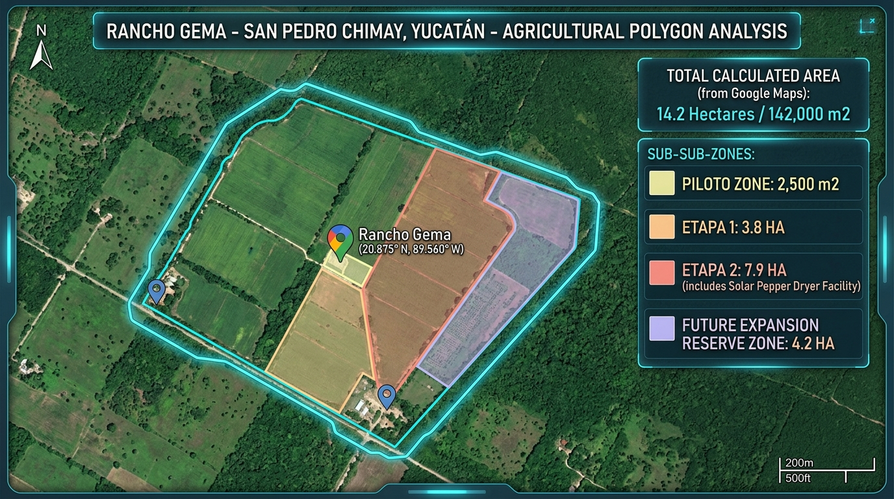
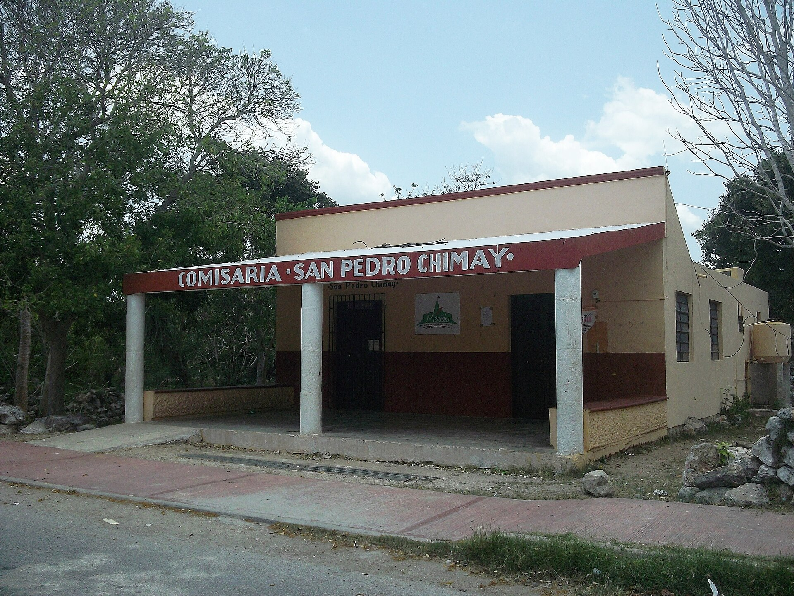
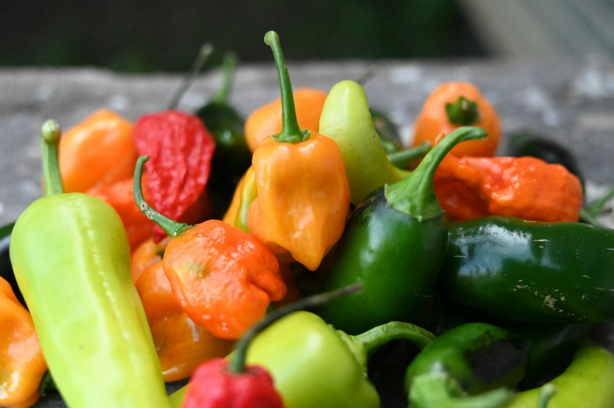
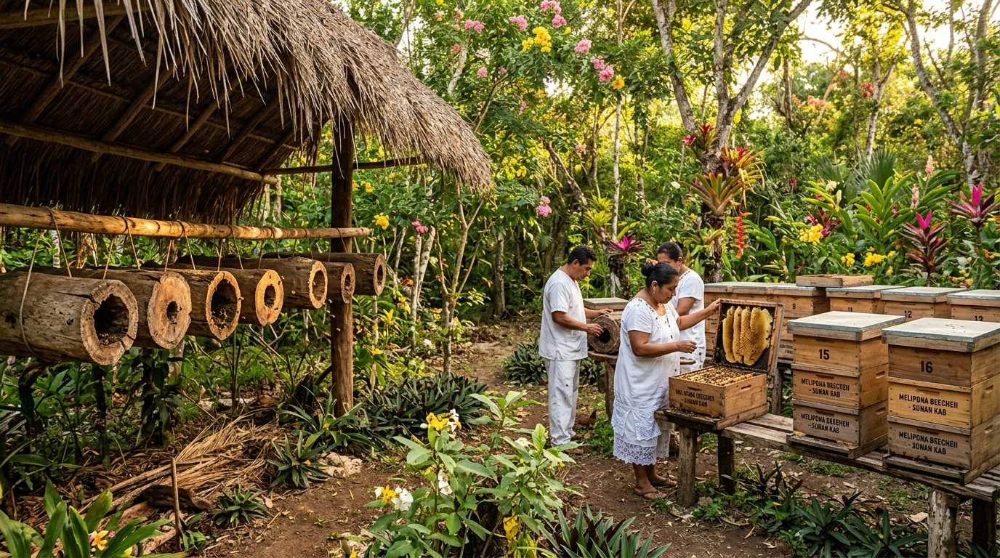
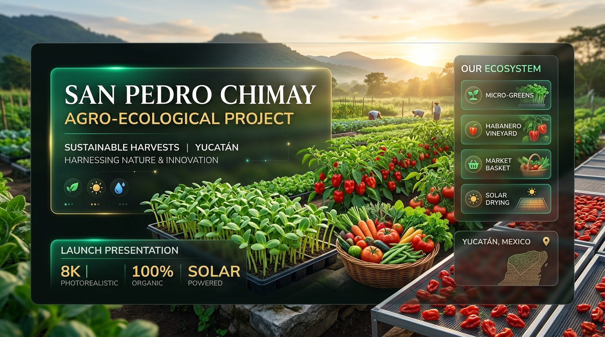
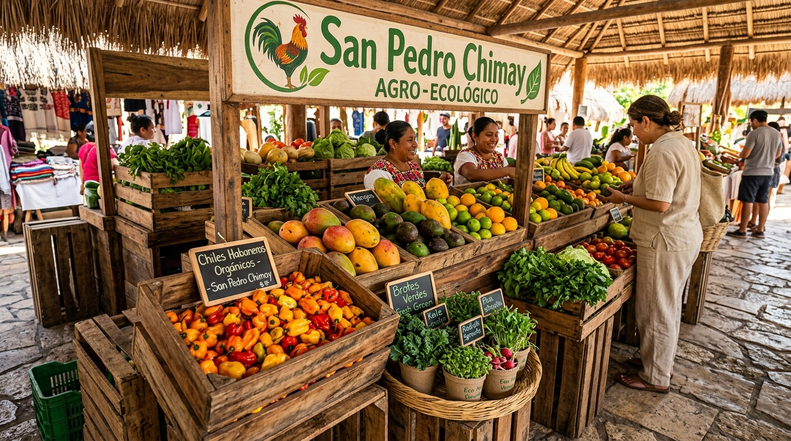

    

        
GEMA AGROECOLOGÍA Proyecto Piloto San Pedro Chimay, Yucatán

        
Plan de Negocios, Modelo Agroecológico &amp; Informe de Evaluación Preliminar de Inversión

        
Con Presupuesto Maestro Detallado, Desglose de Insumos y Costos Operativos Semestrales

    

    

        <table class="ficha-table">
            <thead>
                <tr>
                    <th>Parámetro Técnico</th>
                    <th>Especificación del Proyecto</th>
                </tr>
            </thead>
            <tbody>
                <tr>
                    <td>Estándar Editorial</td>
                    <td>IN2TECHMX Metodología Agéntica de Excelencia (Versión V3.2)</td>
                </tr>
                <tr>
                    <td>Nombre del Proyecto (Preliminar)</td>
                    <td>Gema Agroecología — <em>Denominación preliminar de trabajo; el nombre definitivo se definirá más adelante</em></td>
                </tr>
                <tr>
                    <td>Sede Operativa / Predio Anfitrión</td>
                    <td>Rancho Gema (10.00 HA) | Subcomisaría de San Pedro Chimay, Yucatán</td>
                </tr>
                <tr>
                    <td>Superficie Piloto Activa</td>
                    <td>1.00 Hectárea (10,000 m²) + Invernadero Tecnificado de 200 m²</td>
                </tr>
                <tr>
                    <td>Coordenadas Georreferenciadas</td>
                    <td>20.8750° N, -89.5600° W | Pozo N° 1 (18 m) — Concesión Hídrica: Estatus por confirmar</td>
                </tr>
                <tr>
                    <td>Topografía &amp; Suelo</td>
                    <td>Planicie kárstica (pendiente &lt; 1.5%) · Suelo Luvisol crómico (Kankab) con alta capacidad de retención hídrica</td>
                </tr>
                <tr>
                    <td>Acceso &amp; Logística</td>
                    <td>Carretera pavimentada hasta pie de rancho · 14 km del Periférico de Mérida · 25 min a circuitos gourmet</td>
                </tr>
                <tr>
                    <td>Infraestructura CFE</td>
                    <td>Red de media tensión a 80 m del acceso · Tarifa 09 (Agrícola) en proceso de gestión</td>
                </tr>
                <tr>
                    <td>Presupuesto Total de Arranque</td>
                    <td><strong>$169,273.00 MXN</strong> · CAPEX: $49,273.00 | OPEX 6 Meses: $120,000.00</td>
                </tr>
                <tr>
                    <td>Fecha de Publicación · Versión</td>
                    <td><strong>Septiembre 2026 | Versión V3.2</strong></td>
                </tr>
            </tbody>
        </table>
    

    

        IN2TECHMX Agentic Software &amp; Consulting Group — Documento Maestro
        Depósito Oficial MX-2026-CHIMAY-V3.2 | Edición Controlada
    

    

    

        
Índice General del Documento

        
Gema Agroecología &middot; Proyecto Piloto San Pedro Chimay, Yucatán &middot; Documento Ejecutivo Maestro

    

    <table class="toc-table">
        <tr>
            <td class="toc-num">01</td>
            <td class="toc-t">Carátula, Ficha Técnica Ejecutiva &amp; Localización Georreferenciada
                Identificación del proyecto, misión, zonificación del polígono y estructura de gobierno</td>
            <td class="toc-pg">3</td>
        </tr>
        <tr>
            <td class="toc-num">02</td>
            <td class="toc-t">Resumen Ejecutivo &amp; Modelo de Negocio (Fase Piloto)
                Propuesta de valor, paleta vegetal, 7 canales comerciales y KPIs del piloto</td>
            <td class="toc-pg">6</td>
        </tr>
        <tr>
            <td class="toc-num">03</td>
            <td class="toc-t">Caracterización Edafológica, Climática e Infraestructura Hídrica
                Suelo Luvisol crómico (<em>Kankab</em>), régimen climático, pozo profundo y flora nativa</td>
            <td class="toc-pg">14</td>
        </tr>
        <tr>
            <td class="toc-num">04</td>
            <td class="toc-t">Programa de Apoyos Gubernamentales e Incentivos desde la Fase Piloto
                Arquitectura de fondos y subsidios en los tres órdenes de gobierno</td>
            <td class="toc-pg">17</td>
        </tr>
        <tr>
            <td class="toc-num">05</td>
            <td class="toc-t">Marco Legal, Gobernanza Corporativa &amp; Cumplimiento Patronal IMSS
                Figura societaria S.P.R. de R.L., régimen AGAPES, IMSS, CONAGUA e IMPI</td>
            <td class="toc-pg">20</td>
        </tr>
        <tr>
            <td class="toc-num">06</td>
            <td class="toc-t">Estudio de Mercado, Canales &amp; Comercialización Mérida / Riviera Maya
                Bodas de destino, circuito HORECA, competencia regional y matriz de precios</td>
            <td class="toc-pg">24</td>
        </tr>
        <tr>
            <td class="toc-num">07</td>
            <td class="toc-t">Presupuesto Maestro Detallado ($169,273.00 MXN) &amp; Proyecciones Financieras
                Partidas A a F, catálogo de semillas y modelación a 12 meses en 3 escenarios</td>
            <td class="toc-pg">28</td>
        </tr>
        <tr>
            <td class="toc-num">08</td>
            <td class="toc-t">Hoja de Ruta Estratégica (Roadmap Meses 1 a 24)
                Fases, hitos operativos, Decision Gates y escalamiento modular</td>
            <td class="toc-pg">40</td>
        </tr>
        <tr>
            <td class="toc-num">09</td>
            <td class="toc-t">Matriz de Trazabilidad, Gobernanza de Compras &amp; Proveeduría
                Códigos WBS, niveles de autorización, proveedores homologados y almacén virtual</td>
            <td class="toc-pg">44</td>
        </tr>
    </table>

    

        9 Capítulos &middot; 48 Páginas &middot; Presupuesto $169,273.00 MXN
        Versión V3.2 &middot; Septiembre 2026
    

# CAPÍTULO 1: CARÁTULA, FICHA TÉCNICA EJECUTIVA &amp; LOCALIZACIÓN GEORREFERENCIADA

### 1.1 Identificación del Proyecto, Misión y Predio Anfitrión
Se formaliza la identidad institucional del proyecto y su vinculación operativa con el predio anfitrión:

1. **Nombre del Proyecto (Preliminar):**
   - **Gema Agroecología (Nombre Preliminar):** Denominación operativa preliminar adoptada para las fases de estructuración, viabilidad y puesta en marcha del proyecto piloto en Rancho Gema. Se establece formalmente que este nombre es preliminar y de trabajo; el nombre comercial, identidad de marca y denominación institucional definitiva serán evaluados y definidos más adelante por los socios promotores conforme avance el desarrollo del proyecto.
   - **Misión:** Producir alimentos agroecológicos de manera rentable y regenerativa, rescatando saberes locales y creando un modelo replicable que genere seguridad alimentaria e independencia económica en la región.
   - **Visión:** Ser un referente en la Península de Yucatán en producción agroecológica de especialidad, reconocido por la calidad organoléptica y trazabilidad de sus productos, así como por su labor activa de capacitación y difusión del conocimiento campesino.

2. **Predio Anfitrión / Sede Física:**
   La infraestructura productiva se asienta físicamente en el predio denominado **Rancho Gema**, topado a **10.00 Hectáreas (100,000 m²)**, situado en la Subcomisaría de **San Pedro Chimay** (colindancia municipal con Timucuy), a exactamente 14 kilómetros al sur del anillo periférico de Mérida. Esta cercanía garantiza una ventaja logística insuperable para abastecer en menos de 25 minutos los circuitos gourmet, hoteles boutique y mercados orgánicos de la capital yucateca.

| Parámetro Clave | Especificación Técnica Registrada |
| :--- | :--- |
| **Nombre del Proyecto (Preliminar)** | **Gema Agroecología** *(Nombre preliminar de trabajo; denominación definitiva por definir más adelante)* |
| **Predio Anfitrión / Finca Sede** | **Rancho Gema** |
| **Ubicación Georreferenciada** | 20.8750° N, -89.5600° W (San Pedro Chimay / Timucuy, Yucatán) |
| **Superficie Total del Polígono** | **10.00 Hectáreas (100,000 m²)** *(Topado a 10.00 HA)* |
| **Superficie Unidad Piloto** | **1.00 Hectárea (10,000 m²)** con **Invernadero Tecnificado de 200 m²** |
| **Topografía** | Planicie con ondulaciones kársticas leves (pendiente media < 1.5%) |
| **Acuífero Regional** | Península de Yucatán (Cód. 3105) — Recarga continua, disponibilidad alta |
| **Infraestructura Hídrica** | Pozo Profundo N° 1 (18 m de columna de extracción; nivel freático a 7.2 m) |
| **Concesión Hídrica** | **Estatus por confirmar** *(Estatus administrativo y documental en proceso de validación técnica)* |
| **Acceso Vial** | Pavimentado hasta pie de rancho (Carretera Mérida - Chimay) |
| **Infraestructura Eléctrica** | Red de media tensión CFE a 80 metros del acceso principal |
| **Presupuesto Total de Arranque** | **$169,273.00 MXN** (Inversión Inicial + 6 Meses de Operación) |

    

        
10.00 HA

        
Polígono Total Finca

    

    

        
1.00 HA

        
Unidad Piloto Activa

    

    

        
200 m²

        
Invernadero Tecnificado

    

    

        
18 Metros

        
Pozo Profundo N° 1

    

    

        
        

            Figura 1.1: Polígono Rancho Gema (10.00 HA, San Pedro Chimay)
            Planimetría GIS
        

    

    

        
        

            Figura 1.2: Entorno Paisajístico y Microclima (San Pedro Chimay)
            Reserva Cuxtal
        

    

### 1.2 Zonificación del Polígono Dinámico (10.00 HA Totales)
El desarrollo territorial se planifica en módulos escalables, iniciando con la validación agroecológica dentro del polígono delimitado a 10.00 Hectáreas:

1. **Unidad Piloto Gema Agroecología (1.00 HA / 10,000 m²):** 
   - **Invernadero Tecnificado (200 m²):** Equipado con microaspersión automatizada, estanterías verticales y malla sombra de alta densidad para producción continua de brotes y microgreens los 365 días del año.
   - **Camas Biointensivas de Campo Abierto:** Área de cultivo intensivo en suelo mejorado con riego por goteo para alternancia estacional (invierno / verano).
   - **Nave de Bioinsumos y Compostaje Bocashi:** Módulo de elaboración de enmiendas microbiológicas, biol y biofertilizantes líquidos.
   - **Área de Transformación de Valor Agregado:** Espacio higiénico para deshidratado solar, fermentados y mezclas de sazonadores botánicos.
   - **Bodega de Herramientas e Insumos:** Módulo seguro de almacenamiento y resguardo técnico.
2. **Etapa 1 (3.00 HA):** Área designada para cultivo intensivo a cielo abierto con fertirriego por goteo de Chile Habanero (*Capsicum chinense*) con Denominación de Origen Península de Yucatán, integración de bancales de flores de corte y comestibles de alta gama, establecimiento del Apiario / Meliponario de Abeja Melipona (*Melipona beecheii* / Xunan Kab) para hábitat de polinizadores nativos y miel medicinal, construcción del Módulo de Talleres Agroecológicos y habilitación del Espacio para Food Trucks & "Happenings" Gastronómicos con Chefs.
3. **Etapa 2 (4.50 HA):** Expansión agroforestal, huertos de cítricos y construcción de la Nave Agroindustrial de Deshidratado Solar Pasivo con grado alimenticio AISI 304.
4. **Reserva Ecológica & Amortiguamiento (1.50 HA):** Franja de monte bajo nativo yucateco para preservación de polinizadores nativos (*Melipona beecheii*), barrera rompevientos natural y amortiguamiento biológico (completando exactamente las 10.00 HA totales de Rancho Gema).

### 1.3 Estructura de Gobierno, Liderazgo Operativo & Equipo Clave
El proyecto articula una estructura directiva colegiada y multidisciplinaria que combina experiencia agronómica, visión de negocios, soporte legal y relaciones institucionales:

- **Dirección General (Comité Directivo Colegiado):**
  - **Mecanismo de Gobierno:** Conformada colegiadamente por los socios promotores: **Arturo Arnaiz**, **Arturo de la Barrera** y **Gema Romero**. Las decisiones estratégicas, asignación de presupuestos mayores, compuertas de decisión (Decision Gates para Etapa 1 y 2), alianzas corporativas y endeudamiento o ingreso de capital se resuelven exclusivamente **a discusión y consenso** entre sus integrantes.
- **Gerencia Operativa (Arturo de la Barrera / ID: USR-ABR):**
  - **Experiencia y Credenciales:** Fundador y líder operativo con amplia trayectoria en agricultura biointensiva, permacultura y producción agroecológica; experiencia directa en proveeduría a restaurantes fine-dining (Verdant, Parrilla Paraíso) y proyectos regenerativos de escala internacional (Playa Viva, MUSA); especialista en diseño de paleta vegetal, microgreens para alta cocina y capacitación técnica.
  - **Alcance y Funciones:** Liderazgo técnico y agronómico en campo, diseño y rotación de camas biointensivas, operación continua del invernadero de 200 m², control estricto de inocuidad y bioinsumos (Bocashi/bioles), supervisión directa del personal de campo y aprendices, y conducción de talleres prácticos y diplomados agroturísticos.
- **Dirección de Negocios & Estrategia Tecnológica (Arturo Arnaiz / ID: USR-AAA):**
  - **Modalidad Operativa:** Conducción estratégica **a distancia / remota (radicando fuera de México)**.
  - **Alcance y Funciones:** Conducción de la estrategia comercial y macro-financiera del proyecto; prospección, negociación y cierre de cuentas clave B2B (restaurantes HORECA de alta gama, banquetes, Wedding Planners y tiendas gourmet); arquitectura, despliegue y administración del Centro de Operaciones Web SaaS IN2TECHMX y plataforma e-commerce; modelación financiera, control de flujo de caja, planeación de costos y gestión de financiamientos privados y bancarios.
- **Dirección Legal y Relaciones Públicas (Gema Romero / ID: USR-GRO):**
  - **Alcance y Funciones:** Estructuración y formalización societaria (protocolización de la S.P.R. de R.L. y asambleas); regularización y seguimiento de la concesión hídrica del Pozo N° 1 ante CONAGUA; gestión del Registro Patronal y cumplimiento de seguridad social ante el IMSS Subdelegación Mérida Sur; blindaje de propiedad intelectual y registro de marca ante el IMPI; gestión integral, tramitación y seguimiento de programas de apoyo y subsidios gubernamentales (SADER, SEDER, Círculo 47, SEMUJERES, Jóvenes Construyendo el Futuro y Bienestar); vinculación institucional y relaciones públicas con autoridades gubernamentales, comisarías locales (San Pedro Chimay / Timucuy), haciendas henequeneras y actores clave del ecosistema peninsular.
- **Célula de Integración Operativa Financiera y Tesorería Local (Gema Romero & Arturo de la Barrera):**
  - **Mecanismo Operativo:** Dado que la Dirección de Negocios opera a distancia desde el extranjero, la ejecución financiera física y tesorería en México se articula en estrecha colaboración entre Gema Romero y Arturo de la Barrera, respaldada por la visibilidad y auditoría en tiempo real del SaaS IN2TECHMX:
    - *Gema Romero:* Gestión de cuentas bancarias en México, transferencias bancarias institucionales, pagos a proveedores mayores, dispersión de nómina formal IMSS y control fiscal-administrativo.
    - *Arturo de la Barrera:* Custodia y administración de caja chica operativa en finca, dispersión de raya semanal a jornaleros locales de campo, compras directas de mostrador de insumos menores en Mérida/Chimay y comprobación semanal de gastos.
- **Jornalero Agrícola Local (San Pedro Chimay / Timucuy):**
  - **Alcance y Funciones:** Labores físicas de campo, preparación de camas de cultivo, siembra, riego, mantenimiento del invernadero, deshierbe manual y apoyo en cosecha y selección bajo los estándares del proyecto (40 horas semanales cubiertas en el presupuesto operativo).

---

# CAPÍTULO 2: RESUMEN EJECUTIVO & MODELO DE NEGOCIO (FASE PILOTO)

> **Nota de Alcance y Gobernanza Operativa:** Todo lo estipulado en este capítulo, así como las metas productivas y financieras iniciales de este documento, corresponde estrictamente a la **FASE PILOTO** del proyecto. La operación se concentra en una **Unidad Piloto Activa de 1.00 HA** a campo abierto y un **Invernadero Tecnificado de 200 m²** dentro del polígono delimitado de 10.00 HA de Rancho Gema (San Pedro Chimay). La expansión hacia las etapas subsecuentes (Etapa 1: Habanero 3.00 HA y Etapa 2: Agroforestal y Cítricos 4.50 HA) se ejecutará de forma modular una vez validados los indicadores agronómicos, financieros y comerciales de este piloto.

### 2.1 La Tesis de Inversión y Propuesta de Valor (Fase Piloto)
El proyecto se centra en resolver una necesidad crítica del ecosistema gastronómico y comunitario de la Península de Yucatán: la alta dependencia de hortalizas, hojas finas y brotes transportados desde el centro del país (con deterioro en frescura, vida de anaquel y una severa huella de carbono logística).

**Propuesta de Valor de Gema Agroecología (Nombre Preliminar):**
Producción local en San Pedro Chimay de hortalizas gourmet, brotes vivos, flores comestibles y productos transformados de excepcional frescura y valor nutricional, cultivados bajo principios de agricultura regenerativa y biointensiva. Se ofrece a los clientes un producto cosechado a menos de 25 minutos del centro de Mérida y con enlace expedito a la Riviera Maya, garantizando trazabilidad total, cero agroquímicos de síntesis y autenticidad peninsular.

**Objetivos Estratégicos de la Fase Piloto (Horizonte 12 Meses):**
1. **Validación Agronómica y Resiliencia:** Validar la productividad y los ciclos biológicos de la paleta vegetal en el suelo Luvisol crómico (*Kankab*) bajo el régimen bimodal de Yucatán (invierno fresco y verano cálido-húmedo).
2. **Punto de Equilibrio Operativo:** Alcanzar el punto de equilibrio financiero estimado entre el Mes 3 y el Mes 9 según el escenario modelado (Mes 5 en el escenario base).
3. **Diversificación Comercial sin Concentración:** Validar tracción comercial en 7 canales complementarios (HORECA, mercados regionales especializados, venta por internet [web y redes sociales], venta de boca en boca/comunitaria, experiencias turísticas, banquetes y eventos sociales con Wedding Planners, y eventos gastronómicos pop-up en finca).

    

        MODELO MULTIDIMENSIONAL INTEGRADO — GEMA AGROECOLOGÍA (FASE PILOTO)
    

    

        

            
Pilar 1: Fresco & Brotes Vivos

            
Producción Continua 365 Días

            <ul>
                <li>Invernadero de 200 m² tecnificado</li>
                <li>1.00 HA biointensiva a campo abierto</li>
                <li>Microgreens y germinados (ciclos 8-12 días)</li>
                <li>Hojas finas, raíces baby y flores comestibles</li>
            </ul>
        

        

            
Pilar 2: Valor Agregado

            
Cero Merma & Alta Rentabilidad

            <ul>
                <li>Deshidratados solares pasivos grado inox</li>
                <li>Fermentos vivos artesanales (chucrut, encurtidos)</li>
                <li>Sazonadores botánicos con sal marina de Celestún</li>
                <li>Conservación en aceites botánicos con hierbas finas</li>
            </ul>
        

        

            
Pilar 3: Turismo & Saberes

            
Biocultura & Divulgación

            <ul>
                <li>Recorridos vivenciales agroturísticos en finca</li>
                <li>Experiencias gastronómicas "De la Mata a la Mesa"</li>
                <li>Talleres de huerto biointensivo y Bocashi</li>
                <li>Atracción de turismo regenerativo y escuelas</li>
            </ul>
        

    

    
▼

    

        

            Pilar 4: Absorción Comercial Omnicanal de Alta Gama (7 Canales Sinérgicos)
            Flujo Semanal Continuo
        

        

            <strong>1. HORECA Alta Gama:</strong> Restaurantes de autor y hoteles boutique en Mérida y Riviera Maya. 
            <strong>2. Mercados Regionales:</strong> Slow Food Mérida, Tianguis Agroecológico y ferias gourmet de fin de semana. 
            <strong>3. Venta por Internet:</strong> Tienda en línea oficial integrada al SaaS IN2TECHMX con pasarela SPEI/tarjetas y redes sociales. 
            <strong>4. Redes Comunitarias:</strong> Suscripciones directas de boca en boca para canastas familiares vía WhatsApp y Telegram. 
            <strong>5. Experiencias Turísticas:</strong> Boletos de agroturismo vivencial y reservas directas en finca. 
            <strong>6. Banquetes & Wedding Planners:</strong> Flores comestibles, brotes vivos y mixología botánica para bodas en haciendas henequeneras. 
            <strong>7. Eventos Propios Pop-Up:</strong> Cenas maridaje campestres con chefs invitados y dinámicas culinarias exclusivas.
        

    

### 2.2 Desglose de la Paleta Vegetal y Líneas de Producto de la Fase Piloto

#### 1. Producción en Fresco Adaptada al Clima de Yucatán (1.00 HA Piloto)
Se estructura una estrategia de rotación vegetal con dos temporadas de siembra bien delimitadas para responder al clima cálido-subhúmedo peninsular:

- **Temporada de Invierno (Octubre a Febrero):**
  La ventana climatológica ideal en Yucatán, donde el descenso térmico nocturno permite el pleno desarrollo de hojas gourmet y raíces finas:
  - *Hortalizas de Hoja Gourmet:* Lechuga de especialidad (hoja de roble, sangría, francesa), acelga arcoíris, espinaca baby, mostazas asiáticas (*mizuna*, *tatsoi*), rúcula silvestre y kale rizado/toscano.
  - *Hortalizas de Raíz:* Zanahoria multicolor baby, betabel de mesa y rábanos finos.
  - *Leguminosas:* Chícharo dulce (*sugar snap*) y haba tierna.
  - *Flores Comestibles:* Caléndula, pensamiento, capuchina y borraja (cultivadas con protección solar parcial).

- **Temporada de Verano (Marzo a Septiembre):**
  Aprovecha el calor y la alta insolación para frutos tropicales y cultivos resilientes:
   - *Frutos:* Jitomate (variedades adaptadas al trópico), pepino persa y europeo, calabacita tierna, chile habanero regional seleccionado, sandía y melón en camas acolchadas.
   - *Cultivos Nativos y Resilientes:* Amaranto para verdura y grano, quintonil, verdolaga criolla, chaya maya y nopal verdura.

    
    

        Figura 2.1: Cultivo Biointensivo de Chile Habanero Regional (Capsicum chinense con DO Yucatán)
        Calidad Gourmet de Exportación
    

- **Producción Continua los 365 Días (Invernadero Tecnificado de 200 m²):**
  Con humedad relativa, microaspersión y sombreado regulado, el invernadero funciona como el generador ininterrumpido de flujo de caja semanal:
  - *Brotes y Microgreens de Especialidad:* Girasol negro, rábano *Daikon*, mostaza roja, chícharo verde, trigo verde (*wheatgrass*), amaranto rojo y alfalfa.
  - Cosechas semanales ultrarrápidas (ciclos de 8 a 12 días) comercializadas vivas en charolas forrajeras de 50 cm y en empaques biodegradables ventilados.

#### 2. Línea de Transformación Agroindustrial (Valor Agregado)
Para maximizar el rendimiento por metro cuadrado y erradicar mermas de campo:
- **Deshidratados Solares:** Jitomate deshidratado conservado en aceite de oliva virgen con hierbas de la huerta, hojuelas de chile habanero seco y hierbas aromáticas deshidratadas (orégano de monte, albahaca, romero).
- **Fermentados Vivos Artesanales:** Chucrut vivo no pasteurizado, escabeches tradicionales y encurtidos agridulces de hortalizas y chiles de la región.
- **Sazonadores Botánicos:** Sales marinas peninsulares (Celestún / Las Coloradas) infusionadas con hierbas aromáticas deshidratadas, pétalos de flores comestibles y pimienta gorda de Tabasco.

#### 3. Experiencias Turísticas, Agroturismo, Talleres & Happenings Gastronómicos
Aprovechando la ubicación estratégica de San Pedro Chimay (a escasos minutos del Anillo Periférico de Mérida y su zona metropolitana), este pilar transforma la finca en un centro vivo de experiencia, divulgación y gastronomía regenerativa de alto impacto:
- **Agroturismo y Recorridos Vivenciales:** Visitas guiadas para turistas nacionales, extranjeros y escuelas sobre agricultura regenerativa en el suelo pedregoso de Yucatán, historia de los cultivos mayas y manejo del agua en cenotes y pozos kársticos.
- **Experiencias "De la Mata a la Mesa":** Cosecha personal guiada donde los visitantes recolectan hortalizas, flores y brotes para degustar in situ o preparar alimentos en dinámicas gastronómicas de campo.
- **Módulo de Talleres Prácticos y Escuela de Campo:** Espacio pedagógico rústico bioclimático equipado para talleres vivenciales impartidos por Arturo de la Barrera y especialistas invitados sobre cultivo biointensivo en suelo Kankab, huertos familiares urbanos, bioinsumos fermentados (Bocashi), manejo agroecológico de plagas y meliponicultura maya.
- **Espacio para Food Truck & "Happenings" Gastronómicos con Chefs:** Explanada ajardinada sombreada con vegetación nativa y dotada de acometidas sustentables de agua y energía, concebida para la instalación rotativa de Food Trucks gourmet, pop-ups de restaurantes de Mérida y la Riviera Maya, residencias culinarias efímeras con reconocidos Chefs de autor ("Farm Dinners"), maridajes botánicos y eventos híbridos culturales-market-happenings (mercado agroecológico, música acústica, catas de miel melipona y comida de campo). Representa una unidad de negocio de alto margen con cobro 100% de contado vía boletaje y consumos directos.

### 2.3 Estrategia Comercial y Canales de Venta Diversificados (Fase Piloto)

Para garantizar la viabilidad y resiliencia financiera de la Fase Piloto, la comercialización no depende de un solo nicho, sino que se articula en **7 canales complementarios de alta absorción**:

| Canal Comercial | Segmento Objetivo | Dinámica Operativa | Margen / Plazo de Cobro |
| :--- | :--- | :--- | :--- |
| **1. Hoteles y Restaurantes (HORECA Alta Gama)** | Restaurantes de autor, bistrós gourmet y hoteles boutique en Mérida y Riviera Maya | Pedidos semanales programados vía catálogo digital; entrega matutina de microgreens en raíz viva, flores comestibles y hortalizas baby cosechadas al día. | Alta recurrencia; crédito a 7-15 días o pago contra entrega; consolidación de marca. |
| **2. Mercados Especializados en Productos Regionales** | Consumidores conscientes, residentes extranjeros (*expats*) y público local gourmet | Puesto propio o en alianza en mercados especializados (ej. Slow Food Mérida, Tianguis Agroecológico, ferias artesanales regionales). | Margen minorista 100% íntegro; cobro inmediato en efectivo/terminal móvil; contacto directo. |
| **3. Venta por Internet (Web E-Commerce & Redes Sociales)** | Clientes digitales en Mérida (frescos) y a nivel nacional (productos de valor agregado) | Tienda en línea oficial integrada al Centro de Operaciones Web IN2TECHMX con pasarela de pago (tarjeta/SPEI), catálogo digital interactivo, tienda en Instagram Shopping / Facebook Shops y venta de "Cajas Agroecológicas" por suscripción. | Cobro anticipado 100% digital; alto ticket promedio mediante combos; envíos locales programados y paquetería nacional para deshidratados/sales. |
| **4. Venta Directa de Boca en Boca & Redes Comunitarias** | Familias, círculos vecinales y consumidores locales por recomendación | Grupos dedicados de WhatsApp, canales de Telegram y recomendaciones comunitarias; pedidos directos de canastas familiares y atención personalizada persona a persona. | Cobro anticipado o contra entrega (SPEI / efectivo); máxima fidelización comunitaria y cero comisiones. |
| **5. Experiencias Turísticas (Agricultura en la Región)** | Turistas interesados en ecoturismo, agroturismo, cultura gastronómica maya y familias | Recorridos vivenciales programados por reservación directa web o plataformas (Airbnb Experiences, operadores turísticos sustentables); actividades de campo y degustación. | Cobro previo 100%; alto margen por boleto/paquete; tracción de venta cruzada de productos en finca. |
| **6. Banquetes, Eventos & Wedding Planners (Bodas en Haciendas)** | Wedding planners de élite, firmas de banquetería/catering y recintos históricos de eventos en Yucatán (Hacienda Chimay, Tahdzibichén, Teya, etc.) | Proveeduría B2B programada por evento: flores comestibles para emplatados de gala, flores de corte y follajes nativos para centros de mesa bioculturales, microgreens vivos, botánicos frescos para coctelería/mixología de autor y *wedding favors* (mini-frascos de miel melipona y sales botánicas de Celestún). | Contratación por evento con anticipos del 50% al 100%; alto ticket promedio por fecha; recurrencia en temporadas de bodas (octubre a mayo); cero merma al producirse sobre pedido confirmado. |
| **7. Eventos Gastronómicos Propios, Pop-Ups & Cenas Maridaje** | Comensales gourmet, entusiastas de la gastronomía y empresas para eventos privados en finca | Cenas maridaje con chefs invitados en la huerta, experiencias efímeras "Farm-to-Table" y renta del espacio campestre de Rancho Gema para dinámicas gastronómicas exclusivas. | Venta directa de boletos por reservación anticipada y facturación por evento privado; altísimo margen y proyección mediática de marca. |

### 2.4 Matriz de Metas e Indicadores Clave de Desempeño (KPIs de Fase Piloto)
- **Superficie Activa:** 1.00 HA a campo abierto + 200 m² de invernadero continuo (dentro del polígono de 10.00 HA de Rancho Gema).
- **Clientes HORECA Consolidados:** Cartera base de 5 a 8 restaurantes / hoteles boutique recurrentes al mes 10.
- **Alianzas con Wedding Planners & Banqueteros:** Convenios de proveeduría activa con al menos 3 a 5 coordinadores de bodas y banqueteros de la región, promediando de 2 a 4 eventos atendidos mensualmente para el mes 8.
- **Venta por Internet y Redes Sociales:** 30 a 50 órdenes y suscripciones mensuales procesadas vía tienda web y redes sociales al mes 8.
- **Suscripciones de Venta Directa Comunitaria:** 25 a 40 familias recurrentes vía WhatsApp/Telegram para el mes 8.
- **Presencia en Mercados Regionales:** Asistencia constante semanal o quincenal en al menos 1 mercado especializado consolidado.
- **Eventos y Experiencias Turísticas:** 2 eventos o talleres vivenciales mensuales a partir del mes 4.
- **Punto de Equilibrio (Break-even):** Alcanzado entre el Mes 3 y el Mes 9 según el escenario modelado (Mes 5 en el escenario base) con una facturación que cubra la nómina de campo, insumos y mantenimiento.

### 2.5 Secuencia Lógica y Hoja de Ruta Modular (Piloto → Etapa 1 → Etapa 2)

El desarrollo agronómico y comercial de **Gema Agroecología (Nombre Preliminar)** no se concibe como un gasto de capital especulativo, sino como una **secuencia lógica escalonada y progresiva regida por compuertas de decisión (Decision Gates)**:

    

        SECUENCIA LÓGICA ESCALONADA & HOJA DE RUTA MODULAR
    

    <!-- PASO 1: FASE PILOTO -->
    

        
PILOTO

        

            

                Fase Piloto — Laboratorio Agronómico y Comercial (1.00 HA + 200 m² Invernadero)
                6 Meses
            

            

                Descubrir cultivos y variedades óptimas para suelo Luvisol crómico (<em>Kankab</em>) y microclima de Chimay; validar rotación biointensiva, costos reales y tracción en los 7 canales comerciales. 
                <strong>Meses 4 a 6:</strong> Charlas, mesas de trabajo y acuerdos societarios del Comité para estructurar técnica y presupuestalmente la Etapa 1.
            

        

    

    
▼

    <!-- GATE 1 -->
    

        
GATE 1

        

            

                Decision Gate 1 — Evaluación Colegiada del Piloto & Autorización de Etapa 1
                Hito Mes 6
            

            

                Sesión plenaria del Comité de Dirección General a discusión y consenso. Auditoría de rendimientos reales en campo, márgenes comerciales por canal y conciliación de caja. Aprobación oficial del plan de expansión, mezcla definitiva de cultivos (<em>crop mix</em>) y presupuesto de Etapa 1.
            

        

    

    
▼

    <!-- PASO 2: ETAPA 1 -->
    

        
ETAPA 1

        

            

                Etapa 1 — Escalamiento Técnico, Flores, Meliponario y Consolidación
                Meses 7 a 24
            

            

                Superficie calibrada en campo (hasta 3.00 HA); bancales de flores de especialidad (corte y comestibles para bodas en haciendas); instalación del Apiario/Meliponario tradicional y tecnificado (<em>Melipona beecheii</em> / Xunan Kab); formalidad legal plena (S.P.R. de R.L.) y absorción de apoyos gubernamentales (SEDER/IYEM/STPS); despliegue de paquetes turísticos y academia campesina.
            

        

    

    
▼

    <!-- GATE 2 -->
    

        
GATE 2

        

            

                Decision Gate 2 — Auditoría de Consolidación y Viabilidad de Expansión Mayor
                Hito Mes 24
            

            

                Evaluación integral de dominio técnico agronómico, rentabilidad neta acumulada y canales B2B consolidados. Dictamen colegiado sobre la conveniencia y viabilidad de transitar a la escala multi-hectárea.
            

        

    

    
▼

    <!-- PASO 3: ETAPA 2 -->
    

        
ETAPA 2

        

            

                Etapa 2 — Expansión Multi-Hectárea, Agroforestería y Prospección Internacional
                Año 3+
            

            

                Ampliación de superficie a 4.50 HA adicionales (completando las 10.00 HA de Rancho Gema); huertos de cítricos e integración al programa Sembrando Vida; construcción de nave agroindustrial grado alimenticio AISI 304; exportación de chile habanero y derivados con DO a la Unión Europea, EE. UU. y Asia.
            

        

    

#### 1. Visión Fundamental de la Fase Piloto (El Laboratorio Agronómico y Comercial de 6 Meses)
- **Propósito Central:** Operar como un laboratorio vivo de validación técnica en campo con una duración estricta de **6 meses** sobre la superficie delimitada de **1.00 HA activa** y el **invernadero tecnificado de 200 m²**, respaldada por el presupuesto inicial de capital de trabajo ($120,000.00 MXN para nómina de 6 meses).
- **Descubrimiento y Selección Varietal:** Identificar con rigor científico qué cultivos, hortalizas de hoja, raíces, frutos, flores comestibles y microgreens se adaptan de forma óptima a las condiciones específicas del entorno de Rancho Gema: el suelo Luvisol crómico (*Kankab*), la pedregosidad local, la alcalinidad y mineralización del agua de pozo kárstico, y las fluctuaciones térmicas y de humedad de San Pedro Chimay.
- **Validación del Modelo Económico:** Medir en campo rendimientos por metro cuadrado, costos unitarios de insumos y biopreparados, tiempos de cosecha, vida de anaquel y la respuesta comercial real en los 7 canales de venta.
- **Ventana de Diálogo Estratégico (Meses 4 a 6):** Dado que la Fase Piloto concluye al Mes 6, las conversaciones, acuerdos societarios, dimensionamiento agronómico y planeación presupuestal para iniciar la **Etapa 1** deben sostenerse formalmente entre el **Mes 4 y el Mes 6** en el seno del Comité de Dirección General, permitiendo una transición inmediata y sin baches operativos hacia el Mes 7.

#### 2. Transición y Activación de la Etapa 1 (Meses 7 a 24)
- **Criterio de Activación:** Concluidos los 6 meses del Piloto y alcanzado el consenso en el **DECISION GATE 1 (Mes 6)**, se activa formalmente la **Etapa 1** del proyecto a partir del **Mes 7**.
- **Determinación del Tamaño Óptimo y Mezcla de Cultivo:** La experiencia empírica del piloto permitirá pasar de la hectárea experimental a determinar con precisión matemática:
  - La superficie cultivable óptima para la Etapa 1 (calibrando y optimizando la proyección inicial de 3.00 HA).
  - La mezcla de cultivos (*crop mix*) de mayor margen comercial y estabilidad biológica.
  - El diseño definitivo de camas biointensivas, sistemas de riego tecnificado y calendarios de rotación y asociación vegetal.
- **Siembra de Flores de Especialidad (Corte y Comestibles):**
  Integración sistemática en la Etapa 1 de bancales de flores de corte (para surtido exclusivo a organizadores de eventos, banquetes y bodas boutique en las haciendas henequeneras y recintos de San Pedro Chimay) y flores comestibles finas (pensamiento, caléndula, capuchina, borraja, cempasúchil/tagetes, flor de mayo y albahaca morada). Esta línea responde a la creciente demanda insatisfecha en la alta gastronomía y coctelería de autor de Mérida y la Riviera Maya, capturando márgenes excepcionales por metro cuadrado cultivado y diversificando los flujos de ingreso.
- **Establecimiento del Apiario / Meliponario de Abeja Melipona (*Melipona beecheii* / Xunan Kab):**
  Instalación estratégica de un meliponario tradicional y tecnificado (*hobones* tradicionales y cajas racionales tecnificadas tipo INPA) con colmenas de la abeja sagrada maya sin aguijón (*Melipona beecheii*), fundamentado en una triple sinergia de alto valor:
  - *Fomento y Restauración del Hábitat de Polinizadores Nativos:* Restaurar y proteger las poblaciones de polinizadores endémicos del Mayab en colindancia con la franja de amortiguamiento y la Reserva Ecológica Cuxtal. La polinización especializada por vibración (*buzz pollination*) de las abejas meliponas incrementa exponencialmente el cuajado floral, calibre, uniformidad y rendimiento por planta en el cultivo de Chile Habanero (*Capsicum chinense*), jitomates y cucurbitáceas.
  - *Línea Comercial Ultra-Premium de Miel Medicinal y Subproductos:* Cosecha anual de miel virgen de melipona, reconocida por sus extraordinarias cualidades antimicrobianas, cicatrizantes, oftalmológicas y antioxidantes, comercializada en nichos gourmet, boticas orgánicas y spas boutique a valores de mercado entre **$1,200.00 y $2,500.00 MXN por litro** (o presentaciones fraccionadas de 30 a 50 ml a $150.00 – $250.00 MXN).
  - *Ancla Biocultural y Agroturística de Diferenciación:* El meliponario se consolida como el atractivo estelar de los recorridos vivenciales y talleres agroturísticos ("El Santuario de la Xunan Kab"), posicionando a Rancho Gema como un referente biocultural del rescate de la meliponicultura maya tradicional y la agroecología regenerativa.

    
    

        Figura 2.2: Meliponario Agroforestal Tradicional y Tecnificado (Melipona beecheii / Xunan Kab)
        Polinización Endémica & Miel Medicinal de Alta Gama
    

- **Determinación Presupuestal Precisa:** Con los costos de producción reales obtenidos en el piloto, se determinará el monto económico exacto de inversión (CAPEX y OPEX) requerido para ejecutar la Etapa 1 sin desvíos presupuestales.
- **Formalidad Administrativa, Legal y Bancaria:** Para este momento, el proyecto Gema Agroecología contará con la estructura institucional y legal plenamente consolidada:
  - Constitución protocolizada de la figura moral adecuada (S.P.R. de R.L. o mercantil).
  - Registro Federal de Contribuyentes (RFC) y Registro Patronal formal ante el IMSS (Subdelegación Mérida Sur).
  - Regularización plena y título de concesión hídrica en regla ante la CONAGUA.
  - Cuentas bancarias de persona moral y estados financieros auditables.
- **Estructuración Financiera Híbrida Eficiente:**
  La formalidad administrativa y jurídica es el requisito indispensable que habilita al proyecto para gestionar y recibir recursos institucionales, permitiendo conformar una **mezcla financiera altamente eficiente de Capital Propio y Recursos provenientes de Apoyos Sectoriales**:
  - *Apoyos y Subsidios Gubernamentales:* Programas de fomento de la SADER, Secretaría de Desarrollo Rural de Yucatán (SEDER), fondos de concurrencia y programas de tecnificación hidroagrícola.
  - *Banca de Desarrollo y Crédito de Fomento:* Fideicomisos Instituidos en Relación con la Agricultura (FIRA) y banca comercial agropecuaria para créditos de avío y refaccionarios en condiciones preferenciales.
  - *Optimización de Riesgo:* Esta combinación minimiza la carga de deuda de los socios fundadores y potencia el rendimiento sobre el capital aportado.

#### 3. Evaluación, Dominio y Evolución hacia la Etapa 2 (Expansión Multi-Hectárea y Mercados Globales)
- **Criterio de Prudencia y Viabilidad Económica:** La transición a la Etapa 2 no es automática; se evaluará formalmente si es prudente y económicamente viable una vez que la Etapa 1 haya sido plenamente ejecutada y dominada (con rendimientos agrícolas estables, flujo operativo positivo y canales de distribución locales consolidados).
- **Expansión de Superficie Cultivable:** Se expandirán las extensiones cultivables a más hectáreas, aprovechando la totalidad del predio de 10.00 HA de Rancho Gema y explorando, de ser pertinente, predios contiguos o esquemas de aparcería agroecológica en la microrregión.
- **Prospección y Apertura de Mercados de Exportación:**
  Con volúmenes consolidados y certificaciones orgánicas / inocuidad:
  - *Mercados Internacionales de Alto Rendimiento:* Prospección hacia la **Unión Europea (UE), Estados Unidos (EE. UU.) y Asia**, donde los productos agroecológicos y gourmet peninsulares cotizan con primas de precio sustanciales frente al mercado doméstico.
  - *Caso Especial - Chile Habanero de la Península de Yucatán:* Explotación comercial en fresco premium, deshidratado en hojuelas, pasta pura y subproductos derivados amparados bajo la **Denominación de Origen**, respondiendo a la creciente demanda internacional por picantes auténticos de alta pungencia y sabor.
  - *Líneas de Valor Agregado Exportables:* Deshidratados solares de alta gama, sazonadores botánicos y polvos nutricionales con prolongada vida de anaquel.

#### 4. Maduración de Líneas de Negocio Conexas durante las Etapas 1 y 2
Al consolidarse la actividad principal de cultivo agroecológico, maduran simultáneamente las unidades de negocio conexas, generando flujos de caja adicionales de alto margen:
- **Academia, Clases y Talleres de Formación:**
  Transición hacia un programa académico estructurado: cursos y diplomados presenciales de agricultura biointensiva tropical, diseño de permacultura, biopreparados campesinos y gastronomía viva para profesionales del sector restaurantero, estudiantes y productores.
- **Venta de Experiencias en Paquetes Turísticos:**
  Comercialización estructurada de experiencias agroturísticas en paquetes integrados en alianza con agencias y turoperadores receptivos (recorridos bioculturales, visitas temáticas "de la semilla al plato", talleres vivenciales y eventos gastronómicos privados).
- **Integración de Personal y Pasantías con Apoyos Sectoriales al Empleo Agropecuario:**
  - Vinculación institucional con universidades e institutos tecnológicos (UADY, Tecnológico de Conkal, Universidad Marista) para esquemas de residencia profesional, servicio social y pasantías formativas en campo.
  - Incorporación a programas gubernamentales de fomento al primer empleo y capacitación laboral rural (ej. Jóvenes Construyendo el Futuro, programas de subsidio al empleo agropecuario), profesionalizando el equipo operativo local y reduciendo sustancialmente el costo neto de nómina de campo.

---

# CAPÍTULO 3: CARACTERIZACIÓN EDAFOLÓGICA, CLIMÁTICA E INFRAESTRUCTURA HÍDRICA

### 3.1 Caracterización del Suelo Luvisol Crómico (Kankab)
Los suelos de Rancho Gema en San Pedro Chimay corresponden a la serie **Luvisol Crómico** (*Kankab* maya), caracterizados por su tonalidad rojiza, contenido arcilloso fértil y drenaje óptimo sobre sustrato calcáreo.

- **Profundidad Efectiva:** De 30 a 60 cm en las áreas seleccionadas para las camas biointensivas.
- **Materia Orgánica Basal:** 2.40%, proyectándose elevarla al 4.50% en el primer ciclo mediante la incorporación de compost Bocashi y acolchados vegetales.
- **pH:** Ligeramente alcalino (7.4 a 7.7), neutralizado biológicamente con abonos fermentados y ácidos húmicos derivados de lombricompostaje.

### 3.2 Condiciones Climáticas y Radiación Fototérmica
- **Clima:** Cálido subhúmedo (Aw0) con temperatura media anual de 26.8°C.
- **Aprovechamiento Estacional:** La clara división entre el periodo fresco (octubre-febrero) y el periodo cálido-húmedo (marzo-septiembre) se aprovecha mediante la paleta vegetal dual de Gema Agroecología (Nombre Preliminar).
- **Insolación:** Radiación solar promedio de 5.8 kWh/m²/día, excelente para la fotosíntesis y el secado de productos deshidratados.

### 3.3 Infraestructura Hídrica y Bombeo Agrícola
- **Pozo N° 1:** Perforado a 18 metros con espejo de agua a 7.2 metros, alimentado por el generoso acuífero kárstico de la Península de Yucatán.
- **Estatus Legal de la Concesión:** *Estatus por confirmar* (en proceso de integración y validación documental ante CONAGUA, según resolución LOG-03).
- **Bomba de Extracción:** Bomba sumergible de 7.5 HP con gasto nominal de 6.5 L/s, suficiente para abastecer el invernadero de 200 m² y la hectárea de cultivo por goteo con tan solo 45 minutos de bombeo diario.
- **Tarifa Eléctrica CFE 09:** Esquema subvencionado para uso agrícola que reduce el costo de energía a ~$0.85 MXN/kWh.

    
    

        Figura 3.1: Invernadero Tecnificado de 200 m² (Microgreens & Hortalizas Baby)
        Producción Ininterrumpida 365 Días
    

    
Síntesis Edafológica e Hidroagrícola (Rancho Gema, Chimay)

    

        Suelo <strong>Luvisol Crómico (Kankab)</strong> con 30-60 cm de profundidad efectiva enriquecido con compost Bocashi; <strong>Pozo N° 1 a 18 metros</strong> (espejo a 7.2 m) con bomba sumergible de 7.5 HP (6.5 L/s) que abastece el riego biointensivo en solo 45 minutos diarios; insolación de 5.8 kWh/m²/día óptima para fotosíntesis y deshidratado solar grado alimenticio.
    

### 3.4 Flora Nativa, Especies Pioneras y Cultivos de Fácil Arraigo en el Suelo Kankab

Para maximizar el éxito agronómico de la **Fase Piloto** y reducir la vulnerabilidad frente al clima y el estrés hídrico peninsular, el diseño productivo integra de manera prioritaria especies nativas y naturalizadas del Mayab. Estas plantas crecen con vigor natural en el suelo Luvisol crómico (*Kankab*) y sobre la roca calcárea (*Tzek'el*), exigiendo una inversión mínima en insumos externos:

#### 1. Hojas Comestibles y Quelites Tradicionales del Mayab (Cero Merma y Rusticidad Plena)
- **Chaya Mansa (*Cnidoscolus aconitifolius*):** El superalimento peninsular por excelencia. Arbusto perenne de enraizamiento profundo en sustrato rocoso, inmune a plagas locales, sin requerimiento de fertilizantes sintéticos y con producción continua de biomasa foliar de altísimo valor nutricional (hierro, calcio y proteína vegetal). Demanda sostenida en el circuito HORECA yucateco.
- **Verdolaga Criolla (*Portulaca oleracea*):** Cobertura rastrera espontánea que prospera en los bordes de camas y áreas soleadas. Protege el suelo contra la evaporación, retiene humedad y aporta hojas y tallos carnosos ricos en Omega-3 para ensaladas gourmet de alta cocina.
- **Quintoniles y Amaranto Nativo (*Amaranthus hybridus / cruentus*):** Crecimiento explosivo en temporadas de calor y lluvias sobre suelo Kankab. Brinda hojas tiernas de corte continuo para mezclas de hojas verdes finas (*mesclun*) y grano para confitería o harina agroecológica.
- **Macal Peninsular (*Xanthosoma sagittifolium*):** Arácea comestible tradicional de la milpa maya; produce cormos y tubérculos de alta digestibilidad con nula incidencia de enfermedades en suelos pedregosos con buen drenaje.

#### 2. Leguminosas Nativas y Abonos Verdes (Fijación de Nitrógeno y Regeneración de Suelo)
- **Frijol Xpelón (*Vigna unguiculata*):** Leguminosa rústica de verano que tolera temperaturas superiores a 38°C y sequías intermitentes. Además de su alta cotización culinaria en la temporada de *Hanal Pixán* y gastronomía peninsular, aporta fijación biológica de nitrógeno atmosférico mediante nódulos radiculares simbióticos.
- **Frijol Ib / Ibes Criollos (*Phaseolus lunatus*):** Variedad endémica ancestral de haba tierna adaptada a los suelos calcáreos del Mayab. Excelente cobertura vegetal que suprime arvenses invasoras.
- **Canavalia (*Canavalia ensiformis*):** Fabácea de enraizamiento pivotante agresivo capaz de fracturar capas compactadas de suelo Kankab, acumulando hasta 30 toneladas de materia orgánica verde por hectárea para incorporación directa como abono verde.
- **Huaxín / Guaje (*Leucaena leucocephala*):** Árbol fijador de nitrógeno que tolera el pH alcalino (7.5 - 7.8); sus podas periódicas alimentan las pilas de compostaje biointensivo y proveen acolchado rico en nitrógeno soluble.

#### 3. Aromáticas, Medicinales y Repelentes Biológicos del Mayab
- **Orégano de Monte / Yucateco (*Lippia graveolens*):** Especie xerófita perfectamente adaptada a suelos esqueléticos y laja calcárea. Presenta concentraciones de aceites esenciales (timol y carvacrol) muy superiores al orégano europeo, con nulo consumo de agua y alta demanda en la línea de deshidratados solares y sazonadores botánicos.
- **Epazote Morado Criollo (*Dysphania ambrosioides*):** Especie espontánea de fácil resiembra natural; actúa como barrera aromática repelente contra nemátodos, pulgones y gusanos trozadores en las camas biointensivas.
- **Albahaca de Monte y Tagetes (*Tagetes lucida / erecta*):** Flores polinizadoras y nematicidas naturales que atraen fauna benéfica y embellecen los senderos del recorrido agroturístico.

#### 4. Corredores Florales Melíferos y Hábitat para Abejas Nativas (*Melipona beecheii*)
Para sustentar el meliponario de la Etapa 1 y garantizar un flujo continuo de néctar y polen multifloral durante todo el año, se diseñan corredores florales agroecológicos integrados por especies nativas y de cultivo:
- **Tajonal (*Viguiera dentata*):** Arbusto nativo de floración invernal dorada masiva (noviembre a febrero); es la fuente nectarífera principal de Yucatán que activa el pecoreo y fortalecimiento de las colonias.
- **Dzidzilché (*Gymnopodium floribundum*):** Arbusto endémico de floración primaveral aromática; produce la miel más emblemática, aromática y cotizada de la península.
- **Flor de Mayo (*Plumeria rubra*):** Especie rústica adaptada a suelos calcáreos con profusa floración primaveral y estival de alto atractivo melífero, ornamental y gastronómico.
- **Campanilla / Conchita (*Ipomoea carnea / Clitoria ternatea*):** Enredaderas perennes de floración continua que aportan néctar a las abejas nativas y flores comestibles ricas en antocianinas.
- **Flores de Cultivo (Borraja, Caléndula, Capuchina y Girasol):** Aportan polen accesible y néctar suplementario dentro de las camas biointensivas, reforzando la sinergia de polinización entre el meliponario y los cultivos de chile habanero y hortalizas.

#### 5. Frutales y Cactáceas de Roca y Alta Insolación
- **Pitahaya (*Selenicereus undatus*):** Cactácea epífita y litófita que crece y fructifica anclada directamente sobre albarradas de piedra y roca calcárea (*Tzek'el*) con mínimo sustrato edáfico. Fruto de exportación de alto valor gastronómico con demanda creciente en Europa y EE. UU.
- **Naranja Agria (*Citrus aurantium*):** Árbol emblemático de los solares mayas; tolerante a la caliza y base irreemplazable de los recados y marinados tradicionales de Yucatán. Su resistencia lo convierte además en el portainjerto ideal para cítricos finos.
- **Ciruela Yucateca / Chi'abal (*Spondias purpurea*) y Guanábana Criolla (*Annona muricata*):** Frutales adaptados al régimen de sequía invernal y lluvias estivales, aportando pulpas gourmet para la línea de valor agregado (fermentos, mermeladas y deshidratados).

#### 6. Especies Arbóreas Multipropósito (Cortinas Rompevientos y Biomasa)
- **Chaca o Palo Mulato (*Bursera simaruba*):** Árbol de corteza resinosa con extraordinaria capacidad de propagación por estacas vivas enterradas directamente en pedregal. Se utiliza para conformar cercos vivos perimetrales y cortinas rompevientos contra los "nortes" invernales.
- **Ramón (*Brosimum alicastrum*):** Árbol sagrado maya de hoja perenne que provee sombra densa para áreas de descanso y talleres vivenciales, follaje de alto contenido proteico para composta y semillas ricas en minerales libres de gluten.

---

# CAPÍTULO 4: PROGRAMA DE APOYOS GUBERNAMENTALES E INCENTIVOS DESDE LA FASE PILOTO

### 4.1 Estrategia de Apalancamiento Institucional y Subsidios
El modelo de desarrollo de **Gema Agroecología (Nombre Preliminar)** maximiza el retorno sobre el capital propio mediante una articulación activa con programas públicos en sus tres órdenes de gobierno (Federal, Estatal y Municipal). Esta estrategia permite blindar la liquidez de la Fase Piloto, reducir costos fijos de nómina mediante programas de empleo formativo y cofinanciar la tecnificación de la finca a fondo perdido.

    

        ARQUITECTURA DE FONDOS & SUBSIDIOS SECTORIALES (3 NIVELES DE GOBIERNO)
    

    

        

            
1. Ámbito Federal

            
Capital Humano & Empleo

            <ul>
                <li><strong>STPS — Jóvenes Construyendo el Futuro:</strong> 2 becarios ($181,728.00 MXN/año en becas 100% cubiertas e IMSS).</li>
                <li><strong>Bienestar — Sembrando Vida:</strong> Asesoría técnica e integración agroforestal (Etapa 2).</li>
                <li><strong>SADER — Producción para el Bienestar:</strong> Apoyos directos por hectárea en transición agroecológica.</li>
            </ul>
        

        

            
2. Ámbito Estatal (Yucatán)

            
Tecnificación & Fondo Perdido

            <ul>
                <li><strong>SEDER — "Peso a Peso":</strong> Reembolso del 50% en equipamiento hidroagrícola y mallas ($24,500.00 MXN).</li>
                <li><strong>IYEM — Microyuc Verde / Mujeres:</strong> Créditos blandos (tasa cero o preferencial) de $25,000.00 a $100,000.00 MXN.</li>
                <li><strong>SEMUJERES:</strong> Fondo productivo para mujeres rurales en equipamiento de valor agregado.</li>
            </ul>
        

        

            
3. Ámbito Municipal (Mérida)

            
Comercialización & Entorno

            <ul>
                <li><strong>Círculo 47 (Ayto. Mérida):</strong> Plataforma oficial de enlace comercial de comisarías con el sector restaurantero.</li>
                <li><strong>Caja de Campo:</strong> Venta directa de canastas agroecológicas sin intermediarios.</li>
                <li><strong>Reserva Cuxtal:</strong> Incentivos del Fondo Ambiental por preservación de polinizadores nativos.</li>
            </ul>
        

    

    
Impacto Financiero de los Subsidios en la Fase Piloto

    

        La gestión institucional oportuna de <strong>STPS Jóvenes Construyendo el Futuro</strong> y el programa estatal <strong>SEDER Peso a Peso</strong> inyecta un apalancamiento equivalente a <strong>$206,228.00 MXN</strong> durante el primer año (absorción de 2 aprendices por $181,728.00 MXN y recuperación de hasta $24,500.00 MXN en equipamiento físico), multiplicando el retorno del capital propio sin comprometer liquidez.
    

### 4.2 Catálogo Detallado de Programas y Ventanillas de Apoyo

#### 1. Formación de Juventudes Rurales y Subsidio al Empleo (Federal)
- **STPS — Programa "Jóvenes Construyendo el Futuro":**
  - *Mecánica:* Rancho Gema se registra como Centro Tutor de Capacitación Agrícola, vinculando a **2 aprendices locales** de la comisaría de San Pedro Chimay o municipios circunvecinos (Timucuy / Kanasín).
  - *Beneficio Directo:* El Gobierno Federal absorbe el **100% de la beca mensual** (aprox. **$7,572.00 MXN mensuales por aprendiz**) y otorga cobertura médica completa ante el IMSS durante 12 meses continuos.
  - *Impacto Financiero:* Ahorro directo de **$181,728.00 MXN anuales** en costo de mano de obra de campo, permitiendo contar con personal auxiliar permanente para siembra, riego, mantenimiento de camas y empaque bajo la supervisión de Arturo de la Barrera y el jornalero titular.

#### 2. Apoyos a Mujeres en el Campo y Emprendimiento Rural (Estatal)
- **Secretaría de las Mujeres de Yucatán (SEMUJERES) — Impulso a la Autonomía Económica:**
  - *Mecánica:* Subsidios directos y fondos semilla a fondo perdido para proyectos productivos diseñados o integrados por mujeres mayores de 18 años en el ámbito rural peninsular.
  - *Aplicación:* Financiamiento para equipamiento de la **Línea de Valor Agregado** (deshidratador solar de acero inoxidable, molinos botánicos, frascos de grado alimenticio y etiquetado para sales y fermentos artesanales).
- **Microyuc Mujeres (Instituto Yucateco de Emprendedores - IYEM):**
  - *Mecánica:* Créditos con tasa cero o tasa fija ultra blanda (desde $25,000.00 hasta $100,000.00 MXN) dirigidos a microempresas agroalimentarias con participación femenina.

#### 3. Equipamiento Hidroagrícola y Tecnificación (Estatal)
- **SEDER Yucatán — Programa "Peso a Peso" (50% a Fondo Perdido):**
  - *Mecánica:* Esquema de concurrencia donde el Gobierno del Estado aporta el 50% del valor comercial de insumos, herramientas y equipos agrícolas en catálogo abierto.
  - *Aplicación en Piloto:* Recuperación de hasta **$24,500.00 MXN** sobre el CAPEX físico de arranque ($49,273.00 MXN), aplicable en mallas de sombreo al 50-70%, cintillas de riego por goteo, aspersores, tinacos de almacenamiento y herramientas de labranza biointensiva.
- **Microyuc Verde (IYEM):**
  - *Mecánica:* Financiamiento blando con periodos de gracia extendidos para proyectos de transición ecológica, biofábricas de composta (Bocashi) y agricultura regenerativa.

#### 4. Fomento Municipal Exclusivo para Comisarías (Ayuntamiento de Mérida)
- **Subdirección de Desarrollo Rural — Programa "Círculo 47":**
  - *Mecánica:* San Pedro Chimay está catalogada como comisaría prioritaria dentro de las 47 localidades rurales del municipio de Mérida.
  - *Beneficios Comprobados:* Dotación de equipamiento hidráulico (bombas sumergibles y mangueras tecnificadas para mitigar la sequía, con casos de éxito ya operando en la zona como Rancho El Encuentro), entrega periódica de abonos orgánicos y vinculación directa sin intermediarios a través de la plataforma municipal de reparto a domicilio **Caja de Campo** y espacios preferenciales en ferias locales sin costo de piso.
- **Reserva Ecológica Cuxtal (Mecanismos de Compensación Ambiental):**
  - *Mecánica:* Acceso a fondos de conservación ambiental por ubicarse dentro de la zona de protección hidrogeológica de Mérida, respaldando proyectos con cero agroquímicos sintéticos.

#### 5. Programas Federales de Escalamiento Agroforestal (Etapas Subsecuentes)
- **Secretaría de Bienestar — Programa "Sembrando Vida":**
  - *Mecánica:* Asignación de **$6,450.00 MXN mensuales** por sembrador titular más dotación de plantas maderables, frutales e insumos agroecológicos desde biofábricas comunitarias. Requiere un predio mínimo de 2.5 hectáreas bajo figura de propiedad o contrato de aparcería/usufructo rural formalizado.
  - *Aplicación Estratégica:* Diseñado para activarse en la **Etapa 2 (Zona Agroforestal y Cítricos de 4.50 HA)**, integrando a productores locales de San Pedro Chimay como sembradores acreditados y financiando la siembra masiva de frutales (naranja agria, limón, guanábana) y maderables nativos (chaca, ramón, cedro).
- **SADER — Producción para el Bienestar y Fertilizantes:**
  - *Mecánica:* Apoyos directos por hectárea sembrada y entrega gratuita de paquetes de biofertilizantes para productores de pequeña escala registrados en el padrón rural.

---

### 4.3 Matriz de Articulación y Cronograma de Gestión por Etapas

| Fase del Proyecto | Programa Institucional | Tipo de Apoyo | Monto / Beneficio Anual | Estatus / Acción Requerida |
| :--- | :--- | :--- | :---: | :--- |
| **Fase Piloto (Meses 1 a 12)** | **STPS Jóvenes Construyendo el Futuro** | Beca 100% nómina y seguro IMSS para 2 aprendices | $181,728.00 MXN / año | Registro inmediato de Rancho Gema como Centro Tutor en plataforma digital |
| **Fase Piloto (Meses 1 a 12)** | **SEDER "Peso a Peso" 50%** | Subsidio 50% en equipamiento y riego | Hasta $24,500.00 MXN | Solicitud en ventanilla anual SEDER Mérida con documentos de posesión |
| **Fase Piloto (Meses 1 a 12)** | **Ayuntamiento Mérida: Círculo 47** | Insumos, microrriego y canal "Caja de Campo" | En especie y ventas directas | Alta en el catálogo de productores de la Subdirección de Desarrollo Rural |
| **Fase Piloto (Meses 1 a 12)** | **SEMUJERES / Microyuc Mujeres** | Subsidio productivo y crédito blando | $25,000.00 a $50,000.00 MXN | Postulación de la línea de valor agregado (sales botánicas y deshidratados) |
| **Etapa 1 (Meses 13 a 24)** | **Microyuc Verde (IYEM) / FIRA** | Crédito de avío y tecnificación de 3.00 HA | $100,000.00 a $250,000.00 MXN | Contratación formal una vez protocolizada la figura moral (S.P.R. de R.L.) |
| **Etapa 2 (Año 2+)** | **Bienestar: Sembrando Vida** | Subsidio mensual y plantas para 4.50 HA agroforestales | $77,400.00 MXN / año por sembrador | Registro de 1 a 2 sembradores en parcela agroforestal con contrato de usufructo |
| **Etapa 2 (Año 2+)** | **CONAFOR / Cuxtal (Servicios Ambientales)** | Pago por hectárea conservada en reserva (1.50 HA) | Pagos anuales recurrentes | Incorporación al esquema de preservación del acuífero Cuxtal |

---

# CAPÍTULO 5: MARCO LEGAL, GOBERNANZA CORPORATIVA & CUMPLIMIENTO PATRONAL IMSS

### 5.1 Estructura Jurídica y Régimen Fiscal Agropecuario

Se analiza la arquitectura moral y tributaria idónea para operar el proyecto en San Pedro Chimay, blindar el patrimonio de los socios, optimizar la carga fiscal y habilitar formalmente el acceso a programas gubernamentales y crédito de fomento:

1. **Figura Jurídica Recomendada: Sociedad de Producción Rural de Responsabilidad Limitada (S.P.R. de R.L.):**
   * **Fundamento Legal:** Ley Agraria (Artículos 108 a 112).
   * **Responsabilidad de los Socios:** Limitada estrictamente al monto de sus aportaciones de capital, protegiendo el patrimonio personal frente a contingencias operativas o comerciales.
   * **Idoneidad Institucional y Acceso a Fondos:** Es la figura moral predilecta y requerida por la SADER, la Secretaría de Desarrollo Rural de Yucatán (SEDER), el FIRA y la banca de desarrollo agropecuario para tramitar apoyos a fondo perdido, garantías líquidas y créditos de avío o refaccionarios con tasas preferenciales.
   * **Régimen Fiscal AGAPES (LISR Art. 74):**
     * Régimen específico para personas morales dedicadas con exclusividad a actividades agrícolas, ganaderas, silvícolas y pesqueras.
     * Facilidades de comprobación administrativa: permite deducir hasta un porcentaje de gastos operativos de mano de obra de campo y acarreo sin comprobante fiscal formal de terceros.
     * Esquema tributario de alta eficiencia en el Impuesto Sobre la Renta (ISR) para sociedades cuyos socios se dedican exclusivamente a actividades del sector primario.

2. **Ruta de Transición y Protocolización:**
   * Durante la **Fase Piloto**, la operación de arranque se conduce bajo la figura de Persona Física con Actividad Empresarial (o estructura jurídica preexistente de los socios).
   * Entre los meses 3 y 6 del piloto, la Dirección Legal formaliza la protocolización notarial de la **S.P.R. de R.L.** y su inscripción ante el Registro Agrario Nacional (RAN) o Registro Público de Comercio, dejándola plenamente operativa con cuenta bancaria moral y e.firma para la recepción de fondos y la activación formal de la **Etapa 1**.

### 5.2 Cumplimiento Laboral, Seguridad Social & Registro Patronal (IMSS)

La formalidad en el empleo rural y el estricto cumplimiento de los derechos laborales en la comunidad de San Pedro Chimay es un compromiso ético y legal irrenunciable del proyecto:

1. **Registro Patronal del Campo ante el IMSS:**
   * Tramitación y alta del Registro Patronal formal ante la **Subdelegación Mérida Sur del IMSS** (Circuito Colonias / Calle 131, Mérida), con jurisdicción sobre la comisaría de San Pedro Chimay.
   * Clasificación en el Seguro de Riesgos de Trabajo dentro de la División 0 (Agricultura y Silvicultura), determinando la prima media de riesgo aplicable.

2. **Contratación Laboral Agraria y Jornaleros Locales:**
   * Contratos individuales de trabajo formulados al amparo de la **Ley Federal del Trabajo (Capítulo VIII: Personas Trabajadoras del Campo)**.
   * Cobertura íntegra de prestaciones de ley: alta en el régimen obligatorio del IMSS, aportaciones al Infonavit, vacaciones, prima vacacional y aguinaldo para el jornalero titular de campo (San Pedro Chimay / Timucuy).
   * Incorporación de manuales internos de ergonomía en labranza biointensiva, uso de equipo de protección personal (EPP), hidratación en climas cálidos y manejo seguro de herramientas y biopreparados.

3. **Optimización con Jóvenes Construyendo el Futuro (STPS):**
   * Vinculación de Rancho Gema como Centro Tutor para **2 aprendices locales** de San Pedro Chimay o municipios circunvecinos (Timucuy / Kanasín).
   * El Gobierno Federal cubre el **100% de la beca económica mensual** ($7,572.00 MXN mensuales por becario) y la **cobertura médica directa ante el IMSS** durante los 12 meses de capacitación tutorada, representando un ahorro de $181,728.00 MXN anuales en nómina directa para el proyecto.

### 5.3 Cumplimiento Regulatorio, Ambiental e Hídrico

1. **Normativa Ambiental de la Reserva Ecológica Cuxtal:**
   * San Pedro Chimay se sitúa en el área de influencia de la Reserva Cuxtal (zona de protección de la principal fuente de recarga hídrica de Mérida).
   * Gema Agroecología cumple al 100% con los criterios del Decreto de la Reserva: **cero agroquímicos de síntesis**, prohibición de pesticidas organofosforados, conservación del manto freático mediante bioinsumos fermentados y mantenimiento de 1.50 HA como franja de amortiguamiento y monte nativo para polinizadores.

2. **Regularización Hídrica ante la CONAGUA:**
   * Conducción del proceso de validación documental y regularización del título de concesión del Pozo N° 1 (18 m de profundidad) ante el Organismo de Cuenca Península de Yucatán de la Comisión Nacional del Agua (CONAGUA) (*Estatus por confirmar*, LOG-03).
   * Tramitación de la **Cuota Energética para Uso Agrícola (Tarifa 09 CFE)** ante la SADER/CFE, reduciendo el costo eléctrico del bombeo a ~$0.85 MXN/kWh.

3. **Inocuidad y Buenas Prácticas Agrícolas (SENASICA):**
   * Implementación progresiva de los Sistemas de Reducción de Riesgos de Contaminación (SRRC) y Buenas Prácticas Agrícolas (BPA) de SENASICA, indispensables para proveeduría en hoteles de gran turismo y para la futura exportación de chile habanero a la Unión Europea y EE. UU.

### 5.4 Blindaje de Propiedad Intelectual & Signos Distintivos (IMPI)

1. **Estrategia Multiclase ante el Instituto Mexicano de la Propiedad Industrial (IMPI):**
   Para proteger integralmente el modelo de negocio, se tramitará el registro de marca mixta (nombre y logotipo comercial) en las siguientes clases de la Clasificación Internacional de Niza:
   * **Clase 31:** Hortalizas y verduras frescas, brotes vivos, microgreens, flores comestibles, flores de corte agroecológicas y semillas de cultivo.
   * **Clase 29:** Hortalizas deshidratadas, fermentados vivos (chucrut, escabeches), pastas de chile habanero y miel virgen de melipona.
   * **Clase 30:** Sazonadores botánicos, sales aromatizadas de Celestún y hierbas culinarias deshidratadas.
   * **Clase 41:** Organización de talleres educativos, cursos de agricultura regenerativa y diplomados prácticos en huerto.
   * **Clase 44:** Servicios de agricultura y asesoría agronómica agroecológica.

2. **Gobernanza sobre la Denominación Definitiva (LOG-02):**
   * El nombre *Gema Agroecología* se mantiene como denominación preliminar de trabajo.
   * La solicitud formal de registro ante el IMPI se ingresará una vez que los socios fundadores determinen y ratifiquen por consenso el nombre comercial e identidad de marca definitiva.

### 5.5 Estructura de Gobierno Corporativo y Toma de Decisiones

El proyecto establece un esquema de gobernanza profesional, equilibrado y ágil para asegurar la alineación entre la visión agronómica, el crecimiento comercial y el blindaje legal:

    

        Asamblea General de Socios (Órgano Supremo)
    

    
▼

    

        
Comité de Dirección General (Colegiado)

        
Arturo Arnaiz • Arturo de la Barrera • Gema Romero <strong>Decisiones Estratégicas a Discusión y Consenso</strong>

    

    
▼

    

        

            
Gerencia Operativa

            
Arturo de la Barrera

            <ul>
                <li>Liderazgo agronómico en campo</li>
                <li>Operación continua invernadero 200 m²</li>
                <li>Inocuidad, Bocashi y bioinsumos</li>
                <li>Supervisión de jornaleros y aprendices</li>
                <li>Talleres y diplomados prácticos</li>
            </ul>
        

        

            
Dirección de Negocios

            
Arturo Arnaiz

            <ul>
                <li>Estrategia comercial B2B & HORECA</li>
                <li>Operación remota / plataforma SaaS</li>
                <li>Supervisión financiera y presupuestos</li>
                <li>Planeación de precios y rentabilidad</li>
                <li>Auditoría digital en tiempo real</li>
            </ul>
        

        

            
Dirección Legal & RRPP

            
Gema Romero

            <ul>
                <li>Constitución S.P.R. de R.L. y notaría</li>
                <li>Concesión hídrica Pozo N° 1 CONAGUA</li>
                <li>Registro Patronal IMSS Mérida Sur</li>
                <li>Subsidios (SEDER, STPS, SEMUJERES)</li>
                <li>Registro de marcas IMPI & RRPP</li>
            </ul>
        

    

    
▲ &nbsp; ─── &nbsp; Enlace Operativo Local &nbsp; ─── &nbsp; ▲

    

        
Célula de Integración Financiera y Tesorería Local

        

            <strong>Gema Romero:</strong> Manejo de cuentas bancarias en México, pagos a proveedores mayores y dispersión formal IMSS. 
            <strong>Arturo de la Barrera:</strong> Custodia del fondo de caja chica en finca, dispersión física de raya semanal y compras locales. 
            <strong>Arturo Arnaiz:</strong> Conciliación y auditoría financiera remota en tiempo real mediante la consola SaaS IN2TECHMX.
        

    

1. **Asamblea General de Socios:**
   * Órgano supremo de la sociedad, responsable de la aprobación de reformas estatutarias, ampliaciones de capital, incorporación de nuevos inversionistas y aprobación de estados financieros anuales.

2. **Dirección General (Comité Directivo Colegiado):**
   * **Integración:** Conformada por **Arturo Arnaiz**, **Arturo de la Barrera** y **Gema Romero**.
   * **Mecánica Operativa:** Máximo órgano colegiado ejecutivo; define el rumbo estratégico del proyecto, aprueba presupuestos mayores, evalúa el cumplimiento de compuertas de decisión (Decision Gates para Etapa 1 y Etapa 2), valida contrataciones clave y decide sobre inversiones y alianzas institucionales.
   * **Principio de Consenso:** Opera bajo un esquema deliberativo donde los acuerdos se construyen a **discusión y consenso** mutuo, garantizando equilibrio entre la visión agronómica, la salud financiera y el marco regulatorio.

3. **Gerencia Operativa (Arturo de la Barrera / ID: USR-ABR):**
   * Liderazgo técnico y agronómico en campo, diseño y rotación de camas biointensivas, operación continua del invernadero de 200 m², control estricto de inocuidad y bioinsumos (Bocashi/bioles), supervisión directa del personal de campo y aprendices, y conducción de talleres prácticos y diplomados agroturísticos.

4. **Dirección de Negocios & Estrategia Tecnológica (Arturo Arnaiz / ID: USR-AAA):**
   * Conducción estratégica a distancia (radicando fuera de México); prospección y negociación de cuentas clave B2B (restaurantes HORECA de alta gama, banquetes, Wedding Planners y tiendas gourmet); arquitectura, despliegue y administración del Centro de Operaciones Web SaaS IN2TECHMX y plataforma e-commerce; modelación macro-financiera, control de rentabilidad por canal, planeación presupuestal y auditoría digital en tiempo real.

5. **Dirección Legal y Relaciones Públicas (Gema Romero / ID: USR-GRO):**
   * Estructuración y formalización societaria (protocolización de la S.P.R. de R.L. y asambleas); regularización y seguimiento de la concesión hídrica del Pozo N° 1 ante CONAGUA; gestión del Registro Patronal y cumplimiento de seguridad social ante el IMSS Subdelegación Mérida Sur; blindaje de propiedad intelectual y registro de marca ante el IMPI; gestión integral, postulación, tramitación y seguimiento de programas de apoyo y subsidios gubernamentales en los tres órdenes de gobierno (SADER, SEDER "Peso a Peso", Círculo 47, SEMUJERES, Jóvenes Construyendo el Futuro y Bienestar); vinculación institucional y relaciones públicas con autoridades gubernamentales, comisarías locales (San Pedro Chimay / Timucuy), haciendas henequeneras y actores clave del ecosistema peninsular.

6. **Célula de Integración Operativa Financiera y Tesorería Local (Gema Romero & Arturo de la Barrera):**
   * Para resolver con agilidad y rigor los requerimientos financieros presenciales en México (dada la radicación remota de la Dirección de Negocios en el extranjero), se constituye formalmente esta célula de ejecución local articulada:
     - *Gestión Bancaria y Fiscal (Gema Romero):* Apertura y manejo mancomunado de cuentas bancarias de la persona moral en México, transferencias electrónicas a proveedores mayores, dispersión de nómina formal IMSS y supervisión contable/fiscal.
     - *Tesorería de Campo y Dispersión Física (Arturo de la Barrera):* Custodia y administración del fondo fijo de caja chica en rancho, dispersión semanal de raya en efectivo al jornalero local, compras menores directas de insumos y reparaciones en Mérida y San Pedro Chimay, y reporte fotográfico y comprobación semanal de notas y facturas.
     - *Auditoría y Supervisión Digital en Tiempo Real:* Toda transacción local se registra de inmediato en la plataforma SaaS IN2TECHMX y Google Workspace, permitiendo a Arturo Arnaiz conciliar, auditar y monitorear el flujo de caja diario sin desfase ni fricción geográfica.

7. **Comité de Inocuidad y Calidad Agroecológica:**
   * Auditoría interna de camas, biol, biopreparados y trazabilidad de productos para asegurar cero contaminación química y cumplimiento estricto con las normas de inocuidad alimentaria y de la Reserva Cuxtal.

---

# CAPÍTULO 6: ESTUDIO DE MERCADO, CANALES & COMERCIALIZACIÓN MÉRIDA / RIVIERA MAYA

### 6.1 Validación del Mercado Gastronómico, Tendencia Farm-to-Table y Turismo de Bodas (Destination Weddings)
Mérida (designada Ciudad Creativa de la UNESCO en el ámbito de la Gastronomía) y los corredores turísticos de la Riviera Maya y Tulum experimentan una demanda sin precedentes de vegetales de especialidad, hojas gourmet y brotes de frescura insuperable. Sin embargo, un motor comercial de extraordinario dinamismo y volumen en Yucatán, a menudo desatendido por la producción agrícola convencional, es la **industria de banquetes, eventos sociales de gala y bodas de destino (*Destination Weddings*)**:

1. **El Auge de las Bodas de Destino en Haciendas Henequeneras:**
   - Yucatán se consolida como el destino líder en México para bodas de destino internacionales y de lujo, albergando más de 1,200 eventos sociales y nupciales de alto presupuesto al año en su red de haciendas coloniales restauradas.
   - Estos eventos reúnen entre 150 y 500 invitados con presupuestos de banquetes y diseño floral que oscilan entre $500,000.00 y más de $2,500,000.00 MXN por evento.
   - **Ventaja de Localización Insuperable de Rancho Gema en San Pedro Chimay:** El rancho se ubica a escasos 800 metros de la afamada **Hacienda San Pedro Chimay** (uno de los recintos de eventos y bodas más exclusivos de Mérida) y a menos de 15 a 25 minutos del circuito de haciendas del sur y oriente de Mérida (Tahdzibichén, Teya, Petectunich, Santa Cruz Palomeque, San Antonio Hool y Chichí Suárez). Esto permite entregar insumos botánicos cosechados horas antes del evento, sin estrés hídrico ni marchitamiento.

2. **Requerimientos Críticos de Wedding Planners y Banqueteros de Alta Gama:**
   - *Flores Comestibles y Microgreens Vivos:* Imprescindibles para emplatados de gala de 3 a 5 tiempos (ensaladas con brotes vivos en raíz, cortes acompañados de hojas baby y postres decorados con pétalos orgánicos).
   - *Flores de Corte y Follajes Bioculturales Agroecológicos:* Sustitución de las flores convencionales (transportadas por días en camiones refrigerados desde CDMX o Puebla con alta carga de pesticidas y rápida marchitez en el calor yucateco) por especies rústicas del Mayab (flor de mayo, caléndula, tagetes, borraja, ramas de chaca) para arcos, centros de mesa e instalaciones florales sustentables.
   - *Mixología Botánica de Autor:* Flores comestibles, hierbas aromáticas recién cosechadas (orégano de monte, albahaca de monte, menta criolla) para las barras libres y cócteles de bienvenida.
   - *Amenidades y Recuerdos Nupciales ("Wedding Favors"):* Cajas o botellitas personalizadas de miel virgen de melipona (*Xunan Kab*) y tubos de sales botánicas de Celestún con etiquetas conmemorativas del evento, generando un flujo de venta complementario de alto margen.

3. **Demanda del Circuito HORECA y Farm-to-Table:**
   - Restaurantes de autor en Mérida (Paseo de Montejo, Santa Lucía, García Ginerés) y hoteles boutique en la Riviera Maya buscan reducir activamente su huella de carbono y sustituir las hortalizas que viajan más de 1,400 km desde Puebla o Guanajuato por proveeduría hiperlocal (*Kilómetro Cero*).

4. **Happenings Gastronómicos, Food Trucks y Eventos Híbridos Culturales-Market en Finca (Modelo Comercial Etapa 1):**
   - Una macrotendencia regional en Yucatán es la búsqueda de experiencias inmersivas directas en el campo, donde convergen la alta cocina, el agroturismo vivencial y la cultura viva.
   - En la Etapa 1, Rancho Gema habilita formalmente un **Espacio para Food Trucks & Pop-Ups Culinarios**: una explanada acondicionada con sombra de árboles nativos, mobiliario campestre rústico y acometidas ecológicas de servicio.
   - Este espacio funciona bajo dos modalidades comerciales altamente rentables:
     - **Residencias Efímeras y Cenas con Chefs Invitados ("Chef Happenings"):** Chefs ejecutivos de restaurantes prestigiosos de Mérida, Tulum y Valladolid toman la cocina del rancho o instalan sus food trucks para cenas exclusivas maridadas con flores, microgreens y chiles habaneros recién cosechados.
     - **Jornadas Híbridas Culturales-Market-Happenings:** Fines de semana temáticos que integran mercadito de productores agroecológicos aliados, música acústica en vivo, exposiciones de arte/artesanía maya, impartición de talleres agroecológicos matutinos y servicio gastronómico en vivo.
   - **Métricas del Modelo de Negocio:** Cobro de cuotas de piso o porcentaje de ventas (15% a 20%) a operadores de food trucks, venta anticipada de boletos para experiencias de degustación y venta directa cruzada de canastas, miel melipona y sazonadores botánicos con cobro 100% de contado.

    

        
        

            Figura 6.1: Proveeduría Botánica en Haciendas de Mérida
            Bodas de Destino & HORECA
        

    

    

        
        

            Figura 6.2: Mercado Slow Food Mérida & Venta Directa
            Canal Minorista 100% Margen
        

    

### 6.2 Mapeo de Competencia Regional y Entorno de San Pedro Chimay

Se realizó una investigación de campo y de mercado sobre la oferta existente en la península y en la microrregión de San Pedro Chimay:

| Operador / Proyecto | Ubicación | Modelo y Portafolio Principal | Diferenciador Frente a Gema Agroecología |
| :--- | :--- | :--- | :--- |
| **Mestiza de Indias** | Espita, Yucatán | Huerto biointensivo de especialidad con suministro directo a chefs de renombre en Tulum, Riviera Maya y Mérida. | Valida la viabilidad de precios premium y absorción restaurantera, pero se ubica a más de 160 km de Mérida (2 horas de viaje), mientras que Rancho Gema está a 20 minutos de la capital. |
| **Kaban Tulum / Microfarms Riviera Maya** | Quintana Roo | Cultivo tecnificado de microgreens y brotes para hoteles todo incluido de lujo. | Costos de energía elevados por aire acondicionado; precios inflados por flete peninsular. |
| **Lol Neek' / Productores Orgánicos** | Kanasín / Mérida | Hortalizas de hoja en ferias y canastas comunitarias. | Producción atomizada, sin línea de flores comestibles, sin valor agregado y sin capacidad de suministro para banquetes o bodas masivas. |
| **Rancho El Encuentro (Eduardo López Salcido)** | San Pedro Chimay | Productor local consolidado de lechugas hidropónicas y hortalizas de hoja vinculado a Círculo 47 (Ayto. Mérida). | Especializado en monocultivo de lechuga hidropónica convencional; no compite en microgreens, flores comestibles, flores de corte para banquetes ni miel melipona. Representa un referente de éxito y potencial aliado microrregional. |
| **Hacienda San Pedro Chimay** | San Pedro Chimay | Recinto histórico de eventos sociales y bodas de destino exclusivas. | No es competidor, sino el cliente ancla y socio comercial natural inmediato de Rancho Gema para proveeduría de insumos botánicos y locación compartida. |

    
Sinergia Comercial de Alto Valor en San Pedro Chimay

    

        La proximidad inmediata a la <strong>Hacienda San Pedro Chimay</strong> (800 m) y al circuito de haciendas del sur de Mérida (Tahdzibichén, Teya, San Antonio Hool) convierte a Rancho Gema en el proveedor hiperlocal preferente de flores comestibles, brotes vivos y botánicos frescos para más de 1,200 bodas de destino anuales, asegurando cobros de contado con anticipos del 50% al 100% y cero merma agrícola.
    

### 6.3 Desglose de los 7 Canales Comerciales de Venta (Fase Piloto)

1. **Canal 1: Hoteles y Restaurantes (HORECA de Alta Gama Mérida & Riviera Maya)**
   - *Segmento:* Restaurantes fine-dining, bistrós contemporáneos y hoteles boutique.
   - *Dinámica:* Catálogo digital interactivo; entrega semanal en ruta matutina martes y viernes; pedidos mínimos programados; cobro contra entrega o crédito a 7-15 días.
   - *Portafolio:* Microgreens vivos en charola forrajera, flores comestibles en cajas ventiladas, hojas finas baby (kale, arúgula silvestre, acelga arcoíris).

2. **Canal 2: Mercados Especializados en Productos Regionales (Slow Food Mérida)**
   - *Segmento:* Residentes extranjeros (*expats*), familias conscientes y amantes de la gastronomía limpia.
   - *Dinámica:* Puesto propio semanal en el Mercado de la Tierra Slow Food Mérida (García Ginerés); contacto cara a cara; margen minorista íntegro (100% cobro inmediato en efectivo / terminal Clip/Mercado Pago).

3. **Canal 3: Venta por Internet (Plataforma Web E-Commerce SaaS & Redes Sociales)**
   - *Segmento:* Consumidores digitales en Mérida (productos frescos y canastas) y a nivel nacional (productos transformados de valor agregado).
   - *Dinámica:* Tienda web oficial integrada al Centro de Operaciones Web IN2TECHMX con pasarela de pago Stripe/MercadoPago; venta de suscripciones mensuales de "Cajas Agroecológicas"; catálogo sincronizado en Instagram Shopping y Facebook Shops.

4. **Canal 4: Venta Directa Comunitaria & Redes de Boca en Boca (WhatsApp/Telegram)**
   - *Segmento:* Familias locales, círculos vecinales y clientes recurrentes de Mérida.
   - *Dinámica:* Envío semanal de la lista de cosecha de campo los lunes vía lista de difusión de WhatsApp; pedidos levantados mediante bot conversacional y entrega los jueves. Cero comisiones de intermediarios y máxima fidelización.

5. **Canal 5: Experiencias Turísticas de Agricultura en la Región (Agroturismo y Saberes Campesinos)**
   - *Segmento:* Ecoturistas nacionales e internacionales, visitantes de haciendas y grupos escolares/universitarios.
   - *Dinámica:* Recorridos vivenciales guiados "De la Mata a la Mesa", talleres de compostaje y microbiología de suelos, visitas guiadas al meliponario; venta de boletos por plataformas (Airbnb Experiences, web oficial) y venta cruzada de productos en finca.

6. **Canal 6: Banquetes, Eventos Sociales & Wedding Planners (Bodas de Destino en Haciendas)**
   - *Segmento:* Wedding planners de élite, directores de catering, chefs de banquetes y comités organizadores de bodas y convenciones en haciendas de Yucatán.
   - *Estrategia de Penetración:* Alianzas comerciales estratégicas con 3 a 5 agencias líderes de Wedding Planning en Mérida; presentación de *Kits Botánicos de Muestra* para degustaciones de menú nupcial.
   - *Paquetes de Proveeduría para Eventos:*
     - **Pack Emplatado Gourmet:** Cajas surtidas de flores comestibles y charolas de microgreens vivos para 100 a 400 personas.
     - **Pack Diseño Floral Sustentable:** Docenas de flores de corte locales y follajes tropicales frescos para centros de mesa y montajes temáticos.
     - **Pack Mixología de Autor:** Hierbas frescas aromáticas y botánicos para barra libre.
     - **Wedding Favors Personalizados:** Mini frascos de miel melipona y sales botánicas de Celestún con etiqueta personalizada con los nombres de los novios o logotipo corporativo.
   - *Condiciones Comerciales:* Anticipo del 50% a la firma del contrato y 50% liquidado 48 horas antes del evento. Cero merma agrícola al programarse con semanas de anticipación.

7. **Canal 7: Eventos Gastronómicos Propios, Pop-Ups Campestres & Cenas Maridaje en Finca**
   - *Segmento:* Público gourmet de alto perfil, colectivos culinarios y corporativos.
   - *Dinámica:* Organización de 1 a 2 experiencias mensuales de cocina en campo abierto con chefs invitados de renombre de Mérida o Riviera Maya; banquetes efímeros maridados con bebidas botánicas y cervezas artesanales peninsulares; renta del espacio rústico de Rancho Gema para lanzamientos de marca y recepciones privadas.

### 6.4 Matriz de Precios Reales de Venta y Comparativa de Mercado

A partir de la prospección de mercado en Mérida, Cancún y Tulum, se definen los precios competitivos de salida de Rancho Gema, manteniendo un margen bruto superior al 65%:

| Categoría de Producto | Formato / Unidad de Venta | Precio Rancho Gema (MXN) | Precio Promedio Competencia (Mérida / Riviera Maya) | Ventaja Competitiva Gema Agroecología |
| :--- | :--- | :---: | :---: | :--- |
| **Microgreens en Raíz Viva** | Charola forrajera viva (50 x 25 cm) | **$250.00 – $300.00** | $320.00 – $420.00 | Entrega viva en raíz; vida de anaquel de hasta 12 días; corte al momento en cocina. |
| **Flores Comestibles Finas** | Caja ventilada de 50 piezas surtidas | **$180.00 – $220.00** | $250.00 – $350.00 | Variedades libres de pesticidas; recolección matutina el mismo día de entrega. |
| **Flores de Corte para Eventos** | Paquete de 50 tallos seleccionados | **$200.00 – $350.00** | $380.00 – $550.00 (importadas) | Frescura in situ sin flete aéreo/terrestre; resistencia natural al calor peninsular. |
| **Hortalizas de Hoja Gourmet** | Bolsa kraft biodegradable 250g | **$45.00 – $60.00** | $65.00 – $85.00 | Cultivo biointensivo en suelo Kankab mineralizado; sabor organoléptico superior. |
| **Canasta Familiar Agroecológica** | Huacal mixto surtido (3.5 – 4.5 kg) | **$350.00 – $550.00** | $480.00 – $700.00 | Surtido completo semanal de hortalizas, quelites, brotes y aromáticas a domicilio. |
| **Miel Virgen de Melipona** | Frasco gotero botánico 50 ml | **$150.00 – $200.00** | $220.00 – $300.00 | 100% auténtica *Melipona beecheii*; pureza medicinal garantizada con sello de origen. |
| **Miel Virgen de Melipona (Litro)** | Frasco de vidrio hermético 1,000 ml | **$1,500.00 – $2,200.00** | $2,200.00 – $3,000.00 | Presentación a granel para spas boutique, alta repostería y boticas especializadas. |
| **Sales Botánicas de Celestún** | Frasco de vidrio 150g | **$120.00 – $150.00** | $160.00 – $220.00 | Sal de espuma de Celestún infusionada con flores secas, hierbas del Mayab y habanero. |
| **Pack Proveeduría Boda / Evento** | Paquete integral (flores, brotes, mixología) | **$4,500.00 – $12,000.00** | $7,000.00 – $18,000.00 | Suministro directo a pie de hacienda sin fletes foráneos ni intermediarios banqueteros. |
| **Taller / Recorrido Agroturístico** | Entrada individual con degustación | **$450.00 – $650.00** | $600.00 – $950.00 | Experiencia vivencial campesina maya guiada por Arturo de la Barrera. |

---

# CAPÍTULO 7: PRESUPUESTO MAESTRO DETALLADO ($169,273.00 MXN), DESGLOSE DE INSUMOS & PROYECCIONES FINANCIERAS

### 7.1 Resumen Ejecutivo del Presupuesto Consolidado
Conforme a la modelación financiera detallada en el libro maestro de cálculo `Presupuesto 1.xlsx`, el capital requerido para la puesta en marcha de la **Unidad Piloto Gema Agroecología (1.00 HA + Invernadero de 200 m²)** asciende a **$169,273.00 MXN**. 

Este presupuesto integra de manera integral tanto los bienes de capital iniciales (herramientas, charolas, sistemas de biofábrica, pesaje e instalaciones) como los gastos de operación críticos (nómina de campo y dirección agroecológica) proyectados para cubrir **los primeros 6 meses de operación ininterrumpida**:

| Rubro | Descripción General de la Partida | Subtotal (MXN) | Participación (%) | Tipo de Gasto |
| :---: | :--- | :---: | :---: | :---: |
| **Rubro A** | Equipo y Herramienta Básicos de Labranza (15 conceptos) | $10,008.00 MXN | 5.91% | CAPEX |
| **Rubro B** | Plantas, Semillas e Insumos para Cultivo y Propagación | $11,150.00 MXN | 6.59% | CAPEX / Insumos |
| **Rubro C** | Bioinsumos, Protección Biológica y Equipos de Aspersión | $7,230.00 MXN | 4.27% | CAPEX / Insumos |
| **Rubro D** | Cosecha, Manejo de Producto y Básculas de Precisión | $885.00 MXN | 0.52% | CAPEX |
| **Rubro E** | Instalaciones Pendientes, Adecuaciones Hidráulicas & Mallas | $20,000.00 MXN | 11.82% | CAPEX Obra |
| **Rubro F** | Gastos Operativos de Arranque (6 Meses de Cobertura) | $120,000.00 MXN | 70.89% | OPEX Semestral |
| **TOTAL** | **PRESUPUESTO GENERAL DE ARRANQUE (CHIMAY PILOTO)** | **$169,273.00 MXN** | **100.00%** | **Inversión Total** |

    

        
$49,273.00

        
CAPEX Activos Físicos

    

    

        
$120,000.00

        
OPEX 6 Meses Nómina

    

    

        
$169,273.00

        
Inversión Total Arranque

    

    

        
&gt; 65%

        
Margen Bruto Proyectado

    

---

### 7.2 Partida A: Equipo y Herramienta Básicos de Precisión
Adquisición de herramienta manual ergonómica de uso rudo para acondicionamiento de camas biointensivas, podas y mantenimiento agronómico diario:

| Código | Concepto / Herramienta | Unidad | Cantidad | P. Unitario (MXN) | Total Partida (MXN) |
| :---: | :--- | :---: | :---: | :---: | :---: |
| **A.1** | Azadones agrícolas reforzados | pza | 2 | $305.00 | $610.00 |
| **A.2** | Palas cuadradas de servicio pesado | pza | 2 | $217.00 | $434.00 |
| **A.3** | Pala redonda pocera | pza | 2 | $217.00 | $434.00 |
| **A.4** | Picos de doble punta con mango encabado | pza | 2 | $353.00 | $706.00 |
| **A.5** | Cinta métrica de agrimensura 50 m | pza | 2 | $605.00 | $1,210.00 |
| **A.6** | Machete estándar 22 pulgadas | pza | 2 | $115.00 | $230.00 |
| **A.7** | Rastrillo con dientes de metal templado | pza | 2 | $205.00 | $410.00 |
| **A.8** | Bieldo jardinero para aireación de camas | pza | 2 | $427.00 | $854.00 |
| **A.9** | Carretilla de obra 4.5 pies cúbicos | pza | 2 | $1,275.00 | $2,550.00 |
| **A.10** | Pinzas de poda manual | pza | 2 | $120.00 | $240.00 |
| **A.11** | Tijeras de poda a dos manos | pza | 2 | $533.00 | $1,066.00 |
| **A.12** | Guantes de nitrilo / cuero para trabajo de campo | pza | 2 | $53.00 | $106.00 |
| **A.13** | Lima triangular afiladora | pza | 2 | $79.00 | $158.00 |
| **A.14** | Juego manual para jardinería fina | pza | 2 | $150.00 | $300.00 |
| **A.15** | Tijeras de poda de altura para árboles y cítricos | pza | 2 | $350.00 | $700.00 |
| **SUBTOTAL** | **EQUIPO Y HERRAMIENTA BÁSICOS (RUBRO A)** | | | | **$10,008.00 MXN** |

---

### 7.3 Partida B: Plantas, Semillas e Insumos para Propagación
Equipamiento técnico para la unidad de propagación en invernadero de 200 m² y banco de semillas:

| Código | Concepto de Insumo / Propagación | Unidad | Cantidad | P. Unitario (MXN) | Total Partida (MXN) |
| :---: | :--- | :---: | :---: | :---: | :---: |
| **B.1** | Banco integral de semillas y plántulas (Catálogo Anexo) | lote | 1 | $6,955.00 | $6,955.00 |
| **B.2** | Charolas forrajeras sin orificio para brotes y microgreens | pza | 40 | $50.00 | $2,000.00 |
| **B.3** | Charolas de germinación de 72 cavidades | pza | 25 | $25.00 | $625.00 |
| **B.4** | Charolas forestales cónicas de 50 cavidades | pza | 25 | $25.00 | $625.00 |
| **B.5** | Cernidor de malla metálica 1.00 m x 0.80 m para compost | pza | 1 | $450.00 | $450.00 |
| **B.6** | Bolsas de polietileno negro para vivero | kg | 5 | $99.00 | $495.00 |
| **SUBTOTAL** | **PLANTAS, SEMILLAS E INSUMOS DE CULTIVO (RUBRO B)** | | | | **$11,150.00 MXN** |

---

### 7.4 Partida C: Bioinsumos, Lombricomposta y Protección Biológica
Infraestructura de elaboración de bioles, lixiviados y banco microbiológico local:

| Código | Concepto de Bioinsumo / Fertilidad | Unidad | Cantidad | P. Unitario (MXN) | Total Partida (MXN) |
| :---: | :--- | :---: | :---: | :---: | :---: |
| **C.1** | Tambo plástico de polietileno 200 L para biofermentos | pza | 2 | $480.00 | $960.00 |
| **C.2** | Tambo plástico de polietileno 60 L para bioles y caldos | pza | 2 | $390.00 | $780.00 |
| **C.3** | Pie de cría de lombriz roja californiana (*Eisenia foetida*) | kg | 2 | $300.00 | $600.00 |
| **C.4** | Insumos minerales y repelentes biológicos (Catálogo Anexo) | lote | 1 | $3,530.00 | $3,530.00 |
| **C.5** | Aspersor de mochila agrícola 20 L para biopreparados | pza | 1 | $1,200.00 | $1,200.00 |
| **C.6** | Regaderas manuales de jardín con roseta fina | pza | 2 | $80.00 | $160.00 |
| **SUBTOTAL** | **BIOINSUMOS Y PROTECCIÓN BIOLÓGICA (RUBRO C)** | | | | **$7,230.00 MXN** |

---

### 7.5 Partida D: Cosecha, Manejo Postcosecha y Pesaje
Instrumental de control de pesaje para verificación de gramajes en entregas HORECA y empaque:

| Código | Concepto de Instrumental | Unidad | Cantidad | P. Unitario (MXN) | Total Partida (MXN) |
| :---: | :--- | :---: | :---: | :---: | :---: |
| **D.1** | Báscula digital de mesa (pesaje fino de brotes y flores) | pza | 1 | $500.00 | $500.00 |
| **D.2** | Báscula colgante de reloj (pesaje en campo de canastas) | pza | 1 | $385.00 | $385.00 |
| **SUBTOTAL** | **COSECHA Y MANEJO DE PRODUCTO (RUBRO D)** | | | | **$885.00 MXN** |

---

### 7.6 Partida E: Instalaciones Pendientes y Adecuaciones en Finca
Fondo técnico para carpintería, redes hidráulicas y cubiertas de microclima en Rancho Gema:

| Código | Concepto / Alcance de Instalación | Unidad | Cantidad | P. Unitario (MXN) | Total Partida (MXN) |
| :---: | :--- | :---: | :---: | :---: | :---: |
| **E.1** | Materiales y herramienta para carpintería básica, conexiones hidráulicas, instalaciones eléctricas secundarias, mallas sombra, plásticos para techos y equipos de microrriego (*sujeto a disponibilidad en predio*) | Serv. | 1 | $20,000.00 | $20,000.00 |
| **SUBTOTAL** | **INSTALACIONES PENDIENTES (RUBRO E)** | | | | **$20,000.00 MXN** |

---

### 7.7 Partida F: Gastos Operativos de Arranque (Cobertura 6 Meses)
Para asegurar la viabilidad del proyecto antes de alcanzar el punto de equilibrio comercial (meses 8-10), se asigna un colchón operativo semestral que blinda la operación contra iliquidez:

| Código | Concepto de Gasto Operativo Semestral | Unidad | Cantidad | P. Mensual (MXN) | Total Semestral (MXN) |
| :---: | :--- | :---: | :---: | :---: | :---: |
| **F.1** | Personal local de apoyo para actividades generales, germinación, producción, mantenimiento agronómico y cosecha (40 horas semanales) | mes | 6 | $10,000.00 | $60,000.00 |
| **F.2** | Consultoría agronómica, desarrollo de proyecto, diseño agroecológico, capacitación campesina, supervisión, reporte documental y administración ejecutiva (40 horas semanales) (*Diferencial entre sueldo real de consultor e inversión de capital por sociedad*) | mes | 6 | $10,000.00 | $60,000.00 |
| **SUBTOTAL** | **GASTOS OPERATIVOS DE ARRANQUE — 6 MESES (RUBRO F)** | | | | **$120,000.00 MXN** |

---

### 7.8 Desglose del Catálogo de Semillas y Brotes (Hoja 'Semillas' — $6,955.00 MXN)
El banco de semillas está dividido en tres proveedores estratégicos que garantizan germoplasma adaptado, pureza varietal y abastecimiento a granel para microgreens:

#### 1. Proveedor: La Semillería (Hortalizas, Aromáticas y Flores de Campo)
*Enlace Oficial:* [lasemilleria.com](https://www.lasemilleria.com/) | *Subtotal Insumos:* $3,110.00 MXN | *Envío Foráneo:* $200.00 MXN | **Total: $3,310.00 MXN**

| Item | Especie y Variedad Vegetal | Presentación | Precio (MXN) | Cantidad | Subtotal (MXN) |
| :---: | :--- | :---: | :---: | :---: | :---: |
| 1 | Semillas de Acelga Arcoíris | 100 g | $165.00 | 1 | $165.00 |
| 2 | Semillas de Albahaca Morada | 10 g | $75.00 | 1 | $75.00 |
| 3 | Semillas de Arúgula estándar | 100 g | $61.00 | 2 | $122.00 |
| 4 | Semillas de Arúgula Wild Rocket | 10 g | $56.00 | 2 | $112.00 |
| 5 | Semillas de Berenjena | 10 g | $35.00 | 2 | $70.00 |
| 6 | Semillas de Calabaza Larga Grey Zucchini | 100 g | $68.00 | 1 | $68.00 |
| 7 | Semillas de Calabaza Redonda | 100 g | $76.00 | 1 | $76.00 |
| 8 | Semillas de Cebolla Cojumatlán | 10 g | $25.00 | 2 | $50.00 |
| 9 | Semillas de Cebolla Roja | 10 g | $41.00 | 2 | $82.00 |
| 10 | Semillas de Cebollín Tokyo | 10 g | $40.00 | 2 | $80.00 |
| 11 | Semillas de Chile Anaheim | 10 g | $33.00 | 1 | $33.00 |
| 12 | Semillas de Chile de Árbol | 10 g | $25.00 | 1 | $25.00 |
| 13 | Semillas de Chile Güero | 10 g | $78.00 | 1 | $78.00 |
| 14 | Semillas de Chile Jalapeño | 10 g | $52.00 | 1 | $52.00 |
| 15 | Semillas de Chile Manzano | 10 g | $32.00 | 1 | $32.00 |
| 16 | Semillas de Chile Serrano | 10 g | $96.00 | 1 | $96.00 |
| 17 | Semillas de Lechuga Roja | 100 g | $89.00 | 1 | $89.00 |
| 18 | Semillas de Lechuga Orejona | 100 g | $100.00 | 1 | $100.00 |
| 19 | Semillas de Lechuga Black Seeded Simpson | 100 g | $78.00 | 1 | $78.00 |
| 20 | Semillas de Kale Verde rizado | 100 g | $117.00 | 1 | $117.00 |
| 21 | Semillas de Jícama criolla | 100 g | $82.00 | 2 | $164.00 |
| 22 | Semillas de Jamaica | 100 g | $42.00 | 2 | $84.00 |
| 23 | Semillas de Epazote Morado | 10 g | $25.00 | 2 | $50.00 |
| 24 | Semillas de Sandía Sugar Baby | 10 g | $28.00 | 1 | $28.00 |
| 25 | Semillas de Sandía Peacock | 10 g | $30.00 | 1 | $30.00 |
| 26 | Semillas de Rábano Negro | 100 g | $74.00 | 1 | $74.00 |
| 27 | Semillas de Rábano Largo | 100 g | $91.00 | 1 | $91.00 |
| 28 | Semillas de Rábano Champion | 1 libra | $209.00 | 1 | $209.00 |
| 29 | Semillas de Pepino Poinsett | 100 g | $96.00 | 1 | $96.00 |
| 30 | Semillas de Pepinillo | 100 g | $106.00 | 1 | $106.00 |
| 31 | Semillas de Okra verde | 100 g | $51.00 | 1 | $51.00 |
| 32 | Semillas de Mizuna japonesa | 100 g | $142.00 | 1 | $142.00 |
| 33 | Semillas de Melón dulce | 10 g | $25.00 | 2 | $50.00 |
| 34 | Semillas de Cempasúchil comestible/polinizador | 10 g | $40.00 | 2 | $80.00 |
| 35 | Semillas de Girasol Gigante | 10 g | $27.00 | 3 | $81.00 |
| 36 | Semillas de Trébol Rojo (cobertura fijadora) | 1 libra | $117.00 | 1 | $117.00 |
| 37 | Semillas de Acelga Fordhook | 100 g | $57.00 | 1 | $57.00 |
| **TOTAL** | **LA SEMILLERÍA (INCLUYE ENVÍO $200.00 MXN)** | | | | **$3,310.00 MXN** |

#### 2. Proveedor: Tienda Las Cañadas (Germoplasma Heirloom & Variedades de Conservación)
*Subtotal Insumos:* $1,000.00 MXN | *Envío Especializado:* $200.00 MXN | **Total: $1,200.00 MXN**

| Item | Variedad Heirloom / Conservación | Presentación | P. Unitario (MXN) | Cantidad | Subtotal (MXN) |
| :---: | :--- | :---: | :---: | :---: | :---: |
| 1 | Berenjena asiática rústica | Sobre 0.25 g | $60.00 | 1 | $60.00 |
| 2 | Espinaca malabar perenne (*Basella alba*) | Sobre 3.00 g | $55.00 | 1 | $55.00 |
| 3 | Jitomate Alicia criollo | Sobre 0.05 g | $60.00 | 1 | $60.00 |
| 4 | Jitomate Beauty Queen rayado | Sobre 0.05 g | $60.00 | 1 | $60.00 |
| 5 | Jitomate Cebra Rojo | Sobre 0.05 g | $60.00 | 1 | $60.00 |
| 6 | Jitomate Negro de Tula | Sobre 0.05 g | $60.00 | 1 | $60.00 |
| 7 | Jitomate Chocolate oscuro | Sobre 0.05 g | $60.00 | 1 | $60.00 |
| 8 | Jitomate Cherokee Purple | Sobre 0.05 g | $60.00 | 1 | $60.00 |
| 9 | Jitomate Uva Amarilla baby | Sobre 0.05 g | $60.00 | 1 | $60.00 |
| 10 | Mostaza morada Rugosa | Sobre 0.50 g | $60.00 | 1 | $60.00 |
| 11 | Mostaza Mizuna morada japonesa | Sobre 0.20 g | $60.00 | 1 | $60.00 |
| 12 | Lechuga Flecha Bronceada | Sobre 0.20 g | $55.00 | 1 | $55.00 |
| 13 | Pakchoi chino enano | Sobre 0.40 g | $55.00 | 1 | $55.00 |
| 14 | Clitoria o Conchita Azul (*Clitoria ternatea*) | Sobre 1.00 g | $50.00 | 1 | $50.00 |
| 15 | Girasol de ornato rústico | Sobre 4.00 g | $40.00 | 1 | $40.00 |
| 16 | Girasol nativo Oaxaca | Sobre 5.00 g | $50.00 | 1 | $50.00 |
| 17 | Espantaperros (*Tagetes lucida* - repelente natural) | Planta en bolsa | $40.00 | 1 | $40.00 |
| 18 | Zinnia multicolor flor comestible | Sobre 0.30 g | $55.00 | 1 | $55.00 |
| **TOTAL** | **TIENDA LAS CAÑADAS (INCLUYE ENVÍO $200.00 MXN)** | | | | **$1,200.00 MXN** |

#### 3. Producción Continua de Brotes y Microgreens por Kilo (Charolas Forrajeras Invernadero)
*Total Insumos Brotes Granel:* **$2,445.00 MXN**

| Item | Insumo de Semilla para Brote Vivo | Presentación | Cantidad | P. Unitario (MXN) | Subtotal (MXN) |
| :---: | :--- | :---: | :---: | :---: | :---: |
| 1 | Semillas de Mostaza para microgreens | 1 Kg | 3 bolsas | $127.00 | $381.00 |
| 2 | Semillas de Cilantro para germinado de raíz | 1 Kg | 3 bolsas | $85.00 | $255.00 |
| 3 | Semillas de Hinojo aromático | 1 Kg | 3 bolsas | $114.00 | $342.00 |
| 4 | Semillas de Níger Premium Oaxaca | 1 Kg | 3 bolsas | $120.00 | $360.00 |
| 5 | Semillas de Amaranto grano entero | 1 Kg | 3 bolsas | $139.00 | $417.00 |
| 6 | Semilla negra de Girasol con cáscara para brote | 1 Kg | 6 bolsas | $68.00 | $408.00 |
| 7 | Semilla de Trigo grano integral (*Wheatgrass*) | 1 Kg | 6 bolsas | $47.00 | $282.00 |
| **TOTAL** | **SEMILLAS DE ALTA ROTACIÓN PARA BROTES** | | | | **$2,445.00 MXN** |

> **Consolidación del Rubro B.1:**  
> La Semillería ($3,310.00) + Tienda Las Cañadas ($1,200.00) + Brotes ($2,445.00) = **$6,955.00 MXN**.

---

### 7.9 Desglose de Bioinsumos y Enmiendas Minerales (Hoja 'Bioinsumos' — $3,530.00 MXN)
Adquisición de agentes de control biológico e inductores de resistencia para erradicar pesticidas sintéticos en Rancho Gema:

| Item | Artículo / Bioinsumo Técnico | Presentación | Cantidad | P. Unitario (MXN) | Subtotal (MXN) | Función Agronómica Clave |
| :---: | :--- | :---: | :---: | :---: | :---: | :--- |
| **1** | Tierra de diatomeas grado orgánico micronizada | Saco 20 kg | 2 | $275.00 | $550.00 | Control mecánico de ácaros, trips y pulgones; aporte de silicio soluble al suelo. |
| **2** | Extracto de Aceite de Neem concentrado puro | Bidón 1 L | 6 | $330.00 | $1,980.00 | Repelente natural sistémico, inhibidor de quitina y coadyuvante agrícola orgánico. |
| **3** | Harina de rocas basálticas micronizada | Saco 20 kg | 2 | $500.00 | $1,000.00 | Remineralizador integral de suelos Luvisoles; aporte de oligoelementos y fósforo nativo. |
| **TOTAL** | **LOTE DE BIOINSUMOS AGRÍCOLAS (RUBRO C.4)** | | | | **$3,530.00 MXN** | *Envío y logística integrados en cotización.* |

---

### 7.10 Estrategia de Financiamiento, Subsidios y Recuperación (Payback)
Con la precisión aportada por el presupuesto detallado de **$169,273.00 MXN**:

1. **Apalancamiento con Subsidio SEDER "Peso a Peso":**
   - El programa gubernamental de Yucatán aporta el 50% en equipamiento productivo (herramientas, charolas, invernadero y riego).
   - De los $49,273.00 MXN de CAPEX físico en bienes de capital, hasta $24,500.00 MXN son recuperables vía subsidio a fondo perdido.
2. **Distribución del Flujo Semestral:**
   - La asignación de $120,000.00 MXN para salarios y dirección técnica garantiza 24 semanas completas de operación ininterrumpida sin depender prematuramente de la cobranza inicial.
3. **Punto de Equilibrio Operativo (Break-Even):**
   - Se alcanza entre el **Mes 3 y el Mes 9** según el escenario modelado (Mes 5 en el escenario base, al facturar $26,000.00 MXN mensuales).
   - En régimen estabilizado ($35,000.00 – $58,000.00 MXN/mes), la utilidad neta mensual supera los $15,000.00 a $28,000.00 MXN.
4. **Período de Retorno (Payback):**
   - Retorno íntegro del capital semilla en un plazo estimado de **9 a 11 meses**, con una Tasa Interna de Retorno (TIR) proyectada del **44.8%**.

### 7.11 Modelación Financiera a 12 Meses: Corrida en 3 Escenarios (1. Optimista, 2. Normal y 3. Pesimista)

Con base en la investigación de precios de mercado verificados en Mérida y la Riviera Maya (charolas de microgreens a $250.00 – $350.00 MXN, canastas familiares a $320.00 – $380.00 MXN, domos de flores a $120.00 MXN, hortalizas baby, deshidratados y talleres), se modela la corrida financiera de la **Fase Piloto** en 3 escenarios deterministas independientes: **1. Optimista**, **2. Normal (Base)** y **3. Pesimista**.

La inversión inicial de arranque en todos los casos es de **$169,273.00 MXN**, desglosada en **$49,273.00 MXN de CAPEX físico** (herramientas, semillas, bioinsumos, invernadero, riego) y un **fondo de reserva operativo de $120,000.00 MXN en caja** (nómina de campo y dirección técnica protegida para 6 meses).

---

#### 1. ESCENARIO OPTIMISTA (Penetración Rápida HORECA, E-Commerce y Agroturismo)
* **Supuestos Comerciales:** Rápida adopción en restaurantes gourmet de Mérida y primeros contratos semanales en Riviera Maya / Tulum (12 a 15 restaurantes al mes 12). Venta de 120 a 150 charolas vivas de microgreens al mes ($36,000.00 – $45,000.00 MXN). Club de 40 a 50 familias suscritas a canastas semanales vía Web/WhatsApp ($45,000.00 – $55,000.00 MXN). Proveeduría de flores y brotes para banquetes en Hacienda Chimay ($10,000.00 MXN/mes). E-commerce de sales y deshidratados a nivel regional y nacional. 2 talleres y recorridos vivenciales de agroturismo mensuales.
* **Métricas Clave:**
  - **Ingresos Brutos Año 1:** **$750,000.00 MXN**
  - **Costo Operativo Año 1 (OPEX):** **$309,500.00 MXN**
  - **Utilidad Operativa Bruta (EBITDA Año 1):** **+$440,500.00 MXN**
  - **Punto de Equilibrio Operativo:** **Mes 3** ($22,000.00 MXN/mes)
  - **Retorno de Inversión (Payback Total):** **Mes 7**
  - **ROI Anual sobre Inversión Inicial ($169,273.00):** **260.2%**

| Mes | Saldo Inicial de Caja | Ingresos Brutos del Mes | Costos Operativos (OPEX) | Flujo Neto del Mes | Saldo Final de Caja Acumulado | Hito Operativo / Comercial |
| :---: | :---: | :---: | :---: | :---: | :---: | :--- |
| **Mes 1** | $120,000.00 | $0.00 | $21,000.00 | -$21,000.00 | $99,000.00 | Acondicionamiento de 1.00 HA, bancales, invernadero y siembra |
| **Mes 2** | $99,000.00 | $0.00 | $21,000.00 | -$21,000.00 | $78,000.00 | Germinación, microrriego y primeros microgreens |
| **Mes 3** | $78,000.00 | $22,000.00 | $21,500.00 | **+$500.00** | $78,500.00 | **Punto de equilibrio alcanzado en el Mes 3.** Primeras cosechas y 5 contratos HORECA |
| **Mes 4** | $78,500.00 | $35,000.00 | $22,500.00 | +$12,500.00 | $91,000.00 | 7 restaurantes, 20 canastas, tienda web activa |
| **Mes 5** | $91,000.00 | $48,000.00 | $23,500.00 | +$24,500.00 | $115,500.00 | Proveeduría a banquetes en Hacienda Chimay |
| **Mes 6** | $115,500.00 | $62,000.00 | $24,500.00 | +$37,500.00 | $153,000.00 | 10 restaurantes, 30 canastas, 1er taller masivo |
| **Mes 7** | $153,000.00 | $74,000.00 | $26,000.00 | +$48,000.00 | $201,000.00 | **Payback total del capital semilla ($169,273.00) en Mes 7** |
| **Mes 8** | $201,000.00 | $85,000.00 | $27,500.00 | +$57,500.00 | $258,500.00 | Venta web nacional de sales botánicas y deshidratados |
| **Mes 9** | $258,500.00 | $94,000.00 | $28,500.00 | +$65,500.00 | $324,000.00 | Eventos gastronómicos y pop-ups en finca |
| **Mes 10** | $324,000.00 | $102,000.00 | $30,000.00 | +$72,000.00 | $396,000.00 | 12 restaurantes; alta temporada turística de invierno |
| **Mes 11** | $396,000.00 | $110,000.00 | $31,000.00 | +$79,000.00 | $475,000.00 | Envíos sostenidos a Riviera Maya / Tulum |
| **Mes 12** | $475,000.00 | $118,000.00 | $32,500.00 | +$85,500.00 | **$560,500.00** | Cierre de Año 1 con caja robusta para financiar Etapa 1 |

---

#### 2. ESCENARIO NORMAL (Plan de Negocio Base / Moderado)
* **Supuestos Comerciales:** Crecimiento ordenado y realista. Cartera base de 6 a 8 restaurantes y hoteles boutique en Mérida. Venta de 60 a 80 charolas vivas de microgreens al mes ($18,000.00 – $24,000.00 MXN). 25 a 35 familias suscritas a canastas semanales ($25,000.00 – $35,000.00 MXN). Puesto fijo los sábados en Slow Food Mérida. Línea de valor agregado generando $6,000.00 a $8,000.00 MXN/mes. 1 taller vivencial mensual con 12 asistentes.
* **Métricas Clave:**
  - **Ingresos Brutos Año 1:** **$396,000.00 MXN**
  - **Costo Operativo Año 1 (OPEX):** **$281,500.00 MXN**
  - **Utilidad Operativa Bruta (EBITDA Año 1):** **+$114,500.00 MXN**
  - **Punto de Equilibrio Operativo:** **Mes 5** ($26,000.00 MXN/mes)
  - **Retorno de Inversión (Payback Total):** **Mes 11**
  - **ROI Anual sobre Inversión Inicial ($169,273.00):** **67.6%**

| Mes | Saldo Inicial de Caja | Ingresos Brutos del Mes | Costos Operativos (OPEX) | Flujo Neto del Mes | Saldo Final de Caja Acumulado | Hito Operativo / Comercial |
| :---: | :---: | :---: | :---: | :---: | :---: | :--- |
| **Mes 1** | $120,000.00 | $0.00 | $21,000.00 | -$21,000.00 | $99,000.00 | Acondicionamiento de 1.00 HA, bancales, invernadero y siembra |
| **Mes 2** | $99,000.00 | $0.00 | $21,000.00 | -$21,000.00 | $78,000.00 | Germinación, microrriego y primeros microgreens |
| **Mes 3** | $78,000.00 | $12,000.00 | $21,500.00 | -$9,500.00 | $68,500.00 | Primeras cosechas de invierno; muestras a 10 chefs |
| **Mes 4** | $68,500.00 | $18,500.00 | $22,000.00 | -$3,500.00 | $65,000.00 | 3 restaurantes fijos, 15 canastas y puesto en Slow Food |
| **Mes 5** | $65,000.00 | $26,000.00 | $22,500.00 | **+$3,500.00** | $68,500.00 | **Punto de equilibrio superado.** Flujo operativo mensual positivo |
| **Mes 6** | $68,500.00 | $32,500.00 | $23,000.00 | +$9,500.00 | $78,000.00 | Tienda Web E-commerce activa; 4 restaurantes y 20 canastas |
| **Mes 7** | $78,000.00 | $38,000.00 | $23,500.00 | +$14,500.00 | $92,500.00 | Lanzamiento de deshidratados solares y sales de Celestún |
| **Mes 8** | $92,500.00 | $44,500.00 | $24,000.00 | +$20,500.00 | $113,000.00 | **CAPEX físico ($49,273.00) 100% amortizado**; 1er taller en finca |
| **Mes 9** | $113,000.00 | $49,000.00 | $24,500.00 | +$24,500.00 | $137,500.00 | Proveeduría de flores y brotes a eventos en Hacienda Chimay |
| **Mes 10** | $137,500.00 | $53,500.00 | $25,000.00 | +$28,500.00 | $166,000.00 | 8 restaurantes recurrentes; reservas agroturísticas activas |
| **Mes 11** | $166,000.00 | $58,000.00 | $25,500.00 | +$32,500.00 | $198,500.00 | **Payback total del capital semilla ($169,273.00) completado** |
| **Mes 12** | $198,500.00 | $64,000.00 | $26,000.00 | +$38,000.00 | **$236,500.00** | Cierre de Año 1 con caja excedentaria para fondear Etapa 1 |

---

#### 3. ESCENARIO PESIMISTA (Tracción Lenta y Comercialización Mínima)
* **Supuestos Comerciales:** Resistencia comercial de chefs o curva lenta de adopción. Cartera limitada a solo 3 restaurantes pequeños al mes 12. Venta reducida de 30 a 35 charolas vivas de microgreens al mes ($7,500.00 – $10,000.00 MXN). Solo 10 a 12 familias quincenales en canastas. Asistencia esporádica al mercado Slow Food (1 vez al mes). Línea de transformación y talleres operando al mínimo. Gastos de operación contenidos estrictamente a lo indispensable.
* **Métricas Clave:**
  - **Ingresos Brutos Año 1:** **$195,000.00 MXN**
  - **Costo Operativo Año 1 (OPEX):** **$273,500.00 MXN**
  - **Utilidad Operativa Bruta (EBITDA Año 1):** **-$78,500.00 MXN**
  - **Punto de Equilibrio Operativo:** **Mes 9** ($25,500.00 MXN/mes)
  - **Retorno de Inversión (Payback Total):** **18 a 20 Meses** (Año 2)
  - **Saldo Mínimo de Caja:** **$28,500.00 MXN** (en el Mes 8; sin riesgo de insolvencia)

| Mes | Saldo Inicial de Caja | Ingresos Brutos del Mes | Costos Operativos (OPEX) | Flujo Neto del Mes | Saldo Final de Caja Acumulado | Hito Operativo / Comercial |
| :---: | :---: | :---: | :---: | :---: | :---: | :--- |
| **Mes 1** | $120,000.00 | $0.00 | $20,500.00 | -$20,500.00 | $99,500.00 | Acondicionamiento de terreno, bancales y siembra |
| **Mes 2** | $99,500.00 | $0.00 | $20,500.00 | -$20,500.00 | $79,000.00 | Germinación y cuidados agronómicos |
| **Mes 3** | $79,000.00 | $4,500.00 | $21,000.00 | -$16,500.00 | $62,500.00 | Primeras cosechas; colocación lenta de muestras en chefs |
| **Mes 4** | $62,500.00 | $8,000.00 | $21,500.00 | -$13,500.00 | $49,000.00 | 1 restaurante pequeño y 5 canastas familiares |
| **Mes 5** | $49,000.00 | $12,500.00 | $22,000.00 | -$9,500.00 | $39,500.00 | Ventas locales directas en fresco |
| **Mes 6** | $39,500.00 | $16,000.00 | $22,500.00 | -$6,500.00 | $33,000.00 | Fin de reserva inicial; contención de costos no esenciales |
| **Mes 7** | $33,000.00 | $19,500.00 | $23,000.00 | -$3,500.00 | $29,500.00 | 2 restaurantes fijos y 8 canastas quincenales |
| **Mes 8** | $29,500.00 | $22,500.00 | $23,500.00 | -$1,000.00 | $28,500.00 | Piso de liquidez; ventas cubren el 96% de la operación |
| **Mes 9** | $28,500.00 | $25,500.00 | $24,000.00 | **+$1,500.00** | $30,000.00 | **Punto de equilibrio mensual alcanzado en el Mes 9.** |
| **Mes 10** | $30,000.00 | $27,000.00 | $24,500.00 | +$2,500.00 | $32,500.00 | 3 restaurantes fijos; ventas en mercado Slow Food |
| **Mes 11** | $32,500.00 | $28,500.00 | $25,000.00 | +$3,500.00 | $36,000.00 | Ventas de hortalizas de temporada de invierno |
| **Mes 12** | $36,000.00 | $31,000.00 | $25,500.00 | +$5,500.00 | **$41,500.00** | Operación estabilizada en positivo sin recurrir a deuda |

---

### 7.12 Análisis Comparativo de Solvencia, ROI y Liquidez (Revisión de Auditoría IN2TECHMX)

1. **Blindaje de Liquidez en los Tres Escenarios:**  
   Incluso en el **Escenario 3 (Pesimista)**, la caja mínima nunca cae a cero ni entra en saldo negativo (el punto más bajo es de **$28,500.00 MXN en el Mes 8**). Esto demuestra que la decisión de apartar $120,000.00 MXN de colchón operativo semestral blinda por completo el proyecto contra el riesgo de asfixia financiera por cobros lentos o ventas iniciales bajas.
2. **Capacidad de Autofinanciamiento para la Etapa 1:**  
   En el **Escenario 2 (Normal)**, el proyecto genera una caja acumulada neta de **$236,500.00 MXN**, y en el **Escenario 1 (Optimista)** asciende a **$560,500.00 MXN**. Estos excedentes permiten fondear la preparación de tierras y tecnificación de la **Etapa 1** con recursos 100% autogenerados, optimizando la mezcla financiera con los apoyos de la SEDER y SADER sin incurrir en créditos bancarios caros.

---

# CAPÍTULO 8: HOJA DE RUTA ESTRATÉGICA (ROADMAP DETALLADO MESES 1 A 24)

### 8.1 Arquitectura Temporal y Secuencia por Fases

El despliegue de **Gema Agroecología (Nombre Preliminar)** se ejecuta bajo un estricto cronograma modular de 24 meses estructurado en tres grandes etapas evolutivas, blindado por compuertas de decisión (*Decision Gates*) colegiadas, donde la **Fase Piloto tiene una duración estricta de 6 meses**:

    

        
1

        

            

                FASE PILOTO — 1.00 HA + 200 m² Invernadero
                Meses 1 – 6
            

            

                <ul>
                    <li>Adecuación física de 1.00 HA y montaje de invernadero tecnificado 200 m²</li>
                    <li>Arranque agronómico temporada invierno y ciclos continuos de microgreens</li>
                    <li>Formalización notarial de la S.P.R. de R.L. y alta patronal IMSS Mérida Sur</li>
                    <li>Despliegue de infraestructura digital IN2TECHMX, e-commerce y bot WhatsApp</li>
                    <li>Validación comercial con primeros clientes HORECA, Slow Food y canastas</li>
                    <li>Célula financiera local (Gema Romero &amp; Arturo de la Barrera) con supervisión financiera de Arturo Arnaiz</li>
                    <li><strong>Meses 4 – 6:</strong> Charlas, mesas de trabajo y deliberaciones del Comité para diseñar Etapa 1</li>
                </ul>
            

        

    

    
▼

    

        
G1

        

            

                DECISION GATE 1 — Comité de Dirección General
                Mes 6
            

            

                Sesión colegiada de auditoría del Piloto: (1) Rendimientos reales en suelo Kankab · (2) Márgenes por canal de venta · (3) Posición de liquidez operativa. Aprobación del plan de expansión, mezcla de cultivos y presupuesto de Etapa 1.
            

        

    

    
▼

    

        
2

        

            

                ETAPA 1 — Escalamiento Técnico, Flores, Meliponario &amp; Consolidación
                Meses 7 – 24
            

            

                <ul>
                    <li>Expansión gradual a 3.00 HA con fertirriego por goteo para Chile Habanero con DO</li>
                    <li>Bancales de flores de especialidad (corte y comestibles para banquetes en haciendas)</li>
                    <li>Instalación del Apiario / Meliponario (<em>Melipona beecheii</em> / Xunan Kab)</li>
                    <li>Desarrollo del Módulo de Talleres y Espacio para Food Trucks &amp; "Happenings" Gastronómicos con Chefs</li>
                    <li>Activación en temporada alta de banquetes y bodas de destino (Wedding Planners)</li>
                    <li>Absorción de subsidios gestionados por Dirección Legal (SEDER Peso a Peso, IYEM)</li>
                    <li>Logro sostenido del punto de equilibrio operativo mensual (Meses 5 a 9 según escenario)</li>
                </ul>
            

        

    

    
▼

    

        
G2

        

            

                DECISION GATE 2 — Auditoría Integral Etapa 1
                Mes 24
            

            

                Evaluación colegiada para autorizar la transición a la Etapa 2 (4.50 HA): Agroforestería <em>Sembrando Vida</em>, huertos de cítricos, nave agroindustrial y exportación certificada.
            

        

    

    
▼

    

        
3

        

            

                ETAPA 2 — Consolidación Regional, Miel Gourmet &amp; Exportación
                Año 3+
            

            

                <ul>
                    <li>Cosechas masivas de Chile Habanero y primera cosecha de miel medicinal <em>melipona</em></li>
                    <li>Cartera de 12+ restaurantes gourmet y 5 agencias de Wedding Planning consolidadas</li>
                    <li>Lanzamiento de Academia de Saberes Agroecológicos y paquetes agroturísticos</li>
                    <li>Preparación documental para certificación orgánica nacional e internacional (SENASICA / NOM-037)</li>
                </ul>
            

        

    

    
Síntesis Temporal del Roadmap a 24 Meses

    

        <strong>Piloto (Meses 1 a 6):</strong> Validación en 1.00 HA · Punto de equilibrio entre el Mes 3 y el Mes 9 según escenario · Células financieras activas · Decision Gate 1 colegiado en el Mes 6. &nbsp;|&nbsp; <strong>Etapa 1 (Meses 7 a 24):</strong> Escalamiento a 3.00 HA · Flores, meliponario y temporada alta de bodas · Subsidios SEDER absorbidos. &nbsp;|&nbsp; <strong>Etapa 2 (Año 3+):</strong> 4.50 HA · Miel medicinal · Exportación · Academia Agroecológica.
    

### 8.2 Desglose de Hitos de la Fase Piloto (Meses 1 a 6)

#### 1. Trimestre 1 (Meses 1 a 3): Instalación Física, Siembra de Invierno y Despliegue Digital
- **Eje Agronómico y Campo:**
  - Acondicionamiento de 1.00 HA activa en Rancho Gema; nivelación y trazado de camas biointensivas en suelo Luvisol crómico (*Kankab*).
  - Instalación del sistema de riego por goteo presurizado y conexión al Pozo Profundo N° 1 (18 m).
  - Montaje y equipamiento del invernadero de 200 m² (malla sombra 70%, microaspersión automatizada, estanterías verticales y charolas forrajeras).
  - Activación de la biofábrica: elaboración de las primeras pilas de compost fermentado tipo Bocashi y lombricomposta.
  - Siembra del banco genético de invierno (hojas gourmet, kale, acelga, raíces y flores comestibles).
- **Eje Legal, Institucional y Financiero:**
  - Inscripción de Rancho Gema en el programa federal STPS **Jóvenes Construyendo el Futuro** como Centro Tutor para 2 aprendices locales.
  - Trámite de integración documental del Pozo N° 1 ante CONAGUA y solicitud de tarifa agrícola 09 ante CFE/SADER.
  - Implementación de la **Célula Financiera Local**: apertura de cuenta bancaria provisional, fondeo de caja chica en rancho custodiada por Arturo de la Barrera para gastos menores y raya semanal, con supervisión bancaria de Gema Romero y auditoría digital remota de Arturo Arnaiz.
- **Eje Tecnológico y Comercial:**
  - Despliegue de la infraestructura digital IN2TECHMX: Centro de Operaciones Web SaaS, catálogo digital interactivo y bot de pedidos vía WhatsApp.
  - Creación de perfiles oficiales en redes sociales (Instagram / Facebook Shops) y primeras publicaciones del proceso de construcción regenerativa.

#### 2. Trimestre 2 (Meses 4 a 6): Primeras Cosechas, Tracción, Charlas para Etapa 1 y Decision Gate 1
- **Eje Agronómico y Campo:**
  - Primeras cosechas de hojas finas, raíces baby y flores comestibles de invierno; ajuste de densidades de siembra y frecuencias de riego.
  - Inicio de la producción ininterrumpida de brotes y microgreens vivos en el invernadero (ciclos de 8 a 12 días).
  - Siembra de cultivos de transición de verano (variedades nativas de jitomate, chaya, xpelón y chile habanero regional).
- **Eje Comercial y Canales:**
  - Entrega de *Kits Botánicos de Degustación* a chefs ejecutivos de 10 restaurantes preseleccionados en Mérida (Paseo de Montejo, Santa Lucía).
  - Consolidación de los primeros 3 a 5 clientes HORECA recurrentes en entregas semanales programadas (martes y viernes).
  - Envío de muestras de flores comestibles y microgreens a wedding planners y firmas de banquetes asociadas a haciendas de la zona.
  - Inicio de participación quincenal en el Mercado de la Tierra Slow Food Mérida (García Ginerés).
- **Eje Legal y Corporativo:**
  - Protocolización notarial formal de la **Sociedad de Producción Rural de Responsabilidad Limitada (S.P.R. de R.L.)** a cargo de la Dirección Legal y RRPP (Gema Romero), inscripción en el RAN/Registro Público y alta patronal ante la Subdelegación Mérida Sur del IMSS.
  - Apertura formal de las cuentas bancarias institucionales mancomunadas de la persona moral en México.
- **Charlas Estratégicas y Negociaciones para Iniciar la Etapa 1 (Meses 4 a 6):**
  - **Mes 4:** Revisión preliminar de germinación, comportamiento agronómico en suelo Kankab y retroalimentación inicial de chefs sobre la calidad organoléptica. Inicio de mesas de diálogo del Comité Directivo para proyectar los requerimientos de la Etapa 1.
  - **Mes 5:** Análisis de flujos de caja y punto de equilibrio operativo ($26,000.00 MXN/mes); cálculo de costos unitarios reales por metro cuadrado cultivado; modelado de la superficie requerida para la ampliación a 3.00 HA y dimensionamiento de la demanda de flores para bodas en haciendas y del meliponario.
  - **Mes 6:** Cierre del análisis técnico-financiero del piloto, elaboración del presupuesto formal de la Etapa 1 e integración del expediente de subsidios estatales (SEDER / IYEM) conducido por la Dirección Legal.
- **Sesión del DECISION GATE 1 (Mes 6):**
  - Conclusión formal del ciclo de 6 meses de la Fase Piloto y de la reserva inicial de capital de trabajo ($120,000.00 MXN de nómina).
  - Reunión formal del Comité de Dirección General (Arturo Arnaiz, Arturo de la Barrera y Gema Romero).
  - Deliberación a consenso sobre los resultados agronómicos, comerciales y financieros del piloto.
  - **Aprobación colegiada del arranque formal de la Etapa 1 a partir del Mes 7**, ratificando la superficie a incorporar, la paleta vegetal definitiva, el presupuesto complementario y el cronograma de ejecución.

---

### 8.3 Escalamiento en la Etapa 1 (Meses 7 a 24)

#### 1. Semestre 2 (Meses 7 a 12): Arranque de Expansión, Temporada de Bodas y Meliponario
- **Ampliación de Superficie:** Apertura gradual y acondicionamiento de tierras con fertirriego por goteo automatizado para el cultivo intensivo de **Chile Habanero (*Capsicum chinense*)** bajo Denominación de Origen Península de Yucatán (hasta alcanzar 3.00 HA).
- **Bancales de Flores de Especialidad:** Establecimiento de 2,500 m² dedicados exclusivamente a flores de corte y flores comestibles de alta gama para proveeduría en banquetes de haciendas henequeneras.
- **Establecimiento del Apiario / Meliponario de Abeja Melipona (*Melipona beecheii* / Xunan Kab):**
  - Instalación de las primeras 15 a 20 colmenas tradicionales en hobones y cajas racionales tecnificadas en la zona de amortiguamiento contigua a la reserva.
  - Siembra de los corredores florales melíferos (tajonal, dzidzilché, flor de mayo, campanilla y borraja).
  - Capacitación del personal en manejo de meliponinos y cosecha aséptica de miel medicinal.
- **Desarrollo del Espacio para Food Trucks & "Happenings" Gastronómicos con Chefs:**
  - Habilitación paisajística de la explanada sombreada con especies nativas, mobiliario rústico de madera regional y conexiones ecológicas de agua potable y energía eléctrica.
  - Convocatoria y selección de los primeros 3 a 5 food trucks gourmet y chefs aliados de Mérida para el ciclo inaugural de "Happenings en Finca".
  - Calendario de fines de semana alternos combinando servicio de comida campestre de autor, música acústica y degustación de productos de Rancho Gema.
- **Construcción y Equipamiento del Módulo de Talleres Agroecológicos:**
  - Montaje de la palapa bioclimática / aula viva con mesas de trabajo para 25 participantes, área de demostración biointensiva y laboratorio rústico de bioinsumos.
  - Lanzamiento del programa bimestral de talleres: cultivo de huertos familiares en suelo pedregoso, elaboración de bocashi/biol, cata sensorial de chiles y flores, y meliponicultura maya.
- **Temporada Alta de Eventos (Wedding Planners):**
  - Entrada en la temporada alta de bodas de destino en haciendas de Yucatán (octubre a mayo); activación formal de convenios con 3 a 5 wedding planners para proveeduría de flores comestibles, flores de corte bioculturales, brotes vivos y mixología botánica para banquetes en Hacienda San Pedro Chimay, Tahdzibichén y recintos circunvecinos.
  - Suministro de los primeros paquetes de *Wedding Favors* personalizados (mini-frascos de miel melipona y sales de Celestún con etiquetas de los novios).
- **Eje Legal y Subsidios:**
  - Postulación formal por la Dirección Legal de las solicitudes ante ventanillas anuales de la SEDER (Programa "Peso a Peso" 50% para tecnificación de riego) e IYEM/SEMUJERES para equipamiento de valor agregado.
- **Eje Financiero y Caja:**
  - Cierre del ejercicio anual con flujo acumulado positivo en caja ($236,500.00 MXN en escenario base / $560,500.00 MXN en optimista / $41,500.00 MXN en pesimista), demostrando solvencia sin endeudamiento.

#### 2. Semestre 3 (Meses 13 a 18): Producción Plena de Habanero, Miel Melipona y Subsidios
- **Cosechas de Habanero:** Primera gran cosecha de chile habanero; comercialización en fresco premium para el mercado peninsular y procesamiento de excedentes en hojuelas deshidratadas y pasta pura.
- **Primera Cosecha de Miel Melipona:** Envasado selectivo en goteros medicinales y frascos de vidrio herméticos para venta directa en spas boutique, tiendas gourmet y recuerdos nupciales de lujo ($1,500.00 – $2,200.00 MXN/L).
- **Consolidación de Jornadas Culturales-Market-Happenings:** Frecuencia quincenal de eventos híbridos en finca; cobro de cuota a food trucks, venta de boletos para catas guiadas con chefs y venta directa de canastas y miel a los asistentes.
- **Absorción de Subsidios:** Recepción y aplicación de recursos aprobados por SEDER ("Peso a Peso") e IYEM (Microyuc Verde) gestionados por la Dirección Legal.
- **Expansión Comercial B2B:** Cartera HORECA consolidada en más de 10 restaurantes gourmet en Mérida y despachos semanales consolidados hacia Riviera Maya / Tulum.

#### 3. Semestre 4 (Meses 19 a 24): Consolidación Regional, Diplomados Campesinos y Decision Gate 2
- **Consolidación de Canales B2B:** Alianzas formalizadas con más de 12 restaurantes gourmet en Mérida y Riviera Maya y convenios anuales de proveeduría exclusiva con 5 agencias de Wedding Planning de prestigio.
- **Despliegue del Programa Académico:** Lanzamiento de la Academia de Saberes Agroecológicos con diplomados de fin de semana y paquetes agroturísticos formalizados con turoperadores receptivos.
- **Sesión del DECISION GATE 2 (Mes 24):**
  - Auditoría integral de la Etapa 1 por el Comité Directivo.
  - Evaluación de viabilidad técnico-financiera para la transición a la **Etapa 2 (4.50 HA)**: siembra agroforestal con el programa Sembrando Vida, huertos de cítricos finos, construcción de la Nave Agroindustrial de Acero Inoxidable y prospección formal de exportación de chile habanero a la Unión Europea y EE. UU.

---

# CAPÍTULO 9: MATRIZ DE TRAZABILIDAD, GOBERNANZA DE COMPRAS & PROVEEDURÍA

### 9.1 Matriz de Compras y Trazabilidad Transaccional
Para cumplir con el rigor de control administrativo IN2TECHMX, cada partida del presupuesto maestro de $169,273.00 MXN se vincula a un código de la Estructura de Desglose del Trabajo (WBS), un folio de orden de compra (*Purchase Order* - PO) estandarizado y un protocolo de recepción física:

| Código WBS | Partida Presupuestal / Insumo | Proveedor Registrado | Folio PO Asignado | Especificación / Entrega | Estatus Logístico |
| :---: | :--- | :--- | :---: | :--- | :---: |
| **WBS-01.01** | A.1 - A.15: Herramientas Básicas ($10,008.00 MXN) | Ferretería Agrícola Regional Mérida Sur | `PO-HERR-001` | Azadones, bieldos, carretillas, tijeras de podar y mangueras | Programado Mes 1 |
| **WBS-01.02** | B.1: Semillas Gourmet La Semillería ($3,310.00 MXN) | La Semillería Web (México) | `PO-SEM-001` | 37 variedades hortícolas de invierno no transgénicas | Programado Mes 1 |
| **WBS-01.03** | B.1: Semillas Agroecológicas Las Cañadas ($1,200.00 MXN) | Cooperativa Las Cañadas (Veracruz) | `PO-SEM-002` | Variedades rústicas biointensivas y abonos verdes | Programado Mes 1 |
| **WBS-01.04** | B.1: Semillas para Brotes y Microgreens ($2,445.00 MXN) | MercadoLibre / Orgullo Morelos | `PO-SEM-003` | Rábano, girasol, chícharo, mostaza y betabel de alta germinación | Programado Mes 1 |
| **WBS-01.05** | B.2 - B.6: Charolas e Insumos ($4,195.00 MXN) | Plásticos Agrícolas de la Península | `PO-PROP-001` | Charolas forrajeras sin orificio, domos y fibra de coco en bloque | Programado Mes 1 |
| **WBS-01.06** | C.1 - C.6: Bioinsumos y Tambos ($7,230.00 MXN) | Insumos Orgánicos del Sureste / ML | `PO-BIO-001` | Melaza, harina de rocas, EM-1, sulfato de cobre y tambos 200 L | Programado Mes 1 |
| **WBS-01.07** | D.1 - D.2: Básculas de Precisión ($885.00 MXN) | Proveedora Comercial Torrey Mérida | `PO-PES-001` | Báscula digital gramera (0.1 g) y báscula comercial de plataforma | Programado Mes 1 |
| **WBS-01.08** | E.1: Instalaciones y Riego ($20,000.00 MXN) | Proveedores Locales Chimay / Timucuy | `PO-INST-001` | Tubería PEAD 1", cintilla de goteo, microaspersores y malla 70% | En Proceso Mes 1 |
| **WBS-01.09** | F.1: Jornalero de Campo ($60,000.00 MXN / 6 meses) | Nómina Local San Pedro Chimay | `OP-NOM-001` | Raya semanal ($2,500.00 MXN/sem) para labores de campo | Mensual (Meses 1 a 6) |
| **WBS-01.10** | F.2: Gerencia Operativa ($60,000.00 MXN / 6 meses) | Gerencia Operativa (Arturo de la B.) | `OP-DIR-001` | Asignación mensual ($10,000.00 MXN/mes) dirección técnica campo | Mensual (Meses 1 a 6) |

---

### 9.2 Política de Gobernanza de Adquisiciones, Niveles de Autorización y Célula Financiera

Dada la conformación directiva del proyecto —donde la **Dirección de Negocios (Arturo Arnaiz)** ejerce supervisión financiera desde el extranjero y la **Dirección Legal y RRPP (Gema Romero)** junto con la **Gerencia Operativa (Arturo de la Barrera)** radican en el estado de Yucatán—, la administración de los recursos financieros y la ejecución de compras se rige bajo una estructura tripartita con niveles de autorización transparentes y auditables:

    

        
N1

        

            

                Nivel 1 — Gastos Menores en Rancho
                Hasta $5,000.00 MXN
            

            

                <strong>Ejecutor:</strong> Arturo de la Barrera (Gerente Operativo) 
                <strong>Instrumento:</strong> Fondo Revolvente de Caja Chica ($10,000.00 MXN en efectivo) 
                <strong>Conceptos:</strong> Combustibles, refacciones urgentes de riego, consumibles locales, jornales eventuales 
                <strong>Control:</strong> CFDI o nota firmada · Corte y rendición semanal a Gema Romero
            

        

    

    
▼

    

        
N2

        

            

                Nivel 2 — Compras Operativas &amp; Reabastecimiento
                $5,001.00 – $25,000.00 MXN
            

            

                <strong>Ejecutores:</strong> Visto Bueno mancomunado Arturo de la Barrera + Gema Romero 
                <strong>Instrumento:</strong> Transferencia electrónica bancaria desde la cuenta en México 
                <strong>Conceptos:</strong> Lotes de semillas, rollos de malla sombra, tambos de bioinsumos, empaques 
                <strong>Control:</strong> Cotización en expediente digital · Dispersión ejecutada por Gema Romero
            

        

    

    
▼

    

        
N3

        

            

                Nivel 3 — Inversiones Estratégicas &amp; Contratos Mayores
                &gt; $25,000.00 MXN
            

            

                <strong>Ejecutor:</strong> Comité de Dirección General — consenso unánime de los 3 socios 
                <strong>Instrumento:</strong> Transferencia bancaria institucional con doble factor de autenticación 
                <strong>Conceptos:</strong> Perforaciones adicionales, electrificación, tecnificación Etapa 1, vehículos 
                <strong>Control:</strong> Minuta del Comité · Auditoría remota en tiempo real por Arturo Arnaiz
            

        

    

#### 1. Protocolo de Conciliación y Auditoría en Tiempo Real
1. **Rendición Semanal de Campo:** Cada sábado al concluir la jornada, Arturo de la Barrera elabora el corte de caja chica en la plantilla móvil enlazada a Google Sheets, subiendo fotografías legibles de todos los comprobantes físicos.
2. **Dispersión y Control Fiscal:** Gema Romero concilia los comprobantes recibidos, solicita las facturas electrónicas correspondientes al RFC de la S.P.R. de R.L. y realiza el reembolso del fondo revolvente de caja chica mediante transferencia bancaria.
3. **Auditoría Financiera Remota:** Arturo Arnaiz supervisa la consola digital en tiempo real desde la plataforma SaaS IN2TECHMX, verificando que cada egreso se encuentre etiquetado con su código WBS, contrastando el saldo bancario contra el presupuesto maestro y emitiendo el semáforo mensual de liquidez para el Comité.

---

### 9.3 Directorio Homologado de Proveedores Verificados

Para asegurar la calidad biológica, la inocuidad y la entrega puntual de insumos, se establece el siguiente padrón de proveedores homologados:

#### 1. Material Vegetal y Semillas Orgánicas
- **La Semillería (Web México):** Variedades de hortalizas gourmet (arúgula, mizuna, acelga arcoíris, kale toscano) libres de tratamientos químicos. Tiempo de entrega: 3 a 5 días hábiles vía mensajería certificada.
- **Red de Semillas Campesinas de Yucatán (Ticul, Maní, Oxkutzcab):** Suministro de semillas nativas de maíz criollo, frijol xpelón, calabaza chihua, ibes y chaya de tallo verde.
- **Cooperativa Las Cañadas (Huatusco, Veracruz):** Semillas biointensivas, abonos verdes (*Crotalaria juncea*, *Canavalia ensiformis*) y biofertilizantes de montaña.

#### 2. Insumos Biológicos, Minerales y Biofábrica
- **Insumos Orgánicos del Sureste (Mérida / Kanasín):** Harina de rocas basálticas, sulfatos minerales agrícolas grado alimenticio, melaza cañera de alta densidad y estiércol maduro certificado libre de antibióticos.
- **Distribuidora de Envases Industriales Mérida Sur:** Tambos de polietileno de alta densidad (HDPE) de 200 litros grado alimenticio con cincho hermético para biodigestores anaeróbicos.

#### 3. Riego Tecnificado, Estructuras y Mallas
- **Plásticos Agrícolas de la Península (Mérida, Periférico Sur):** Malla sombra monofilamento al 70%, charolas forrajeras germinadoras de polipropileno de alta resistencia y charolas de germinación de 200 cavidades.
- **Sistemas de Riego del Mayab (Mérida / Umán):** Tubería de polietileno agrícola (PEAD), cintilla de goteo de alta uniformidad (calibre 8000, 1.0 LPH a 20 cm) y filtros de anillas autolimpiables.

#### 4. Meliponicultura y Fomento de Polinizadores (*Melipona beecheii*)
- **Meliponarios Certificados del Mayab (Maní / Tixkokob, Yucatán):** Cajas racionales tecnificadas de madera de cedro (modelo INPA / PNN adaptado a clima peninsular), dotadas de alzas melíferas y divisiones de cría. Suministro de colonias madre con reinas fecundadas y certificado de salud apícola.

#### 5. Empaques Sustentables y Envasado de Especialidad
- **Empaques Bio-Peninsulares:** Clamshells biodegradables de ácido poliláctico (PLA) a base de almidón de maíz para microgreens y brotes vivos; cajas ventiladas de cartón kraft reciclado con sello FSC para hortalizas de hoja.
- **Cristalería y Envases de México (Mérida):** Frascos de vidrio de grado farmacéutico y goteros ámbar de 30 ml y 50 ml con sello de seguridad para miel melipona virgen; tarros hexagonales de 250 g con tapa twist-off dorada para sales botánicas y deshidratados.

---

### 9.4 Mecanismo de Almacén Virtual, Control de Stock y Prevención de Mermas

Toda adquisición ingresada a Rancho Gema se gestiona a través del **Módulo de Almacén Virtual** del Centro de Operaciones Web SaaS:

1. **Protocolo de Ingreso y Control de Calidad en Finca:**
   - Todo insumo recibido debe ser inspeccionado físicamente por Arturo de la Barrera o el aprendiz tutor asignado.
   - En el caso de semillas: verificación de etiqueta de pureza biológica, porcentaje de germinación nominal (> 85%) y fecha de caducidad.
   - En el caso de bioinsumos y minerales: inspección de hermeticidad y ausencia de humedad en polvos.
   - Confirmación en la app móvil: el gerente operativo valida la recepción cambiando el estado de la orden de compra de `Programado` a `Recibido Conforme` mediante el folio `PO-XXXX`.
2. **Zonificación Física del Almacén en Rancho Gema:**
   - **Zona A (Cámara Seca de Semillas):** Contenedores herméticos con desecante a temperatura controlada (18 a 22 °C) para garantizar tasas de germinación superiores al 90%.
   - **Zona B (Biofábrica e Insumos Húmedos):** Área techada con piso firme y ventilación natural para tambos de biofermentos, melaza y enmiendas minerales, protegida contra escurrimientos pluviales.
   - **Zona C (Cuarto Aséptico de Cosecha y Empaque):** Mesa de acero inoxidable grado alimenticio, báscula gramera calibrada, contenedores de lavado con agua purificada y empaques esterilizados para atención inmediata a chefs y wedding planners.
3. **Control de Mermas y Registro Digital:**
   - Salidas de insumos registradas diariamente por lote y cama de cultivo asignada.
   - Monitoreo de mermas postcosecha con tolerancia máxima del 3.5%; todo excedente no comercializado en fresco se transfiere de inmediato al deshidratador solar o a la biofábrica como biomasa de compostaje para economía circular 100% cerrada.

---

### 9.5 Base Instrumental Tecnológica: Plataforma Digital de Gestión, Bitácora y Analítica Operativa

Para el seguimiento sistemático de las actividades, se encuentra en proceso de construcción una **plataforma digital** orientada a la gestión integral de las etapas del proyecto (Fase Piloto de 6 meses, Etapa 1 y Etapa 2), sus actividades y el seguimiento puntual de hitos y cronograma.

Esta herramienta tecnológica servirá como base instrumental para:
1. **Gestión y Seguimiento de Actividades:** Control centralizado de tareas, asignación de responsables y monitoreo del avance en cada una de las fases del proyecto.
2. **Reportes de Costos y Control Financiero:** Seguimiento transparente del presupuesto, registro de compras y conciliación entre la operación local y la supervisión financiera.
3. **Bitácora Operativa de Campo:** Registro digital de la bitácora operativa diaria en rancho durante la Fase Piloto y las etapas subsecuentes (labores, siembras, manejo agronómico e incidencias).
4. **Cálculos Operativos y Eficiencia:** Determinación de rendimientos por cultivo y superficie, eficiencia en el uso de insumos y otros indicadores clave de desempeño agronómico y comercial que se determinen como estándar del proyecto.

> **Nota de Gobernanza y Alcance:** Los detalles técnicos de arquitectura de software, especificaciones de la bitácora, fórmulas de cálculo operativo e interfaces de usuario se definirán y formalizarán en la **documentación técnica anexa** (Especificación Funcional y manuales operativos) una vez que la plataforma sea construida y quede aprobada por el Comité de Dirección General para su puesta en operación.

---

### 9.6 Síntesis Ejecutiva de Cierre y Dictamen de Viabilidad del Documento Maestro (Versión V3.2)

El presente documento maestro consolida la visión agronómica, técnica, financiera, legal y comercial para el establecimiento de **Gema Agroecología (Nombre Preliminar)** en el Rancho Gema de San Pedro Chimay, Mérida, Yucatán.

#### 1. Dictamen Técnico-Financiero IN2TECHMX
1. **Viabilidad Edafo-Climática Comprobada:** El suelo Luvisol crómico (*Kankab*) y el agua dulce del acuífero cárstico garantizan condiciones ideales para hortalizas de alta gama, microgreens, flores de corte y meliponicultura, aprovechando la ventana climática de invierno (octubre a febrero) para maximizar ingresos.
2. **Modelo Financiero Blindado:** Con una inversión inicial de **$169,273.00 MXN** y una reserva de liquidez operativa de **$120,000.00 MXN (6 meses)**, el proyecto resiste el escenario más adverso sin riesgo de asfixia financiera, alcanzando el punto de equilibrio operativo en el Mes 5 (escenario normal) o Mes 9 (escenario pesimista), y logrando la amortización total en el Mes 11 con utilidades retenidas para fondear la Etapa 1.
3. **Estrategia Comercial Omnicanal de Alto Margen:** La diversificación en 7 canales comerciales —con especial énfasis en la proveeduría directa a chefs de autor y a la industria de bodas de destino y banquetes en haciendas henequeneras— elimina intermediarios y asegura cobros de contado con márgenes brutos superiores al 65%.
4. **Gobernanza Colegiada y Operatividad Eficiente:** La articulación de un Comité Directivo con toma de decisiones a consenso, la gestión legal y de subsidios institucionalizada en Yucatán, y la Célula de Integración Financiera Local supervisada a distancia mediante herramientas digitales, garantizan una operación fluida, transparente y escalable.

---

    
Dictamen de Viabilidad — IN2TECHMX (Versión V3.2)

    

        <strong>1. Edafo-Climática ✓</strong> Suelo Kankab + acuífero cárstico · Ventana de invierno Nov–Mar optimizada para cultivos gourmet. &nbsp;|&nbsp;
        <strong>2. Financiera ✓</strong> $169,273.00 MXN · Reserva de liquidez 6 meses · Break-even M5 (normal) · Payback M11. &nbsp;|&nbsp;
        <strong>3. Comercial ✓</strong> 7 canales omnicanal · Márgenes &gt;65% · Sin intermediarios · Cobro de contado. &nbsp;|&nbsp;
        <strong>4. Gobernanza ✓</strong> Comité colegiado · Célula financiera local + supervisión financiera remota · WBS trazable.
    

    

        
RATIFICACIÓN Y FIRMAS DE GOBERNANZA

        
Gema Agroecología (Nombre Preliminar) · Documento Ejecutivo Maestro — Versión V3.2 · Septiembre 2026

        
Por el Comité de Dirección General &amp; Asamblea Fundadora

    

    

        

            

            
Arturo Arnaiz

            
Dirección de Negocios

            
Estrategia Comercial B2B, SaaS &amp; Macro-Finanzas · Supervisión Financiera

        

        

            

            
Arturo de la Barrera

            
Gerencia Operativa

            
Gestión Agronómica, Invernadero, Inocuidad &amp; Talleres de Campo

        

        

            

            
Gema Romero

            
Dirección Legal &amp; Relaciones Públicas

            
Estructura Societaria, Subsidios STPS/SEDER, Bancos &amp; Tesorería Operativa Local

        

        

            

            
Metodología IN2TECHMX

            
Especialista en Auditoría y Aseguramiento de Calidad

            
Certificación de Rigor Metodológico, Trazabilidad WBS &amp; Versión V3.2

        

    

---
*Fin del Documento Ejecutivo — Plan de Negocios, Modelo Agroecológico y Presupuesto Detallado: Gema Agroecología (Nombre Preliminar) (Versión V3.2)*
